MCMC convergence plot
================
Yi Huang
2023-04-30

## Beta plot

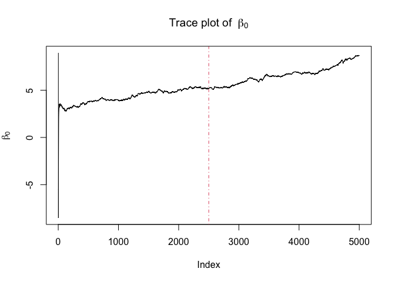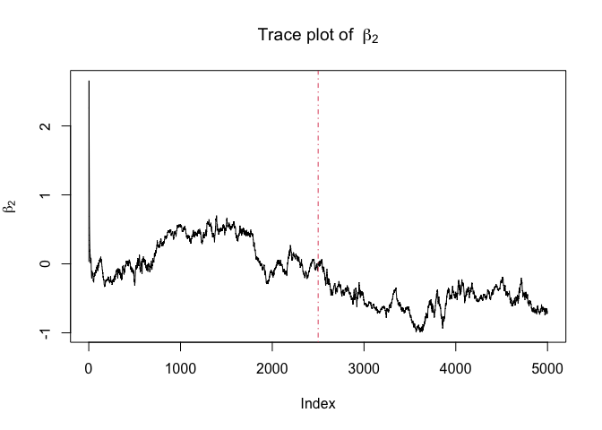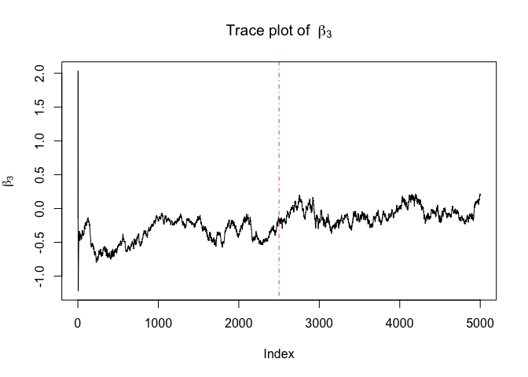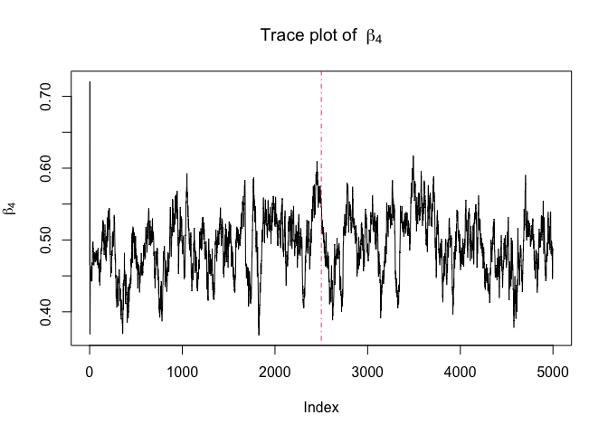

## sigma^2 plot

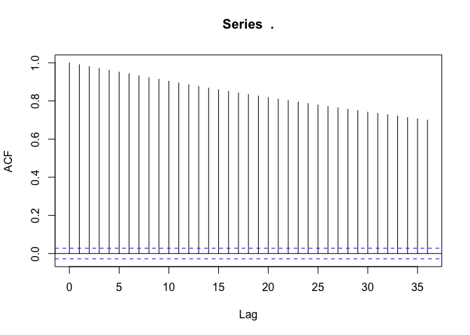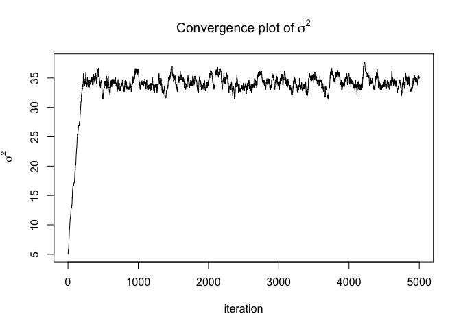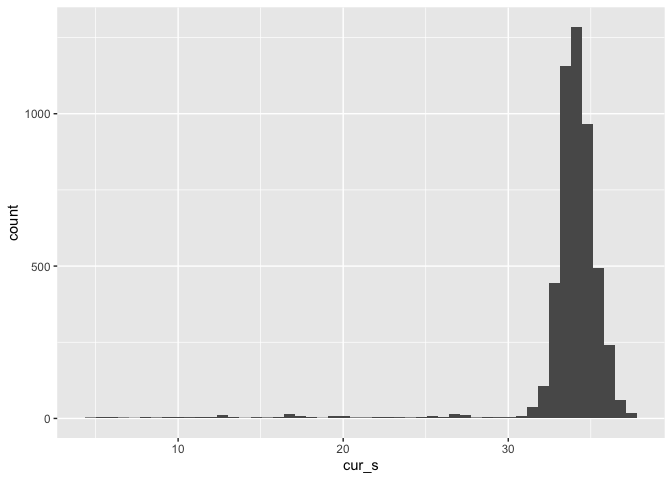

## Gamma plot

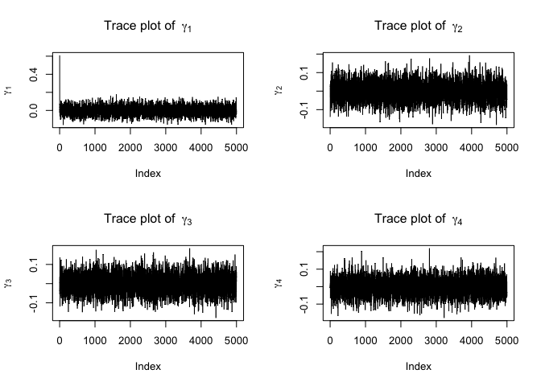

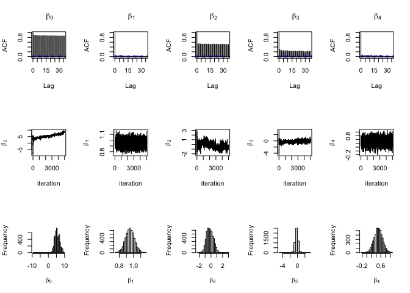

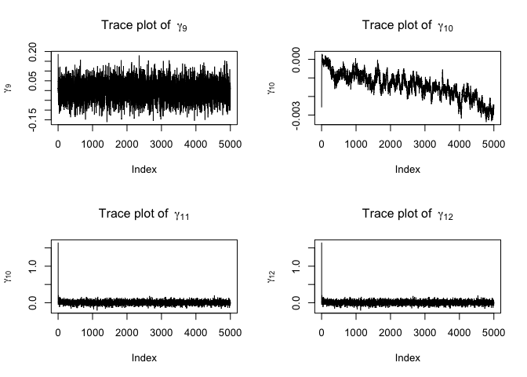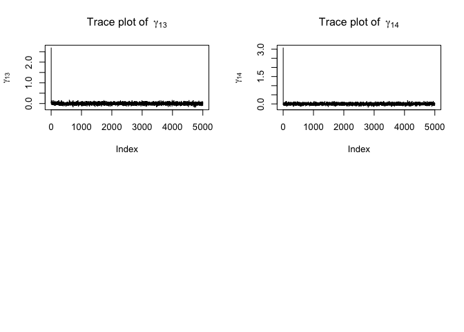

## Sigma_inverse plot

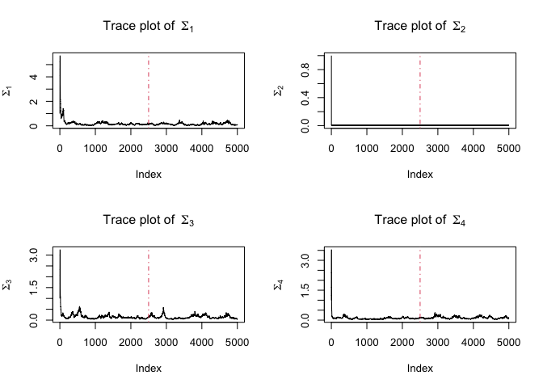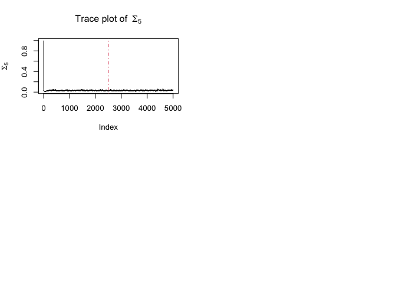

# Appendix: code

``` r
knitr::opts_chunk$set(echo = FALSE, 
                      message = FALSE, 
                      warning = FALSE, 
                      fig.align = "center")
library(dplyr)
library(tidyverse)
##### Plot for 5000 iterations
plot_df=readRDS("data/new_gibb5000_zn.rds")

testB = plot_df$B[[5000]]
testmu = plot_df$mu[[5000]]
testsigmasq = plot_df$sigmasq[[5000]]
testSIGMA = plot_df$SIGMA[[5000]]
testgamma=plot_df$gamma[[5000]]
beta.res.plot <- NULL
for (i in 1:5000) {
  B.res = plot_df$B[[i]]
  B.res = as.data.frame(B.res)
  B.res = rowMeans(B.res, na.rm = T)
  beta.res.plot = rbind(beta.res.plot, B.res)
}

sigma.res.plot = NULL
for (i in 1:5000) {
  sigma.res = plot_df$SIGMA[[i]]
  sigma.res = as.data.frame(sigma.res)
  sigma.res.plot = rbind(sigma.res.plot, sigma.res)
}

mu.res.plot = NULL
for (i in 2:5000) {
  mu.res = plot_df$mu[[i]]
  mu.res = as.data.frame(t(mu.res))
  mu.res.plot = rbind(mu.res.plot, mu.res)
}


# par(mfrow = c(2, 2))
plot(beta.res.plot[,1],type = "l", main = bquote("Trace plot of "~ beta[0]), ylab = bquote(beta[0]))
abline(v = 2500, col = 2, lty = 4)
plot(beta.res.plot[,2],type = "l", main = bquote("Trace plot of "~ beta[1]), ylab = bquote(beta[1]))
abline(v = 2500, col = 2, lty = 4)
plot(beta.res.plot[,3],type = "l", main = bquote("Trace plot of "~ beta[2]), ylab = bquote(beta[2]))
abline(v = 2500, col = 2, lty = 4)
plot(beta.res.plot[,4],type = "l", main = bquote("Trace plot of "~ beta[3]), ylab = bquote(beta[3]))
abline(v = 2500, col = 2, lty = 4)
plot(beta.res.plot[,5],type = "l", main = bquote("Trace plot of "~ beta[4]), ylab = bquote(beta[4]))
abline(v = 2500, col = 2, lty = 4)
burn=1
chain_length=5000
#sigmasq
cur_s <- NA
for (i in burn:chain_length) {
  cur_s[i-burn+1] <- plot_df$sigmasq[i]
}

cur_s %>% acf()
cur_s %>% ts.plot(gpars=list(ylab="sigma^2"))
data.frame(cur_s) %>% ggplot(aes(x = cur_s)) + geom_histogram(bins = 50)
gamma.res.plot <- data.frame(matrix(nrow = 14, ncol = 5000))

for (i in 1:5000) {
    gamma.res = plot_df$gamma[[i]]
    gamma.res = as.data.frame(gamma.res)
    gamma.res.plot[,i]=gamma.res
}

gamma.res.plot = t(gamma.res.plot)

par(mfrow=c(2,2))
plot(gamma.res.plot[,1],type = "l",main = bquote("Trace plot of "~ gamma[1]), ylab=bquote(gamma[1]))

plot(gamma.res.plot[,2],type = "l", main = bquote("Trace plot of "~ gamma[2]), ylab=bquote(gamma[2]))

plot(gamma.res.plot[,3],type = "l", main = bquote("Trace plot of "~ gamma[3]), ylab=bquote(gamma[3]))

plot(gamma.res.plot[,4],type = "l", main = bquote("Trace plot of "~ gamma[4]), ylab=bquote(gamma[4]))
par(mfrow=c(2,2))
plot(gamma.res.plot[,5],type = "l", main = bquote("Trace plot of "~ gamma[5]), ylab = bquote(gamma[5]))
plot(gamma.res.plot[,6],type = "l", main = bquote("Trace plot of "~ gamma[6]), ylab = bquote(gamma[6]))
plot(gamma.res.plot[,7],type = "l", main = bquote("Trace plot of "~ gamma[7]), ylab = bquote(gamma[7]))
plot(gamma.res.plot[,8],type = "l", main = bquote("Trace plot of "~ gamma[8]), ylab = bquote(gamma[8]))
par(mfrow=c(2,2))
plot(gamma.res.plot[,9],type = "l", main = bquote("Trace plot of "~ gamma[9]), ylab = bquote(gamma[9]))
plot(gamma.res.plot[,10],type = "l", main = bquote("Trace plot of "~ gamma[10]), ylab=bquote(gamma[10]))
plot(gamma.res.plot[,11],type = "l", main = bquote("Trace plot of "~ gamma[11]), ylab=bquote(gamma[10]))
plot(gamma.res.plot[,11],type = "l", main = bquote("Trace plot of "~ gamma[12]), ylab=bquote(gamma[12]))
plot(gamma.res.plot[,13],type = "l", main = bquote("Trace plot of "~ gamma[13]), ylab=bquote(gamma[13]))
plot(gamma.res.plot[,14],type = "l", main = bquote("Trace plot of "~ gamma[14]), ylab=bquote(gamma[14]))
Sigma_inv.res.plot = NULL
for (i in 1:5000) {
  Sigma_inv.res = diag(plot_df$SIGMA[[i]])
  Sigma_inv.res = as.data.frame(t(Sigma_inv.res))
  Sigma_inv.res.plot = rbind(Sigma_inv.res.plot, Sigma_inv.res)
}

par(mfrow = c(2, 2))
plot(Sigma_inv.res.plot[,1],type = "l", main = bquote("Trace plot of "~ Sigma[1]), ylab = bquote(Sigma[1]))
abline(v = 2500, col = 2, lty = 4)
plot(Sigma_inv.res.plot[,2],type = "l", main = bquote("Trace plot of "~ Sigma[2]), ylab = bquote(Sigma[2]))
abline(v = 2500, col = 2, lty = 4)
plot(Sigma_inv.res.plot[,3],type = "l", main = bquote("Trace plot of "~ Sigma[3]), ylab = bquote(Sigma[3]))
abline(v = 2500, col = 2, lty = 4)
plot(Sigma_inv.res.plot[,4],type = "l", main = bquote("Trace plot of "~ Sigma[4]), ylab = bquote(Sigma[4]))
abline(v = 2500, col = 2, lty = 4)
plot(Sigma_inv.res.plot[,5],type = "l", main = bquote("Trace plot of "~ Sigma[5]), ylab = bquote(Sigma[5]))
abline(v = 2500, col = 2, lty = 4)
```
