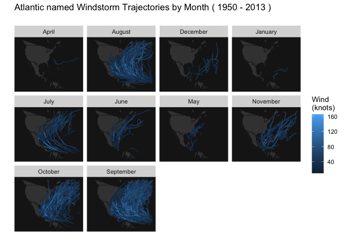

eda
================
Ruihan Zhang
2023-04-27

Introduction: The United States faces significant social and economic
risks from hurricanes, which cause fatalities and property damage
through high winds, heavy rain, and storm surges. To address this, there
is a growing need to accurately predict hurricane behavior, including
location and speed. This project aims to forecast wind speeds by
modeling hurricane trajectories using a Hierarchical Bayesian Model. The
hurricane data includes specific effects unique to each hurricane, and
model integration is achieved through the use of a Markov Chain Monte
Carlo algorithm.

Furthermore, we aim to explore seasonal variations in hurricane wind
speeds using the Bayesian model previously estimated, and investigate
whether there is evidence of increasing wind speeds over time.
Additionally, we plan to utilize data on hurricane damages and
fatalities in the United States to develop a prediction model. Through
this model, we intend to identify the key factors that influence
hurricanes and draw meaningful conclusions based on the results.

``` r
dt <- read.csv("data/hurrican703.csv")
dt <- as.data.table(dt)
summary(dt)
```

    ##       ID                Season        Month              Nature         
    ##  Length:22038       Min.   :1950   Length:22038       Length:22038      
    ##  Class :character   1st Qu.:1969   Class :character   Class :character  
    ##  Mode  :character   Median :1989   Mode  :character   Mode  :character  
    ##                     Mean   :1986                                        
    ##                     3rd Qu.:2003                                        
    ##                     Max.   :2013                                        
    ##      time              Latitude       Longitude          Wind.kt      
    ##  Length:22038       Min.   : 5.00   Min.   :-107.70   Min.   : 10.00  
    ##  Class :character   1st Qu.:18.70   1st Qu.: -78.70   1st Qu.: 30.00  
    ##  Mode  :character   Median :26.50   Median : -64.05   Median : 45.00  
    ##                     Mean   :26.99   Mean   : -62.91   Mean   : 52.28  
    ##                     3rd Qu.:33.60   3rd Qu.: -48.60   3rd Qu.: 65.00  
    ##                     Max.   :70.70   Max.   :  13.50   Max.   :165.00

``` r
dt_long <- dt %>%
    dplyr::group_by(ID) %>% 
    mutate(Wind_prev = lag(Wind.kt, 1),
           Lat_change = Latitude - lag(Latitude, 1),
           Long_change = Longitude - lag(Longitude, 1),
           Wind_prev_prev = lag(Wind.kt, 2)) %>% 
    mutate(Wind_change = Wind_prev - Wind_prev_prev)
```

<!-- -->
<!-- -->
If we group the hurricanes by years, we can see in general, we have more
observations in recently years compared to 50 years ago as shown in
Figure 3. However, from Figure 4, the average wind speed seems to have a
decreasing trend.

<!-- -->
<!-- -->
<!-- -->
<!-- -->
``` r
ggplot(data=dt, aes(x = Longitude, y = Latitude)) + 
  stat_summary_2d(data = dt, aes(x = Longitude, y = Latitude, z = dt$Wind.kt), fun = median, binwidth = c(1, 1), show.legend = TRUE)
```

<!-- -->

``` r
library(data.table)
dt <- as.data.table(dt)
summary(dt)
```

    ##       ID                Season        Month              Nature         
    ##  Length:22038       Min.   :1950   Length:22038       Length:22038      
    ##  Class :character   1st Qu.:1969   Class :character   Class :character  
    ##  Mode  :character   Median :1989   Mode  :character   Mode  :character  
    ##                     Mean   :1986                                        
    ##                     3rd Qu.:2003                                        
    ##                     Max.   :2013                                        
    ##      time              Latitude       Longitude          Wind.kt      
    ##  Length:22038       Min.   : 5.00   Min.   :-107.70   Min.   : 10.00  
    ##  Class :character   1st Qu.:18.70   1st Qu.: -78.70   1st Qu.: 30.00  
    ##  Mode  :character   Median :26.50   Median : -64.05   Median : 45.00  
    ##                     Mean   :26.99   Mean   : -62.91   Mean   : 52.28  
    ##                     3rd Qu.:33.60   3rd Qu.: -48.60   3rd Qu.: 65.00  
    ##                     Max.   :70.70   Max.   :  13.50   Max.   :165.00

``` r
library(maps)
map <- ggplot(data = dt, aes(x = Longitude, y = Latitude)) + 
  geom_polygon(data = map_data(map = 'world'), aes(x = long, y = lat, group = group))
map +
  stat_summary_2d(data = dt, aes(x = Longitude, y = Latitude, z = dt$Wind.kt), fun = median, binwidth = c(1, 1), show.legend = TRUE, alpha = 0.75) + 
  ggtitle(paste0("Atlantic Windstorm mean knot"))
```

<!-- -->

``` r
map <- ggplot(dt, aes(x = Longitude, y = Latitude, group = ID)) + 
  geom_polygon(data = map_data("world"), 
               aes(x = long, y = lat, group = group), 
               fill = "gray25", colour = "gray10", size = 0.2) + 
  geom_path(data = dt, aes(group = ID, colour = Wind.kt), size = 0.5) + 
  xlim(-138, -20) + ylim(3, 55) + 
  labs(x = "", y = "", colour = "Wind \n(knots)") + 
  theme(panel.background = element_rect(fill = "gray10", colour = "gray30"),
        axis.text.x = element_blank(), axis.text.y = element_blank(), 
        axis.ticks = element_blank(), panel.grid.major = element_blank(),
        panel.grid.minor = element_blank())

seasonrange <- paste(range(dt[, Season]), collapse=" - ")

map + ggtitle(paste("Atlantic named Windstorm Trajectories (", 
                     seasonrange, ")\n")) 
```

<!-- -->

``` r
mapMonth <- map + facet_wrap(~ Month) +
  ggtitle(paste("Atlantic named Windstorm Trajectories by Month (", 
                 seasonrange, ")\n")) 
mapMonth
```

<!-- -->
