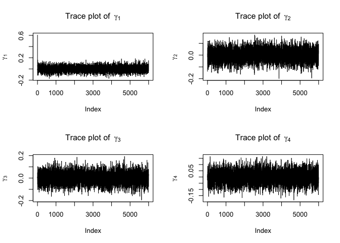

mcmc 6000 iteration
================
2023-04-26

# Data processing

``` r
data=read_csv("data/hurrican703.csv")%>%
  janitor::clean_names() %>%
  # reformat the time 
  tidyr::separate(
    time, c('Date', 'Time'), 
    sep = ' ', extra = 'merge') %>% 
  tidyr::separate(
    Date, c('year_num', 'month_num', 'day'), 
    sep = '-', extra = 'merge') %>% 
  tidyr::separate(
    Time, c('hour', 'min', 'sec'), 
    sep =':', extra = 'merge')  %>%
  mutate(
    year_num=gsub('[^[:alnum:] ]',"",year_num),
    sec=gsub('[^[:alnum:] ]',"",sec)
  ) %>%
  dplyr::select(id, nature, latitude, longitude, wind_kt, 
         season, month, day, hour, min) %>%
  # filter the time with 6 hours change
  filter(
  hour %in% c("00", "06", "12", "18"),
         min == "00") %>%
  group_by(id) %>% 
  # changes 
  mutate(latitude_d = latitude - lag(latitude, 1),
         longitude_d = longitude - lag(longitude, 1),
         wind_kt_d = lag(wind_kt, 1) - lag(wind_kt, 2),
         wind_prev = lag(wind_kt, 1),
         month = factor(month,levels = month.name)) %>% 
  na.omit() %>% 
  mutate(intercept = 1) 

data_sort = data[order(data$id), ]
data_sort$index = 1:nrow(data_sort)

X_sort2 = data_sort %>% 
  group_by(index) %>% 
  dplyr::select(nature, season, month, id) %>% 
  mutate(n = 1) %>% 
  pivot_wider(names_from = month, values_from = n, values_fill = 0) %>% 
  mutate(n = 1) %>% 
  pivot_wider(names_from = nature, values_from = n, values_fill = 0) %>% 
  ungroup() %>% 
  dplyr::select(April, May, June, July, August, September, October, November, December, season, TS, ET, SS, NR) 
  # %>% nest(.by=id) %>% pull()

Xi_sort2 = data_sort %>% 
  group_by(index) %>% 
  dplyr::select(nature, season, month, id) %>% 
  mutate(n = 1) %>% 
  pivot_wider(names_from = month, values_from = n, values_fill = 0) %>% 
  mutate(n = 1) %>% 
  pivot_wider(names_from = nature, values_from = n, values_fill = 0) %>% 
  ungroup() %>% 
  dplyr::select(April, May, June, July, August, September, October, November, December, season, TS, ET, SS, NR, id) %>%
  nest(.by=id) %>% pull()

X_mtx = as.matrix(X_sort2)

Y_sort = data_sort%>%dplyr::select(wind_kt)  
  # %>% nest() %>% pull(data)

Yi_sort = data_sort%>%dplyr::select(wind_kt, id) %>% nest() %>% pull(data)

Y_mtx = matrix(data_sort$wind_kt, nrow = nrow(data_sort))

Zi_sort = data_sort %>% 
  dplyr::select(intercept, wind_prev, latitude_d, longitude_d, wind_kt_d,id) %>% nest() %>% pull(data)
```

# GLMM model

``` r
glmm.hurricane.1 <- lme4::glmer(wind_kt ~ month+season+nature +
                                  (1+wind_prev+latitude_d+longitude_d+wind_kt_d|id),
                       family = 'gaussian', data = data)
# summary(glmm.hurricane.1)

beta_raw <- as.data.frame(ranef(glmm.hurricane.1)$id)

B_sort <- beta_raw %>% t()

gamma_start <- as.matrix(fixef(glmm.hurricane.1))
gamma_start2 <- as.matrix(gamma_start[2:15])
beta_raw2 = beta_raw
beta_raw2[, 1] = beta_raw2[, 1] + gamma_start[1]
B_start2 = beta_raw2 %>% t()
```

# Posterior

``` r
B = function(zdat,ydat,xdat,mu_est, sigma, sigma_inv,gamma){
  res = NULL
  n = length(zdat)
  # Beta_i function ~ N(,)
  for (i in 1:n){
    z = zdat[[i]]
    y = ydat[[i]]
    x=  xdat[[i]]
    k = sigma^(-2) * as.matrix(t(z)) %*% as.matrix(z) + solve(sigma_inv) 
    m = (sigma^(-2)*as.matrix(t(z))%*%as.matrix(y))-(sigma^(-2)*as.matrix(t(z))%*%as.matrix(x)%*%gamma)+solve(sigma_inv)%*%as.matrix(mu_est)
    varcov = solve(k)
    if (!is.positive.definite(varcov)){
      varcov = make.positive.definite(varcov)
      return(varcov)
    }
    mu = varcov%*%m
    bi = mvrnorm(1, mu = mu, Sigma = varcov)
    
    res = rbind(res, bi)
  }
  res=as.matrix(t(res))
  return(res)
}

testB <- B(Zi_sort,Yi_sort,Xi_sort2, as.matrix(c(-10,2,3,4,5)), 5, diag(c(1,1,1,1,1)), as.matrix(gamma_start2))
```

``` r
mu_est = function(B, sigma_inv){
  res= matrix(0, nrow=5, ncol=1)
  N = ncol(B)
  v = diag(0.8, 5)
  v[lower.tri(v)] = 0.1
  v[upper.tri(v)] = 0.1
  v_inv=solve(v)
  me= solve(N*solve(sigma_inv)-v_inv)
  for (i in 1:N){
    beta_i = as.matrix(B[,i])
    M = solve(sigma_inv) %*% beta_i
    res=res+M
  } 
  mean_vec = me %*% res
  mu = mvrnorm(1, mu = mean_vec, Sigma = me)
  return(as.matrix(mu))
}
testmu=mu_est(as.matrix(testB),diag(2,5,5))
```

``` r
sigma_inv=function(B, mu_est) {
  res= matrix(0,nrow=5,ncol=5)
  N = ncol(B) # N is number of hurricane
  S.matrix = diag(0.7,5)
  S.matrix[lower.tri(S.matrix)] = 0.2
  S.matrix[upper.tri(S.matrix)] = 0.2
  v=N+5+1
  for (i in 1:N){
    beta_i = as.matrix(B[,i])
    ai=(beta_i-mu_est) %*% t(beta_i-mu_est)
    res= res + as.matrix(ai)
  }
  sigma= rinvwishart(1, nu = v, Omega = S.matrix+res, checkSymmetry = T)
  return(sigma[,,1])
}

testsigmainv=sigma_inv(as.matrix(testB),testmu)
```

``` r
gamma = function(B,zdat, ydat,xdat, sigma) {

  n = length(zdat)
  a = diag(0, 14)
  N = matrix(0,nrow=14,ncol=1)
  for (i in 1:n){
    z = as.matrix(zdat[[i]])
    y = as.matrix(ydat[[i]])
    x=  as.matrix(xdat[[i]])
    ai = sigma^(-2)*as.matrix(t(x))%*% as.matrix(x) 
    a = a + ai
    # mi = solve(ai)
    ni = sigma^(-2)*(t(x)%*%y - t(x)%*%z%*%as.matrix(B[,i]))
    N = N + ni
  }
  M = a + 400*diag(14)
  gamma_est = mvrnorm(1, mu = solve(M)%*%N, Sigma = solve(M))
  return(gamma_est)
}
testgamma=gamma(testB,Zi_sort,Yi_sort,Xi_sort2,5)
```

# Gibb sampling

``` r
gibb <- function(niter,zdat, ydat,xdat, B_start,mustart,sigma_start, sigmainv_start, gamma_start) {
  Bvec = list(B_start)
  muvec = list(mustart)
  sigmasqvec = rep(NA, niter)
  sigmasqvec[1] = sigma_start
  SIGMAvec = list(sigmainv_start)
  gammavec = list(gamma_start)
  
  for (k in 2:niter) {
    Bvec[[k]] = B(zdat=zdat,ydat=ydat,xdat=xdat, mu_est = muvec[[k-1]], sigma=sigmasqvec[k-1],sigma_inv=SIGMAvec[[k-1]] ,gamma = gammavec[[k-1]])
    muvec[[k]] = mu_est(Bvec[[k]], SIGMAvec[[k-1]])
    sigmasqvec[k] = sigma_sample(sigmasqvec[k-1], Bvec[[k]], gammavec[[k-1]], 0.5)
    SIGMAvec[[k]] = sigma_inv(Bvec[[k]], muvec[[k]])
    gammavec[[k]] = gamma(Bvec[[k]],zdat, ydat,xdat, sigmasqvec[[k]])
    print(k)
  }
  
  return(list(B = Bvec, mu = muvec, sigmasq = sigmasqvec, SIGMA = SIGMAvec, gamma = gammavec))
}
```

``` r
# mh_res_6000 = gibb(6000, Zi_sort,Yi_sort,Xi_sort2, B_start2, as.matrix(c(5,2,3,4,5)), 5, diag(c(1,1,1,1,1)), as.matrix(gamma_start2))
```

``` r
# # saveRDS(mh_res_5000, file = "data/new_gibb5000_4.49.rds")
# saveRDS(mh_res_6000, file = "data/new_gibb6000.rds")
```

# Plot

``` r
##### Plot for 6000 iterations
plot_df=readRDS("data/new_gibb6000.rds")

testB = plot_df$B[[6000]]
testmu = plot_df$mu[[6000]]
testsigmasq = plot_df$sigmasq[[6000]]
testSIGMA = plot_df$SIGMA[[6000]]
testgamma=plot_df$gamma[[6000]]
```

## Beta plot

``` r
beta.res.plot <- NULL
for (i in 1:6000) {
  B.res = plot_df$B[[i]]
  B.res = as.data.frame(B.res)
  B.res = rowMeans(B.res, na.rm = T)
  beta.res.plot = rbind(beta.res.plot, B.res)
}

sigma.res.plot = NULL
for (i in 1:6000) {
  sigma.res = plot_df$SIGMA[[i]]
  sigma.res = as.data.frame(sigma.res)
  sigma.res.plot = rbind(sigma.res.plot, sigma.res)
}

mu.res.plot = NULL
for (i in 2:6000) {
  mu.res = plot_df$mu[[i]]
  mu.res = as.data.frame(t(mu.res))
  mu.res.plot = rbind(mu.res.plot, mu.res)
}


par(mfrow = c(2, 2))
plot(beta.res.plot[,1],type = "l", main = bquote("Trace plot of "~ beta[0]), ylab = bquote(beta[0]))
abline(v = 3000, col = 2, lty = 4)
plot(beta.res.plot[,2],type = "l", main = bquote("Trace plot of "~ beta[1]), ylab = bquote(beta[1]))
abline(v = 3000, col = 2, lty = 4)
plot(beta.res.plot[,3],type = "l", main = bquote("Trace plot of "~ beta[2]), ylab = bquote(beta[2]))
abline(v = 3000, col = 2, lty = 4)
plot(beta.res.plot[,4],type = "l", main = bquote("Trace plot of "~ beta[3]), ylab = bquote(beta[3]))
abline(v = 3000, col = 2, lty = 4)
```

<!-- -->

``` r
plot(beta.res.plot[,5],type = "l", main = bquote("Trace plot of "~ beta[4]), ylab = bquote(beta[4]))
abline(v = 3000, col = 2, lty = 4)
```

<!-- -->

## sigma^2 plot

``` r
burn=1
chain_length=6000
#sigmasq
cur_s <- NA
for (i in burn:chain_length) {
  cur_s[i-burn+1] <- plot_df$sigmasq[i]
}

cur_s %>% acf()
```

<!-- -->

``` r
cur_s %>% ts.plot(gpars=list(ylab="sigma^2"))
```

<!-- -->

``` r
data.frame(cur_s) %>% ggplot(aes(x = cur_s)) + geom_histogram(bins = 50)
```

<!-- -->

## Gamma plot

``` r
gamma.res.plot <- data.frame(matrix(nrow = 14, ncol = 6000))

for (i in 1:6000) {
    gamma.res = plot_df$gamma[[i]]
    gamma.res = as.data.frame(gamma.res)
    gamma.res.plot[,i]=gamma.res
}

gamma.res.plot = t(gamma.res.plot)

par(mfrow=c(2,2))
plot(gamma.res.plot[,1],type = "l",main = bquote("Trace plot of "~ gamma[1]), ylab=bquote(gamma[1]))

plot(gamma.res.plot[,2],type = "l", main = bquote("Trace plot of "~ gamma[2]), ylab=bquote(gamma[2]))

plot(gamma.res.plot[,3],type = "l", main = bquote("Trace plot of "~ gamma[3]), ylab=bquote(gamma[3]))

plot(gamma.res.plot[,4],type = "l", main = bquote("Trace plot of "~ gamma[4]), ylab=bquote(gamma[4]))
```

<!-- -->

``` r
par(mfrow=c(2,2))
plot(gamma.res.plot[,5],type = "l", main = bquote("Trace plot of "~ gamma[5]), ylab = bquote(gamma[5]))
plot(gamma.res.plot[,6],type = "l", main = bquote("Trace plot of "~ gamma[6]), ylab = bquote(gamma[6]))
plot(gamma.res.plot[,7],type = "l", main = bquote("Trace plot of "~ gamma[7]), ylab = bquote(gamma[7]))
plot(gamma.res.plot[,8],type = "l", main = bquote("Trace plot of "~ gamma[8]), ylab = bquote(gamma[8]))
```

<!-- -->

``` r
par(mfrow=c(2,2))
plot(gamma.res.plot[,9],type = "l", main = bquote("Trace plot of "~ gamma[9]), ylab = bquote(gamma[9]))
plot(gamma.res.plot[,10],type = "l", main = bquote("Trace plot of "~ gamma[10]), ylab=bquote(gamma[10]))
plot(gamma.res.plot[,11],type = "l", main = bquote("Trace plot of "~ gamma[11]), ylab=bquote(gamma[10]))
plot(gamma.res.plot[,11],type = "l", main = bquote("Trace plot of "~ gamma[12]), ylab=bquote(gamma[12]))
```

<!-- -->

``` r
plot(gamma.res.plot[,13],type = "l", main = bquote("Trace plot of "~ gamma[13]), ylab=bquote(gamma[13]))
plot(gamma.res.plot[,14],type = "l", main = bquote("Trace plot of "~ gamma[14]), ylab=bquote(gamma[14]))
```

<!-- -->

## Sigma_inverse plot

``` r
Sigma_inv.res.plot = NULL
for (i in 1:6000) {
  Sigma_inv.res = diag(plot_df$SIGMA[[i]])
  Sigma_inv.res = as.data.frame(t(Sigma_inv.res))
  Sigma_inv.res.plot = rbind(Sigma_inv.res.plot, Sigma_inv.res)
}

par(mfrow = c(2, 2))
plot(Sigma_inv.res.plot[,1],type = "l", main = bquote("Trace plot of "~ Sigma[1]), ylab = bquote(Sigma[1]))
abline(v = 3000, col = 2, lty = 4)
plot(Sigma_inv.res.plot[,2],type = "l", main = bquote("Trace plot of "~ Sigma[2]), ylab = bquote(Sigma[2]))
abline(v = 3000, col = 2, lty = 4)
plot(Sigma_inv.res.plot[,3],type = "l", main = bquote("Trace plot of "~ Sigma[3]), ylab = bquote(Sigma[3]))
abline(v = 3000, col = 2, lty = 4)
plot(Sigma_inv.res.plot[,4],type = "l", main = bquote("Trace plot of "~ Sigma[4]), ylab = bquote(Sigma[4]))
abline(v = 3000, col = 2, lty = 4)
```

<!-- -->

``` r
plot(Sigma_inv.res.plot[,5],type = "l", main = bquote("Trace plot of "~ Sigma[5]), ylab = bquote(Sigma[5]))
abline(v = 3000, col = 2, lty = 4)
```

<!-- -->
