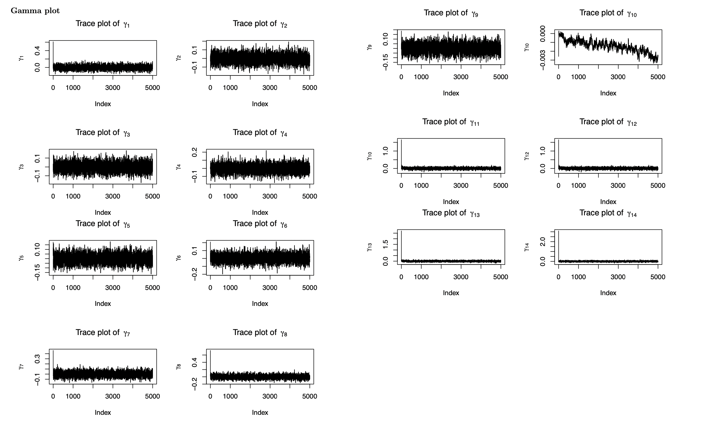

```{r setup, include=FALSE}
knitr::opts_chunk$set(echo = F, warning = F, message = F)
library(base)
library(caret)
library(corrplot)
library(plotmo)
library(ggplot2)
library(kableExtra)
```

## Content
1. Introduction
2. Dataset
3. EDA
4. Bayesian Model
5. MCMC Results
6. Conclusion


## Introduction
* Hurricanes cause fatalities and property damage
* there is a growing need to accurately predict hurricane behavior, including location and speed
* This project aims to forecast wind speeds by modeling hurricane trajectories using a Hierarchical Bayesian Model. 

## Dataset

* Hurrican703 dataset: 22038 observations $\times$ 8 variables 
  + 702 hurricanes in the North Atlantic area since 1950
  
## EDA-Count of Hurricanes in each Month

```{r, include = FALSE}
dt= read.csv("./data/hurrican703.csv")
library(data.table)
dt <- as.data.table(dt)
summary(dt)

library(tidyverse)
dt_long <- dt %>%
    dplyr::group_by(ID) %>% 
    mutate(Wind_prev = lag(Wind.kt, 1),
           Lat_change = Latitude - lag(Latitude, 1),
           Long_change = Longitude - lag(Longitude, 1),
           Wind_prev_prev = lag(Wind.kt, 2)) %>% 
    mutate(Wind_change = Wind_prev - Wind_prev_prev)
```


```{r}
library(ggpubr)
storms_month_name = distinct(group_by(dt_long, Month, ID), Month)

bx=storms_month_name %>% 
  dplyr::group_by(Month) %>% 
  mutate(Month =  factor(Month, levels = month.name)) %>%  
  ggplot(aes(x = Month)) +
  geom_bar()
bx+ theme(axis.text.x = element_text(angle = 90, vjust = 0.5, hjust=1))


```

## EDA-Count of Hurricanes in each Year


```{r}
storms_season_name = distinct(group_by(dt_long, Season, ID), Season)
ggplot(data = storms_season_name) + 
  geom_bar(aes(x = Season)) +
  scale_x_continuous("Year")

```


## Show hurricance tracks by month
```{r}
map <- ggplot(dt, aes(x = Longitude, y = Latitude, group = ID)) + 
  geom_polygon(data = map_data("world"), 
               aes(x = long, y = lat, group = group), 
               fill = "gray25", colour = "gray10", size = 0.2) + 
  geom_path(data = dt, aes(group = ID, colour = Wind.kt), size = 0.5) + 
  xlim(-138, -20) + ylim(3, 55) + 
  labs(x = "", y = "", colour = "Wind \n(knots)") + 
  theme(panel.background = element_rect(fill = "gray10", colour = "gray30"),
        axis.text.x = element_blank(), axis.text.y = element_blank(), 
        axis.ticks = element_blank(), panel.grid.major = element_blank(),
        panel.grid.minor = element_blank())

seasonrange <- paste(range(dt[, Season]), collapse=" - ")


```
```{r}
mapMonth <- map + facet_wrap(~ Month) +
  ggtitle(paste("Atlantic named Windstorm Trajectories by Month (", 
                 seasonrange, ")\n")) 
mapMonth
```


## Bayesian Model

The suggested Bayesian model is $Y_{i}(t+6) =\beta_{0,i}+\beta_{1,i}Y_{i}(t) + \beta_{2,i}\Delta_{i,1}(t)+ \beta_{3,i}\Delta_{i,2}(t) +\beta_{4,i}\Delta_{i,3}(t)  +\boldsymbol{X_i}\gamma+ \epsilon_{i}(t)$ 

- where $Y_{i}(t)$ the wind speed at time $t$ (i.e. 6 hours earlier),  $\Delta_{i,1}(t)$, $\Delta_{i,2}(t)$ and $\Delta_{i,3}(t)$ are the changes of latitude, longitude and wind speed between $t$ and $t-6$, and $\epsilon_{i,t}$ follows a  normal distributions with mean zero and variance $\sigma^2$, independent across $t$. 

- $\boldsymbol{\beta}_{i} =  (\beta_{0,i},\beta_{1,i},...,\beta_{5,i})$, we assume that $\boldsymbol{\beta}_{i} \sim N(\boldsymbol{\mu}, \boldsymbol{\Sigma})$, where $d$ is dimension of $\boldsymbol{\beta}_{i}$.

## Priors
$$\quad P(\boldsymbol{\mu}) = \frac{1}{\sqrt{2\pi}|\boldsymbol V|^{\frac{1}{2}}}\exp\{-\frac{1}{2}\boldsymbol\mu^{\top}\boldsymbol V^{-1}\boldsymbol\mu\}\propto |\boldsymbol V|^{-\frac{1}{2}}\exp\{-\frac{1}{2}\boldsymbol\mu^{\top}\boldsymbol V^{-1}\boldsymbol\mu\}\tag{2}$$
$$\quad P(\Sigma^{-1}) \propto 
|\Sigma|^{-\frac{(\nu+d+1)}{2}} \exp(-\frac{1}{2}tr(S\Sigma^{-1}))\tag{3}$$
$$P(\gamma) \propto exp(-\frac{\gamma^2}{2*(0.05)^2}) =e^{-200\gamma^2}\tag{4}$$
$$P(\sigma) = \frac{2\alpha}{\pi+\alpha^2} \propto \frac{1}{\sigma^2+\alpha^2}\tag{5}$$

## Posterior

Let $\textbf{B} = (\boldsymbol{\beta}_1^\top,..., \boldsymbol{\beta}_n^\top)^\top$, derive the posterior distribution of the parameters $\Theta = (\textbf{B}^\top, \boldsymbol{\mu}^\top, \sigma^2, \Sigma, \gamma)$.
\
\
Let

$$\boldsymbol{Z}_i(t)\boldsymbol{\beta}_i^\top = \beta_{0,i} + \beta_{1,i}Y_i(t) + \beta_{2,i}\Delta_{i,1}(t) + \beta_{3,i}\Delta_{i,2}(t) + \beta_{4,i}\Delta_{i,3}(t)$$
We can find that
$$\boldsymbol{Y_i} {\sim} MVN(\boldsymbol{Z}_i\boldsymbol{\beta}_i, \sigma^2I)\tag{6}$$

The likelihood for our data is
$$
\begin{aligned}
L(\boldsymbol{Y}_i\mid\boldsymbol{B}_i, \sigma^2) = &  \prod_{i=1}^n\frac{1}{\sqrt{2\pi}\sigma}\exp\{-\frac{1}{2}(\boldsymbol{y}_i - \boldsymbol{Z}_i\boldsymbol{\beta}_i-\boldsymbol{X_i}\boldsymbol\gamma_i)^\top (\sigma^2 I)^{-1}(\boldsymbol{y}_i - \boldsymbol{Z}_i\boldsymbol{\beta}_i-\boldsymbol{X_i}\boldsymbol\gamma_i)\}\\
\propto & (\sigma^{-\frac{N}{2}}) \prod_{i=1}^n\exp\big\{-\frac{1}{2}(\boldsymbol{Y}_i - \boldsymbol{Z}_i\boldsymbol{\beta}_i-\boldsymbol{X_i}\boldsymbol\gamma_i)^\top (\sigma^2 I)^{-1}(\boldsymbol{Y}_i - \boldsymbol{Z}_i\boldsymbol{\beta}_i-\boldsymbol{X_i}\boldsymbol\gamma_i)\big\}
\end{aligned}
\tag{7}
$$

## Joint Posrerior

$$
\begin{aligned}
P(\Theta|Y) = & P(B, \mu, \sigma^2, A, \gamma|Y) \\ 
&\propto L(Y| B, \sigma^2)L(B|\mu,\Sigma)p(\mu)p(\sigma)p(A)p(\gamma)\\
&\propto \frac{1}{\sigma^{N}(\sigma^2+10^2)} \prod_{i=1}^n\exp\big\{-\frac{1}{2}(\boldsymbol{Y}_i - \boldsymbol{Z}_i\boldsymbol{\beta}_i-\boldsymbol{X_i}\boldsymbol\gamma_i)^\top (\sigma^2 I)^{-1}(\boldsymbol{Y}_i - \boldsymbol{Z}_i\boldsymbol{\beta}_i-\boldsymbol{X_i}\boldsymbol\gamma_i)\big\}\\
&\times \exp\{-\frac{1}{2}\sum_i^n(\beta_i-\mu)^\top A(\beta_i-\mu)\} |A|^{\frac{N+d+6}{2}} \exp\{-\frac{1}{2}tr(SA)\}|\boldsymbol V|^{-\frac{1}{2}}\exp\{-\frac{1}{2}\boldsymbol\mu^{\top}\boldsymbol V^{-1}\boldsymbol\mu\}e^{-200\gamma^2}
\end{aligned}
\tag{9}
$$


## Conditional Distributions
Generate $B_t$ from $f(B_t, \sigma_{t-1},\mu_{t-1},\Sigma_{t-1}^{-1})$

$$
\begin{aligned}
f(B^\top|\sigma^2,\mu,\Sigma) \propto \prod_{i=1}^n\exp \{-\frac{(Y_j-Z_j\beta_j-X_j\gamma)^\top(Y_jZ_j\beta_j-X_j\gamma)}{2\sigma^2}-\frac{(\beta_j-\mu)^\top\Sigma^{-1}(\beta_j-\mu)}{2}\}\\
\propto \prod_{i=1}^n\exp(-\frac{1}{2}(\beta_j^\top(\frac{Z_j^\top Z_j}{\sigma^2}+A)\beta_j-2(\frac{Y_j^\top Z_j-X_j^\top Z_j\gamma}{\sigma^2}+\mu^\top A)\beta_j))\\
\propto \prod_{i=1}^n\exp\{-\frac{1}{2}(\beta_j-(\frac{Z_j^\top Z_j}{\sigma^2}+A)(\beta_j-(\frac{Z_j^\top Z_j}{\sigma^2}+A)^{-1}(\frac{Y_j^\top Z_j-X_j^\top Z_j\gamma}{\sigma^2}+\mu^\top A)^\top))\}
\end{aligned}
$$
$MVN_d((\frac{Z_j^\top Z_j}{\sigma^2}+A)^{-1}(\frac{Y_j^\top Z_j^\top-X_j^\top Z_j\gamma}{\sigma^2}+\mu^\top A)^\top,\frac{Z_j^\top Z_j}{\sigma^2}+A)^{-1})$


## MCMC Algorithm

$$
f(\textbf{B} |\boldsymbol{\mu^\top}, \sigma^2, A, \gamma, Y^\top) \sim MVN_d((\frac{Z_j^\top Z_j}{\sigma^2}+A)^{-1}(\frac{Y_j^\top Z_j^\top-X_j^\top Z_j\gamma}{\sigma^2}+\mu^\top A)^\top,\frac{Z_j^\top Z_j}{\sigma^2}+A)^{-1})
$$

$$
f(\mu_t|B^\top, \sigma^2, A, \gamma, Y^\top) \sim MVN_d((NA+\frac{1}{v})^{-1}(\sum_i^n\beta_jA)^\top,(NA+\frac{1}{v})^{-1})
$$

$$
f(\sigma|B^\top, \mu^\top, A, \gamma, Y^\top)\sim MVN_d((X_i^\top\sigma^{-2}IX_i+400I)^{-1}(X_i^\top\sigma^{-2}IY_i-X_i^\top\sigma^{-2}IZ_i\beta_i),(X_i^\top\sigma^{-2}IX_i+400I)^{-1})
$$

$$
f(\boldsymbol{A}|\boldsymbol{B^\top} \sigma^2, \boldsymbol{\gamma, Y^\top}) \sim w^{-1}(\boldsymbol{S+\sum_i^n(\beta_i-\mu)(\beta_i-\mu)^\top,n+v})
$$

$$
f(\gamma|B^\top,\mu^top, \sigma^2, A, Y^\top) \sim MVN((\frac{X_j^\top X_j}{\sigma^2}+400I)^{-1}(\sum_i^nY_j^\top X_j-\sum_i^nX_jZ_j\beta_j)^\top,(\frac{X_j^\top X_j}{\sigma^2}+400I)^{-1})
$$

## MCMC Results - Details

- 5000 iterations

- Estimates and inferences based on 5000 MCMC samples

## MCMC Results - Beta Plots 1
```{r,echo=FALSE,out.width='70%',out.height='70%',fig.align='center'}
knitr::include_graphics("plots/beta1.png")
```
-Trace plots of variance parameters, based on 5000 MCMC sample.

## MCMC Results - Beta Plots 2
```{r,echo=FALSE,out.width='70%',out.height='70%',fig.align='center'}

```
-Trace plots of variance parameters, based on 5000 MCMC sample.

## MCMC Results - sigma^2 Plots 1
```{r}
library(magick)

pic1 <- image_read("plots/sigma1.png")
pic2 <- image_read("plots/sigma2.png")

# Combine the pictures side by side
combined <- image_append(c(pic1, pic2), stack=FALSE)

# Save the combined picture to a file
image_write(combined, path = "plots/combinedbeta1.jpg")

# Open the combined picture using your system's image viewer
system("plots/combinedbeta1.jpg")
```


```{r,echo=FALSE,out.width='90%',out.height='100%',fig.align='center'}

```

## MCMC Results - sigma^2 Plots 2
```{r}
library(magick)

pic3 <- image_read("plots/sigma3.png")
pic4 <- image_read("plots/sigma4.png")

# Combine the pictures side by side
combined <- image_append(c(pic3, pic4), stack=FALSE)

# Save the combined picture to a file
image_write(combined, "plots/combinedsigma2.png")


```


```{r,echo=FALSE,out.width='90%',out.height='100%',fig.align='center'}
knitr::include_graphics("plots/combinedsigma2.png")
```
## MCMC Results - Gamma Plots 1
```{r}
library(magick)

pic5 <- image_read("plots/gamma1.png")
pic6 <- image_read("plots/gamma2.png")

# Combine the pictures side by side
combined <- image_append(c(pic5, pic6), stack=FALSE)

# Save the combined picture to a file
image_write(combined, "plots/combinedgamma1.png")


```


```{r,echo=FALSE,out.width='90%',out.height='100%',fig.align='center'}

```

## MCMC Results - Gamma Plots 2
```{r}
library(magick)

pic7 <- image_read("plots/gamma3.png")
pic8 <- image_read("plots/gamma4.png")

# Combine the pictures side by side
combined <- image_append(c(pic7, pic8), stack=FALSE)

# Save the combined picture to a file
image_write(combined, "plots/combinedgamma2.png")


```


```{r,echo=FALSE,out.width='90%',out.height='100%',fig.align='center'}

```

## MCMC Results - Sigma Inverse Plots 1
```{r,echo=FALSE,out.width='90%',out.height='100%',fig.align='center'}
knitr::include_graphics("plots/sigmainverse1.png")
```

## MCMC Results - Sigma Inverse Plots 2
```{r,echo=FALSE,out.width='90%',out.height='100%',fig.align='center'}
knitr::include_graphics("plots/sigmainverse2.png")
```