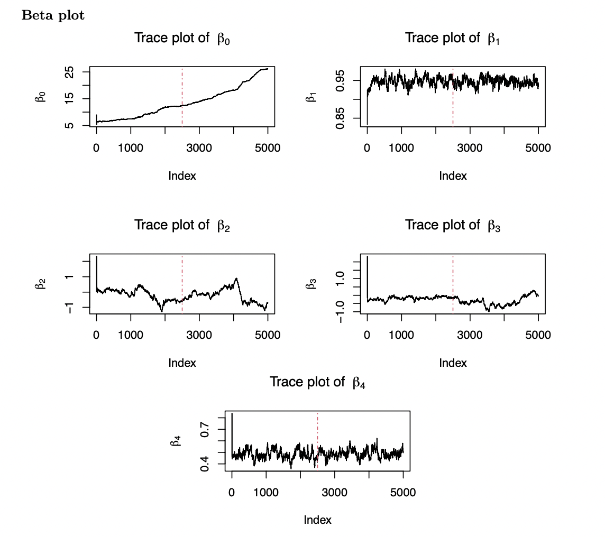
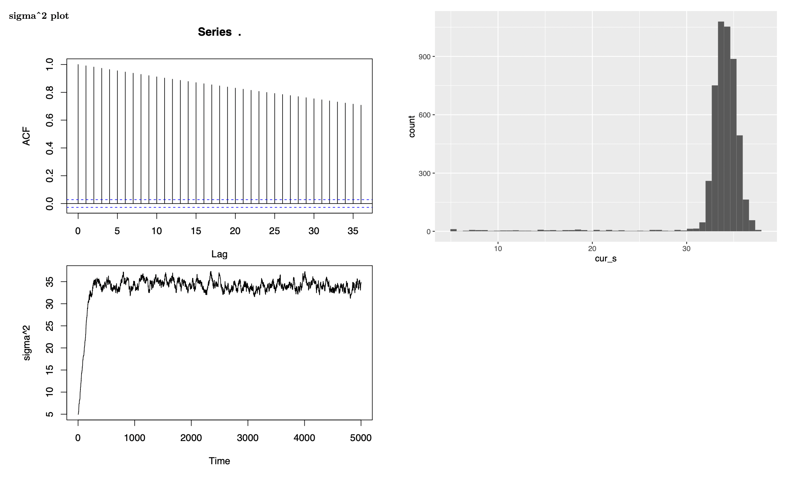
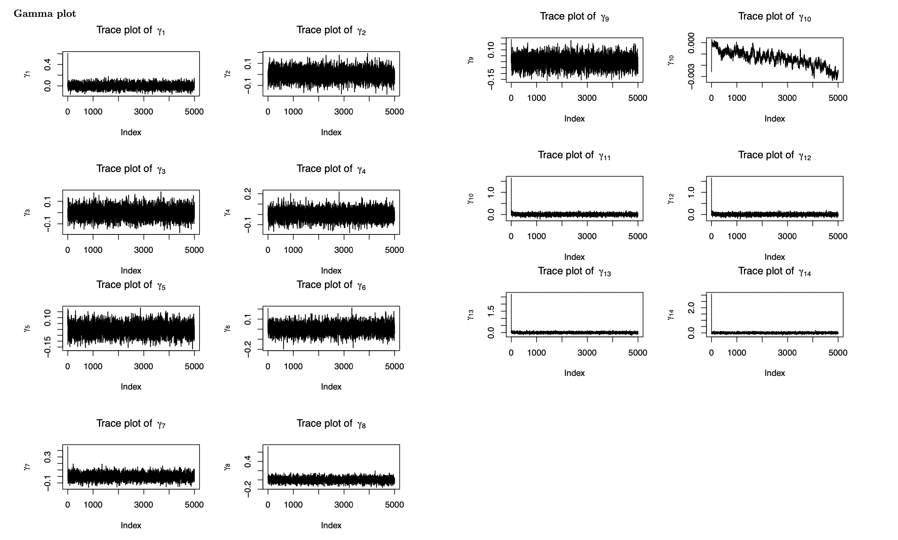
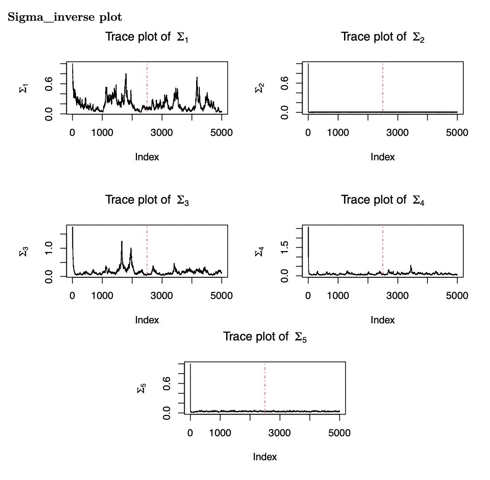

---
title: "P8160 - Project 3"
subtitle: "P8160 Group Project 3 Baysian modeling of hurricane trajectories"
institute: Columbia University
author: "Jingchen Chai, Yi Huang, Zining Qi, Ziyi Wang, Ruihan Zhang"
date: "`r Sys.Date()`"
output:
  beamer_presentation:
    theme: "Madrid"
    colortheme: "default"
    fonttheme: "structurebold"
    latex_engine: xelatex
    slide_level: 2
    
    
    
header-includes:
  - \setbeamerfont{section in toc}{size=\normalsize}
 


---

```{r setup, include=FALSE}
knitr::opts_chunk$set(echo = F, warning = F, message = F)
library(base)
library(caret)
library(corrplot)
library(plotmo)
library(ggplot2)
library(ggpubr)
library(data.table)
library(magick)
library(kableExtra)
library(tidyverse)
```
## Content
1. Introduction\
\
2. Hierarchical Bayesian Model\
\
3. EDA\
\
4. Results\
\
5. Discussion and Conclusion


## Introduction
- Hurricanes cause fatalities and property damage
- There is a growing need to accurately predict hurricane behavior, including location and speed
- This project aims to forecast wind speeds by modeling hurricane trajectories using a Hierarchical Bayesian Model. 

## Dataset
- Hurrican703 dataset: 22038 observations $\times$ 8 variables 
  + 702 hurricanes in the North Atlantic area since 1950
  
## EDA-Count of Hurricanes in each Month

```{r, include = FALSE}
dt= read.csv("./data/hurrican703.csv")

dt <- as.data.table(dt)
summary(dt)


dt_long <- dt %>%
    dplyr::group_by(ID) %>% 
    mutate(Wind_prev = lag(Wind.kt, 1),
           Lat_change = Latitude - lag(Latitude, 1),
           Long_change = Longitude - lag(Longitude, 1),
           Wind_prev_prev = lag(Wind.kt, 2)) %>% 
    mutate(Wind_change = Wind_prev - Wind_prev_prev)
```


```{r}

storms_month_name = distinct(group_by(dt_long, Month, ID), Month)

bx=storms_month_name %>% 
  dplyr::group_by(Month) %>% 
  mutate(Month =  factor(Month, levels = month.name)) %>%  
  ggplot(aes(x = Month)) +
  geom_bar()
bx+ theme(axis.text.x = element_text(angle = 90, vjust = 0.5, hjust=1))


```

## EDA-Count of Hurricanes in each Year


```{r}
storms_season_name = distinct(group_by(dt_long, Season, ID), Season)
ggplot(data = storms_season_name) + 
  geom_bar(aes(x = Season)) +
  scale_x_continuous("Year")

```


## Show hurricance tracks by month
```{r}
map <- ggplot(dt, aes(x = Longitude, y = Latitude, group = ID)) + 
  geom_polygon(data = map_data("world"), 
               aes(x = long, y = lat, group = group), 
               fill = "gray25", colour = "gray10", size = 0.2) + 
  geom_path(data = dt, aes(group = ID, colour = Wind.kt), size = 0.5) + 
  xlim(-138, -20) + ylim(3, 55) + 
  labs(x = "", y = "", colour = "Wind \n(knots)") + 
  theme(panel.background = element_rect(fill = "gray10", colour = "gray30"),
        axis.text.x = element_blank(), axis.text.y = element_blank(), 
        axis.ticks = element_blank(), panel.grid.major = element_blank(),
        panel.grid.minor = element_blank())

seasonrange <- paste(range(dt[, Season]), collapse=" - ")


```
```{r}
mapMonth <- map + facet_wrap(~ Month) +
  ggtitle(paste("Atlantic named Windstorm Trajectories by Month (", 
                 seasonrange, ")\n")) 
mapMonth
```


## Bayesian Model

The suggested Bayesian model is $Y_{i}(t+6) =\beta_{0,i}+\beta_{1,i}Y_{i}(t) + \beta_{2,i}\Delta_{i,1}(t)+ \beta_{3,i}\Delta_{i,2}(t) +\beta_{4,i}\Delta_{i,3}(t)  +\boldsymbol{X_i}\gamma+ \epsilon_{i}(t)$ 

- where $Y_{i}(t)$ the wind speed at time $t$ (i.e. 6 hours earlier),  $\Delta_{i,1}(t)$, $\Delta_{i,2}(t)$ and $\Delta_{i,3}(t)$ are the changes of latitude, longitude and wind speed between $t$ and $t-6$, and $\epsilon_{i,t}$ follows a  normal distributions with mean zero and variance $\sigma^2$, independent across $t$. 

- $\boldsymbol{\beta}_{i} =  (\beta_{0,i},\beta_{1,i},...,\beta_{5,i})$, we assume that $\boldsymbol{\beta}_{i} \sim N(\boldsymbol{\mu}, \boldsymbol{\Sigma})$, where $d$ is dimension of $\boldsymbol{\beta}_{i}$.

## Priors
$$
\scriptsize{
\begin{aligned}
\quad P(\boldsymbol{\mu}) = \frac{1}{\sqrt{2\pi}|\boldsymbol V|^{\frac{1}{2}}}\exp\{-\frac{1}{2}\boldsymbol\mu^{\top}\boldsymbol V^{-1}\boldsymbol\mu\}\propto |\boldsymbol V|^{-\frac{1}{2}}\exp\{-\frac{1}{2}\boldsymbol\mu^{\top}\boldsymbol V^{-1}\boldsymbol\mu\}
\end{aligned}
}
$$
where $\boldsymbol{V}$ is a variance-covariance matrix
$$
\scriptsize{
\begin{aligned}
\quad P(\Sigma) \propto 
|\Sigma|^{-\frac{(\nu+d+1)}{2}} \exp(-\frac{1}{2}tr(S\Sigma^{-1}))
\end{aligned}
}
$$
$$
\scriptsize{
\begin{aligned}
P(\gamma) \propto exp(-\frac{\gamma^2}{2*(0.05)^2}) =e^{-200\gamma^2}
\end{aligned}
}
$$

$$
\scriptsize{
\begin{aligned}
P(\sigma) = \frac{2\alpha}{\pi+\alpha^2} \propto \frac{1}{\sigma^2+\alpha^2}
\end{aligned}
}
$$

## Posterior

Let $\textbf{B} = (\boldsymbol{\beta}_1^\top,..., \boldsymbol{\beta}_n^\top)^\top$, derive the posterior distribution of the parameters $\Theta = (\textbf{B}^\top, \boldsymbol{\mu}^\top, \sigma^2, \Sigma, \gamma)$.
\
\
Let

$$
\scriptsize{
\begin{aligned}
\boldsymbol{Z}_i(t)\boldsymbol{\beta}_i^\top = \beta_{0,i} + \beta_{1,i}Y_i(t) + \beta_{2,i}\Delta_{i,1}(t) + \beta_{3,i}\Delta_{i,2}(t) + \beta_{4,i}\Delta_{i,3}(t) + \boldsymbol{X_i}\gamma+\epsilon_{i}(t)
\end{aligned}
}
$$
We can find that
$$
\scriptsize{
\begin{aligned}
\boldsymbol{Y_i} {\sim} MVN(\boldsymbol{Z}_i\boldsymbol{\beta}_i, \sigma^2I)
\end{aligned}
}
$$

The likelihood for our data is
$$
\scriptsize{
\begin{aligned}
f(Y \mid \boldsymbol B, \boldsymbol \mu, \sigma^2, \boldsymbol \Sigma,\gamma) =\\ \prod_{i = 1}^N f(Y_i | B, \mu, \Sigma, \sigma^2) = &\prod_{i=1}^n\frac{1}{\sqrt{2\pi}\sigma}\exp\{-\frac{1}{2}(\boldsymbol{y}_i - \boldsymbol{Z}_i\boldsymbol{\beta}_i-\boldsymbol{X_i}\boldsymbol\gamma_i)^\top (\sigma^2 I)^{-1}(\boldsymbol{y}_i - \boldsymbol{Z}_i\boldsymbol{\beta}_i-\boldsymbol{X_i}\boldsymbol\gamma_i)\}\\
\propto & (2\pi\sigma^2)^{-\frac{N}{2}} \prod_{i=1}^n\exp\big\{-\frac{1}{2}(\boldsymbol{Y}_i - \boldsymbol{Z}_i\boldsymbol{\beta}_i-\boldsymbol{X_i}\boldsymbol\gamma_i)^\top (\sigma^2 I)^{-1}(\boldsymbol{Y}_i - \boldsymbol{Z}_i\boldsymbol{\beta}_i-\boldsymbol{X_i}\boldsymbol\gamma_i)\big\}
\end{aligned}
}
$$
where N is the total number of hurricanes.
## Joint Posterior

$$
\scriptsize{
\begin{aligned}
\pi(\Theta|Y) = & P(B, \mu, \sigma^2, \Sigma, \gamma|Y) \\ 
&\propto L(Y| B, \sigma^2)L(B|\mu,\Sigma)p(\mu)p(\sigma)p(\Sigma)p(\gamma)\\
&\propto \frac{1}{\sigma^{N}(\sigma^2+10^2)} \prod_{i=1}^n\exp\big\{-\frac{1}{2}(\boldsymbol{Y}_i - \boldsymbol{Z}_i\boldsymbol{\beta}_i-\boldsymbol{X_i}\boldsymbol\gamma_i)^\top (\sigma^2 I)^{-1}(\boldsymbol{Y}_i - \boldsymbol{Z}_i\boldsymbol{\beta}_i-\boldsymbol{X_i}\boldsymbol\gamma_i)\big\}\\
&\times \exp\{-\frac{1}{2}\sum_i^n(\beta_i-\mu)^\top \Sigma^{-1}(\beta_i-\mu)\} |\Sigma^{-1}|^{\frac{N+d+v+1}{2}} \exp\{-\frac{1}{2}tr(S\Sigma^{-1})\}|\boldsymbol V|^{-\frac{1}{2}}\exp\{-\frac{1}{2}\boldsymbol\mu^{\top}\boldsymbol V^{-1}\boldsymbol\mu\}\exp\{-200\gamma^2\}
\end{aligned}
}
$$
where $\boldsymbol{V}$ is a variance-covariance matrix, N is the total number of hurricanes and d is the dimension of $\beta$, and v is the degree of freedom.

## Conditional Distributions
Generate $B_t$ from $f(B_t, \sigma_{t-1},\mu_{t-1},\Sigma_{t-1}^{-1})$

$$
\scriptsize{
\begin{aligned}
f(B^\top|\sigma^2,\mu,\Sigma) &\propto \prod_{i=1}^n\exp \{-\frac{(Y_j-Z_j\beta_j-X_j\gamma)^\top(Y_jZ_j\beta_j-X_j\gamma)}{2\sigma^2}-\frac{(\beta_j-\mu)^\top\Sigma^{-1}(\beta_j-\mu)}{2}\}\\
&\propto \prod_{i=1}^n\exp(-\frac{1}{2}(\beta_j^\top(\frac{Z_j^\top Z_j}{\sigma^2}+\Sigma^{-1})\beta_j-2(\frac{Y_j^\top Z_j-X_j^\top Z_j\gamma}{\sigma^2}+\mu^\top \Sigma^{-1})\beta_j))\\
&\propto \prod_{i=1}^n\exp\{-\frac{1}{2}(\beta_j-(\frac{Z_j^\top Z_j}{\sigma^2}+\Sigma^{-1})(\beta_j-(\frac{Z_j^\top Z_j}{\sigma^2}+\Sigma^{-1})^{-1}(\frac{Y_j^\top Z_j-X_j^\top Z_j\gamma}{\sigma^2}+\mu^\top \Sigma^{-1})^\top))\}
\end{aligned}
}
$$
$MVN_d((\frac{Z_j^\top Z_j}{\sigma^2}+\Sigma^{-1})^{-1}(\frac{Y_j^\top Z_j^\top-X_j^\top Z_j\gamma}{\sigma^2}+\mu^\top \Sigma^{-1})^\top,\frac{Z_j^\top Z_j}{\sigma^2}+\Sigma^{-1})^{-1})$


## MCMC Algorithm

$$
\scriptsize{
\begin{aligned}
\beta_i\sim MVN_d(N^{-1}M^\top,N^{-1})
\end{aligned}
}
$$
where $N=\frac{Z_j^\top Z_j}{\sigma^2}+\Sigma^{-1}$ and $M=\frac{Y_j^\top Z_j^\top-X_j^\top Z_j\gamma}{\sigma^2}+\mu^\top \Sigma^{-1}$
$$
\scriptsize{
\begin{aligned}
\mu_t \sim MVN_d(N^{-1}M^\top,N^{-1})
\end{aligned}
}
$$
where $N=NA+\frac{1}{v}$ and $M=\sum_i^n\beta_jA$, and v is the degree of freedom.


$$
\scriptsize{
\begin{aligned}
\boldsymbol{\Sigma} \sim w^{-1}(\boldsymbol{S+\sum_i^n(\beta_i-\mu)(\beta_i-\mu)^\top,n+v})
\end{aligned}
}
$$

$$
\scriptsize{
\begin{aligned}
\gamma \sim MVN(N^{-1}M^\top,N^{-1})
\end{aligned}
}
$$
where $N=\frac{X_j^\top X_j}{\sigma^2}+400I$ and $M=\sum_i^nY_j^\top X_j-\sum_i^nX_jZ_j\beta_j$

## MCMC Algorithm - Metropolis-Hastings

*Target distribution is 
$$
\scriptsize{
\begin{aligned}
\pi(\sigma|\boldsymbol{Y},\textbf{B}^\top, \boldsymbol{\mu}^\top,\boldsymbol{\Sigma},\boldsymbol{\gamma})
&\propto \frac{1}{\sigma^{N}(\sigma^2+10^2)} \\
&\times \prod_{i=1}^n\exp\big\{-\frac{1}{2(\sigma^2 I)}(\boldsymbol{Y}_i - \boldsymbol{Z}_i\boldsymbol{\beta}_i-\boldsymbol{X_i}\boldsymbol\gamma_i)^\top (\boldsymbol{Y}_i - \boldsymbol{Z}_i\boldsymbol{\beta}_i-\boldsymbol{X_i}\boldsymbol\gamma_i)\big\}
\end{aligned}
}
$$

- Choose a random walk with step size distributed as a uniform random variable 

- The conditional density is $q(x|y) = \frac{1}{2a}1_{[y-a, y+a]}(x)$

- Proposed q is symmetric, thus the acceptance rate is only depend on $P(\sigma|B, \mu, A, \gamma, Y)$


## MCMC Algorithm - Metropolis-Hastings

- The acceptance rate $\alpha_{XY} = \min(1, \frac{P(X|B, \mu, A, \gamma, Y)}{P(Y|B, \mu, A, \gamma, Y)})$

- Accept X if $U < \alpha_{XY}$

- Iterate over 1000 times

- New $\sigma$ is the mean of last 200 values in the chain


## MCMC Algorithm - Gibbs Sampling

We apply a MCMC algorithm consisting of Gibb Samping and Metropolis-Hastings steps. 

Parameters are updated component-wise for each $k = 1, ..., N, N = 5000$:

- Generate $\beta_{ij}, j = 0, 1, 2, 3, 4$ for $i^{th}$ hurricane from $\pi(\textbf{B}|\boldsymbol{Y}, \boldsymbol{\mu}_{k-1}^\top,\boldsymbol{\sigma}_{k-1}, \boldsymbol{\Sigma}_{k-1},\boldsymbol{\gamma}_{k-1})$

- Generate $\mu_{j}, j = 0, 1, 2, 3, 4$ from $\pi(\boldsymbol{\mu}|\boldsymbol{Y}, \textbf{B}_{k},\boldsymbol{\sigma}_{k-1}, \boldsymbol{\Sigma}_{k-1},\boldsymbol{\gamma}_{k-1})$

- Generate $\sigma_{k}$ from the Metropolis-Hastings steps

- Generate $\Sigma_{k}$ from $\pi(\boldsymbol{\Sigma}|\boldsymbol{Y}, \textbf{B}_{k},\boldsymbol{\mu}_{k}, \boldsymbol{\sigma}_{k},\boldsymbol{\gamma}_{k-1})$

- Generate $\gamma_{k}$ from $\pi(\boldsymbol{\gamma}|\boldsymbol{Y}, \textbf{B}_{k},\boldsymbol{\mu}_{k}, \boldsymbol{\sigma}_{k},\boldsymbol{\Sigma}_{k})$

## MCMC Algorithm - Initial Values

We first fit a Generalize Linear Mixed Models(GLMM) \

- $\beta_i^{(0)}$: The random effect for $i^{th}$ hurricane from GLMM as start values\

- $\mu^{(0)}$: Average over $\beta_i^{(0)}$ \

- $\sigma^{(0)}$: Residuals from the GLMM \

- $\Sigma^{(0)}$: Variance-Covariance matrix of $\beta_i^{(0)}$\

- $\gamma^{(0)}$: Fixed effects from the GLMM\


## MCMC Results - Beta Plots 
```{r,echo=FALSE,out.width='70%',out.height='70%',fig.align='center'}

```
-Trace plots of variance parameters, based on 5000 MCMC sample.


## MCMC Results - sigma^2 Plots 
```{r}


pic1 <- image_read("plots/sigma1.png")
pic2 <- image_read("plots/sigma2.png")

# Combine the pictures side by side
combined <- image_append(c(pic1, pic2), stack=FALSE)

# Save the combined picture to a file
image_write(combined, path = "plots/combinedsigma1.png")

# Open the combined picture using your system's image viewer
system("plots/combinedsigma1.png")
```


```{r,echo=FALSE,out.width='90%',out.height='100%',fig.align='center'}

```


## MCMC Results - Gamma Plots 
```{r}


pic5 <- image_read("plots/gamma1.png")
pic6 <- image_read("plots/gamma2.png")

# Combine the pictures side by side
combined <- image_append(c(pic5, pic6), stack=FALSE)

# Save the combined picture to a file
image_write(combined, "plots/combinedgamma1.png")


```


```{r,echo=FALSE,out.width='90%',out.height='90%',fig.align='center'}

```


## MCMC Results - Sigma Inverse Plots 
```{r,echo=FALSE,out.width='90%',out.height='90%',fig.align='center'}

```


