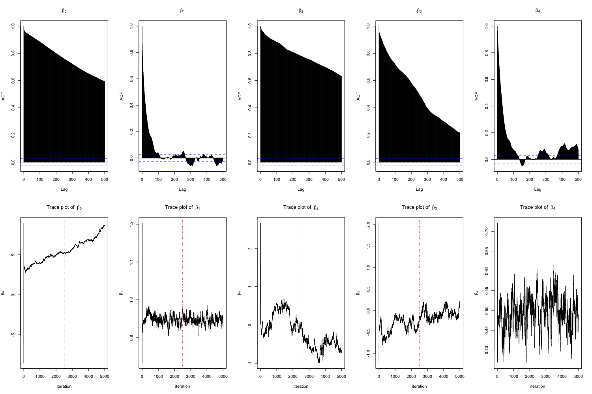
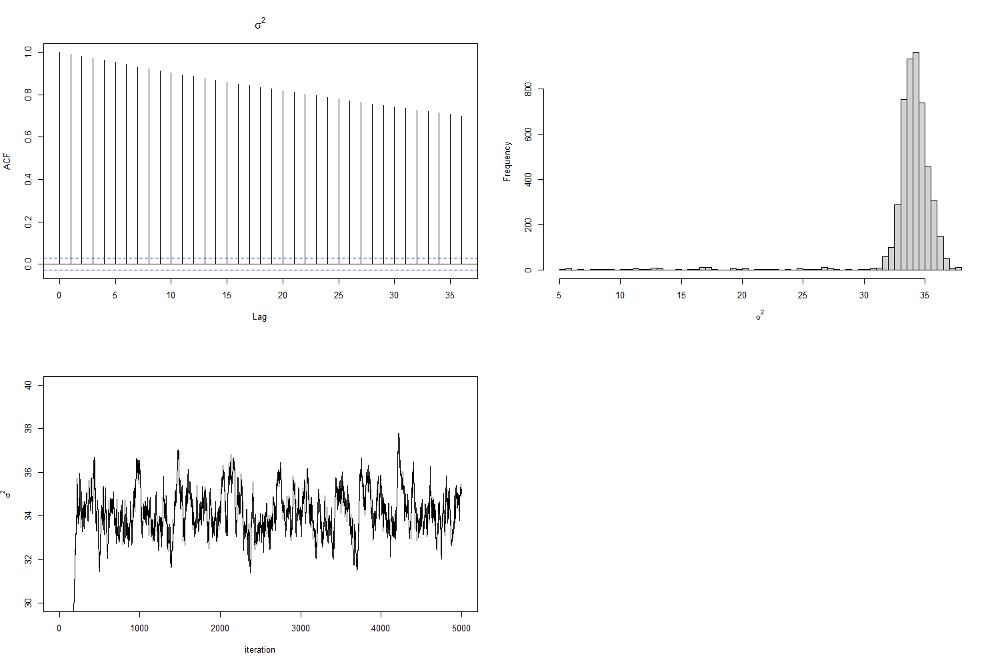

---
title: "P8160 - Project 3"
subtitle: "P8160 Group Project 3 Baysian modeling of hurricane trajectories"
institute: Columbia University
author: "Jingchen Chai, Yi Huang, Zining Qi, Ziyi Wang, Ruihan Zhang"
date: "`r Sys.Date()`"
output:
  beamer_presentation:
    theme: "Madrid"
    colortheme: "default"
    fonttheme: "structurebold"
    latex_engine: xelatex
    slide_level: 2
header-includes:
  - \setbeamerfont{section in toc}{size=\normalsize}

---

```{r setup, include=FALSE}
knitr::opts_chunk$set(echo = F, warning = F, message = F)
library(base)
library(caret)
library(corrplot)
library(plotmo)
library(ggplot2)
library(ggpubr)
library(data.table)
library(magick)
library(kableExtra)
library(tidyverse)
library(maps)
```
## Content
1. Introduction\
\
2. EDA\
\
3. Method\
\
4. Results\
\
5. Limitations and Conclusion


## Introduction
- Hurricanes cause fatalities and property damage
- There is a growing need to accurately predict hurricane behavior, including location and speed (Taboga, 2021)
- This project aims to forecast wind speeds by modeling hurricane trajectories using a Hierarchical Bayesian Model. 

## Data 

**ID**: ID of hurricanes

**Year**: In which year the hurricane occurred

**Month**: In which month the hurricane occurred

**Nature**: Nature of the hurricane

- ET: Extra Tropical
- DS: Disturbance
- NR: Not Rated
- SS: Sub Tropical
- TS: Tropical Storm

**Time**: dates and time of the record

**Latitude** and **Longitude**: The location of a hurricane check point

**Wind.kt**: Maximum wind speed (in Knot) at each check point


## Data Pre-processing

- We have filtered observations that occurred on a 6-hour intervals. (e.g., hour 0, 6, 12, 18)

- Calculated the lag difference for latitude, longitude and wind speed. 

- After data cleaning, we obtained 20293 observations and with 699 different hurricanes. 


## EDA-Count of Hurricanes in each Month

```{r, include = FALSE}
dt = read.csv("./data/hurrican703.csv")

dt <- as.data.table(dt)
summary(dt)


dt_long <- dt %>%
    dplyr::group_by(ID) %>% 
    mutate(Wind_prev = lag(Wind.kt, 1),
           Lat_change = Latitude - lag(Latitude, 1),
           Long_change = Longitude - lag(Longitude, 1),
           Wind_prev_prev = lag(Wind.kt, 2)) %>% 
    mutate(Wind_change = Wind_prev - Wind_prev_prev)
```


```{r}

storms_month_name = distinct(group_by(dt_long, Month, ID), Month)

bx =storms_month_name %>% 
  dplyr::group_by(Month) %>% 
  mutate(Month =  factor(Month, levels = month.name)) %>%  
  ggplot(aes(x = Month)) +
  geom_bar()
bx + theme(axis.text.x = element_text(angle = 90, vjust = 0.5, hjust=1))

```

## EDA-Count of Hurricanes in each Year
```{r}
storms_season_name = distinct(group_by(dt_long, Season, ID), Season)
ggplot(data = storms_season_name) + 
  geom_bar(aes(x = Season)) +
  scale_x_continuous("Year")

```


## Show hurricance tracks by month
```{r}
map <- ggplot(dt, aes(x = Longitude, y = Latitude, group = ID)) + 
  geom_polygon(data = map_data("world"), 
               aes(x = long, y = lat, group = group), 
               fill = "gray25", colour = "gray10", size = 0.2) + 
  geom_path(data = dt, aes(group = ID, colour = Wind.kt), size = 0.5) + 
  xlim(-138, -20) + ylim(3, 55) + 
  labs(x = "", y = "", colour = "Wind \n(knots)") + 
  theme(panel.background = element_rect(fill = "gray10", colour = "gray30"),
        axis.text.x = element_blank(), axis.text.y = element_blank(), 
        axis.ticks = element_blank(), panel.grid.major = element_blank(),
        panel.grid.minor = element_blank())

seasonrange <- paste(range(dt[, Season]), collapse =" - ")


```

```{r}
mapMonth <- map + facet_wrap(~ Month) +
  ggtitle(paste("Atlantic named Windstorm Trajectories by Month (", 
                 seasonrange, ")\n")) 
mapMonth
```


## Bayesian Model

The suggested Bayesian model is $Y_{i}(t+6) =\beta_{0,i}+\beta_{1,i}Y_{i}(t) + \beta_{2,i}\Delta_{i,1}(t)+ \beta_{3,i}\Delta_{i,2}(t) +\beta_{4,i}\Delta_{i,3}(t)  +\boldsymbol{X_i}\gamma+ \epsilon_{i}(t)$ 

- where $Y_{i}(t)$ the wind speed at time $t$ (i.e. 6 hours earlier),  $\Delta_{i,1}(t)$, $\Delta_{i,2}(t)$ and $\Delta_{i,3}(t)$ are the changes of latitude, longitude and wind speed between $t$ and $t-6$, and $\epsilon_{i,t}$ follows a  normal distributions with mean zero and variance $\sigma^2$, independent across $t$. 

- $\boldsymbol{X}_i = (x_{i,1},x_{i,2},x_{i,3})$ are covariates with fixed
effect $\gamma$, where $x_{i,1}$ be the month of year when the $i$-th
hurricane started, $x_{i,2}$ be the calendar year of the $i$ hurricane,
and $x_{i,3}$ be the type of the $i$-th hurricane.

- $\boldsymbol{\beta}_{i} =  (\beta_{0,i},\beta_{1,i},...,\beta_{5,i})$, we assume that $\boldsymbol{\beta}_{i} \sim N(\boldsymbol{\mu}, \boldsymbol{\Sigma})$.

## Prior Distribution
$$
\scriptsize{
\begin{aligned}
\quad P(\boldsymbol{\mu}) = \frac{1}{\sqrt{2\pi}|\boldsymbol V|^{\frac{1}{2}}}\exp\{-\frac{1}{2}\boldsymbol\mu^{\top}\boldsymbol V^{-1}\boldsymbol\mu\}\propto |\boldsymbol V|^{-\frac{1}{2}}\exp\{-\frac{1}{2}\boldsymbol\mu^{\top}\boldsymbol V^{-1}\boldsymbol\mu\}
\end{aligned}
}
$$
\begin{center} 
where $\boldsymbol{V}$ is a variance-covariance matrix
\end{center} 

$$
\scriptsize{
\begin{aligned}
\quad P(\Sigma) \propto 
|\Sigma|^{-\frac{(\nu+d+1)}{2}} \exp(-\frac{1}{2}tr(S\Sigma^{-1}))
\end{aligned}
}
$$

\begin{center} 
where $d$ is the dimension of $\boldsymbol{\beta}_{i}$.
\end{center} 

$$
\scriptsize{
\begin{aligned}
P(\gamma) \propto exp(-\frac{\gamma^2}{2*(0.05)^2}) =e^{-200\gamma^2}
\end{aligned}
}
$$

$$
\scriptsize{
\begin{aligned}
P(\sigma) = \frac{2\alpha}{\pi+\alpha^2} \propto \frac{1}{\sigma^2+\alpha^2} = \frac{1}{\sigma^2+100}
\end{aligned}
}
$$

## Posterior

Let $\textbf{B} = (\boldsymbol{\beta}_1^\top,..., \boldsymbol{\beta}_n^\top)^\top$, derive the posterior distribution of the parameters $\Theta = (\textbf{B}^\top, \boldsymbol{\mu}^\top, \sigma^2, \Sigma, \gamma)$.
\
\
Let$\boldsymbol{Z}_i(t)\boldsymbol{\beta}_i^\top = \beta_{0,i} + \beta_{1,i}Y_i(t) + \beta_{2,i}\Delta_{i,1}(t) + \beta_{3,i}\Delta_{i,2}(t) + \beta_{4,i}\Delta_{i,3}(t) + \boldsymbol{X_i}\gamma+\epsilon_{i}(t)$
We can find that
$$
\scriptsize{
\begin{aligned}
\boldsymbol{Y_i} {\sim} MVN(\boldsymbol{Z}_i\boldsymbol{\beta}_i, \sigma^2I)
\end{aligned}
}
$$

The likelihood for Y is
$$
\scriptsize{
\begin{aligned}
&f(Y \mid \boldsymbol B, \boldsymbol \mu, \sigma^2, \boldsymbol \Sigma,\gamma) = \prod_{i = 1}^n f(Y_i | B, \mu, \Sigma, \sigma^2)=\\&\prod_{i=1}^n\frac{1}{\sqrt{2\pi}\sigma}\exp\{-\frac{1}{2}(\boldsymbol{y}_i - \boldsymbol{Z}_i\boldsymbol{\beta}_i-\boldsymbol{X_i}\boldsymbol\gamma_i)^\top (\sigma^2 I)^{-1}(\boldsymbol{y}_i - \boldsymbol{Z}_i\boldsymbol{\beta}_i-\boldsymbol{X_i}\boldsymbol\gamma_i)\}\\
&\propto  (2\pi\sigma^2)^{-\frac{n}{2}} \prod_{i=1}^n\exp\big\{-\frac{1}{2}(\boldsymbol{Y}_i - \boldsymbol{Z}_i\boldsymbol{\beta}_i-\boldsymbol{X_i}\boldsymbol\gamma_i)^\top (\sigma^2 I)^{-1}(\boldsymbol{Y}_i - \boldsymbol{Z}_i\boldsymbol{\beta}_i-\boldsymbol{X_i}\boldsymbol\gamma_i)\big\}
\end{aligned}
}
$$

## Joint Posterior

$$
\scriptsize{
\begin{aligned}
&\pi(\Theta|Y) =  P(B, \mu, \sigma^2, \Sigma, \gamma|Y)  
\propto \underbrace{L(Y| B, \sigma^2)}_{\text{likelihood of } \boldsymbol{Y}}\underbrace{L(B|\mu,\Sigma)}_{\text{distribution of }\textbf{B}}\underbrace{p(\mu)p(\sigma)p(\Sigma)p(\gamma)}_{\text{priors}}\\
&\propto \frac{1}{\sigma^{N}(\sigma^2+10^2)} \prod_{i=1}^n\exp\big\{-\frac{1}{2}(\boldsymbol{Y}_i - \boldsymbol{Z}_i\boldsymbol{\beta}_i-\boldsymbol{X_i}\boldsymbol\gamma_i)^\top (\sigma^2 I)^{-1}(\boldsymbol{Y}_i - \boldsymbol{Z}_i\boldsymbol{\beta}_i-\boldsymbol{X_i}\boldsymbol\gamma_i)\big\}\\
&\times \exp\{-\frac{1}{2}\sum_i^n(\beta_i-\mu)^\top \Sigma^{-1}(\beta_i-\mu)\} |\Sigma^{-1}|^{\frac{N+d+v+1}{2}} \exp\{-\frac{1}{2}tr(S\Sigma^{-1})\}|\boldsymbol V|^{-\frac{1}{2}}\\
&\times \exp\{-\frac{1}{2}\boldsymbol\mu^{\top}\boldsymbol V^{-1}\boldsymbol\mu\} \\
&\times\exp\{-200\gamma^2\}
\end{aligned}
}
$$
where $\boldsymbol{V}$ is a variance-covariance matrix, N is the total number of hurricanes and d is the dimension of $\beta$, and v is the degree of freedom.

## MCMC for Hierarchical Bayesian Model: Method
**Conditional Distribution of each parameter:**

- $\beta_i \sim MVN(N^{-1}M,N^{-1})$, where $N=\frac{Z_i^\top Z_i}{\sigma^2}+\Sigma^{-1}$, $M=\frac{Z_i^\top Y_i-Z_i^\top X_i\gamma}{\sigma^2}+\mu \Sigma^{-1}$

- $\mu \sim MVN(H^{-1}M, N^{-1})$, where $H=N\Sigma^{-1}-\frac{1}{V}$, $M=\sum_i^n\beta_i\Sigma^{-1}$

- $\boldsymbol{\Sigma} \sim W^{-1}(\boldsymbol{S+\sum_i^n(\beta_i-\mu)(\beta_i-\mu)^\top,n+v})$

- $\gamma \sim MVN(N^{-1}M,N^{-1})$, where $N=\frac{\sum_i^nX_i^\top X_i}{\sigma^2}+400I$, M=$\frac{\sum_i^n(X_i^\top Y_i-X_i^\top Z_i\beta_i)}{\sigma^2}$
-
$$
\scriptsize{
\begin{aligned}
\pi(\sigma|\boldsymbol{Y},\textbf{B}^\top, \boldsymbol{\mu}^\top,\boldsymbol{\Sigma},\boldsymbol{\gamma})
&\propto \frac{1}{\sigma^{N}(\sigma^2+10^2)} \\
&\times \prod_{i=1}^n\exp\big\{-\frac{1}{2(\sigma^2 I)}(\boldsymbol{Y}_i - \boldsymbol{Z}_i\boldsymbol{\beta}_i-\boldsymbol{X_i}\boldsymbol\gamma_i)^\top (\boldsymbol{Y}_i - \boldsymbol{Z}_i\boldsymbol{\beta}_i-\boldsymbol{X_i}\boldsymbol\gamma_i)\big\}
\end{aligned}
}
$$


## MCMC Algorithm - Metropolis-Hastings

- Target distribution is 
$$
\scriptsize{
\begin{aligned}
\pi(\sigma|\boldsymbol{Y},\textbf{B}^\top, \boldsymbol{\mu}^\top,\boldsymbol{\Sigma},\boldsymbol{\gamma})
&\propto \frac{1}{\sigma^{N}(\sigma^2+10^2)} \\
&\times \prod_{i=1}^n\exp\big\{-\frac{1}{2(\sigma^2 I)}(\boldsymbol{Y}_i - \boldsymbol{Z}_i\boldsymbol{\beta}_i-\boldsymbol{X_i}\boldsymbol\gamma_i)^\top (\boldsymbol{Y}_i - \boldsymbol{Z}_i\boldsymbol{\beta}_i-\boldsymbol{X_i}\boldsymbol\gamma_i)\big\}
\end{aligned}
}
$$

- Choose a random walk with step size distributed as a uniform random variable 

- The conditional density is $q(x|y) = \frac{1}{2a}1_{[y-a, y+a]}(x)$

- Proposed q is symmetric, thus the acceptance rate is only depend on $P(\sigma|B, \mu, A, \gamma, Y)$


## MCMC Algorithm - Metropolis-Hastings

- The acceptance rate $\alpha_{XY} = \min(1, \frac{P(X|B, \mu, A, \gamma, Y)}{P(Y|B, \mu, A, \gamma, Y)})$

- Accept X if $U < \alpha_{XY}$

- Iterate over 1000 times

- New $\sigma$ is the mean of last 200 values in the chain


## MCMC Algorithm - Gibbs Sampling

We apply a MCMC algorithm consisting of Gibb Samping and Metropolis-Hastings steps. 

Parameters are updated component-wise for each $k = 1, ..., N, N = 5000$:

- Generate $\beta_{ij}, j = 0, 1, 2, 3, 4$ for $i^{th}$ hurricane from $\pi(\textbf{B}|\boldsymbol{Y}, \boldsymbol{\mu}_{k-1}^\top,\boldsymbol{\sigma}_{k-1}, \boldsymbol{\Sigma}_{k-1},\boldsymbol{\gamma}_{k-1})$

- Generate $\mu_{j}, j = 0, 1, 2, 3, 4$ from $\pi(\boldsymbol{\mu}|\boldsymbol{Y}, \textbf{B}_{k},\boldsymbol{\sigma}_{k-1}, \boldsymbol{\Sigma}_{k-1},\boldsymbol{\gamma}_{k-1})$

- Generate $\sigma_{k}$ from the Metropolis-Hastings steps

- Generate $\Sigma_{k}$ from $\pi(\boldsymbol{\Sigma}|\boldsymbol{Y}, \textbf{B}_{k},\boldsymbol{\mu}_{k}, \boldsymbol{\sigma}_{k},\boldsymbol{\gamma}_{k-1})$

- Generate $\gamma_{k}$ from $\pi(\boldsymbol{\gamma}|\boldsymbol{Y}, \textbf{B}_{k},\boldsymbol{\mu}_{k}, \boldsymbol{\sigma}_{k},\boldsymbol{\Sigma}_{k})$

## MCMC Algorithm - Initial Values

We first fit a Generalize Linear Mixed Models(GLMM) \

- $\beta_i^{(0)}$: The random effect for $i^{th}$ hurricane from GLMM as start values\

- $\mu^{(0)}$: Average over $\beta_i^{(0)}$ \

- $\sigma^{(0)}$: Residuals from the GLMM \

- $\Sigma^{(0)}$: Variance-Covariance matrix of $\beta_i^{(0)}$\

- $\gamma^{(0)}$: Fixed effects from the GLMM\


## MCMC Results - Convergence plot of $\boldsymbol{B}$

```{r,echo=FALSE,out.width='70%',out.height='70%',fig.align='center'}

```


## MCMC Results - Selected $\boldsymbol{B}$: Hurricane GEORGE.1951 

```{r,echo=FALSE,out.width='70%',out.height='70%',fig.align='center'}
knitr::include_graphics("graph/beta_hurricane GEORGE.1951.png")
```


## MCMC Results - Beta Plots 
```{r,echo=FALSE,out.width='70%',out.height='70%',fig.align='center'}
knitr::include_graphics("plots/beta1.png")
```


## MCMC Results - sigma^2 Plots 
```{r}


pic1 <- image_read("plots/sigma1.png")
pic2 <- image_read("plots/sigma2.png")

# Combine the pictures side by side
combined <- image_append(c(pic1, pic2), stack=FALSE)

# Save the combined picture to a file
image_write(combined, path = "plots/combinedsigma1.png")

# Open the combined picture using your system's image viewer
system("plots/combinedsigma1.png")
```


```{r,echo=FALSE,out.width='90%',out.height='100%',fig.align='center'}

```


## MCMC Results - Gamma Plots 
```{r}


pic5 <- image_read("plots/gamma1.png")
pic6 <- image_read("plots/gamma2.png")

# Combine the pictures side by side
combined <- image_append(c(pic5, pic6), stack = FALSE)

# Save the combined picture to a file
image_write(combined, "plots/combinedgamma1.png")


```


```{r,echo=FALSE,out.width='90%',out.height='100%',fig.align='center'}
knitr::include_graphics("plots/combinedgamma1.png")
```


## MCMC Results - Sigma Plots 
```{r,echo=FALSE,out.width='90%',out.height='90%',fig.align='center'}
knitr::include_graphics("plots/sigmainverse1.png")
```

## 95% credible intervals of Gamma

|$95\% CI$ | $2.5\%$ | $97.5\%$ |
|:---:|:---:|:---:|
| | $-0.003099822$ | $-0.001501638$ |

## Are there seasonal differences in hurricane wind speeds?

## Are hrricane wind speeds increasing over the years?
- $H_0$: $\gamma_{10} \le 0$; vs $H_1$: $\gamma_{10} > 0$

|$95\% CI$ | $2.5\%$ | $97.5\%$ |
|:---:|:---:|:---:|
| | $-0.003099822$ | $-0.001501638$ |

- Fail to reject $H_1$. No evidence to support the claim that hurricane wind speeds have been increasing over the years.

## Bayesian Model Performance
-The overall mean RMSE is 6.467.

```{r,echo=FALSE,out.width='90%',out.height='80%',fig.align='center'}
knitr::include_graphics("q4/4.png")
```


## Bayesian Model Performance
```{r}
pic1 <- image_read("q4/1.jpg")
pic2 <- image_read("q4/2.jpg")
pic3 <- image_read("q4/3.jpg")
# Combine the pictures side by side
combined <- image_append(c(pic1, pic2,pic3), stack=FALSE)

# Save the combined picture to a file
image_write(combined, path = "q4/combine.png")

# Open the combined picture using your system's image viewer
system("q4/combine.png")
```
```{r,echo=FALSE,out.width='90%',out.height='80%',fig.align='center'}
knitr::include_graphics("q4/combine.png")
```
\begin{center}                      
Estimated Wind Speed vs. Predicted Wind Speed
\end{center}

## Limitations
-Long running time for MCMC algorithm

-Low performance on hurricanes without enough observations

## Conclusion
- Our MCMC algorithm successfully estimates the high-dimensional parameters

    + All the parameters converges under a good initial values setting
    
    + The overall $R^2$ is relatively large, and the overall RMSE is relatively small, so our model  fits the data well

- There are no discernible variations between the months. The impact of the wind speed from six months ago on the current wind speed may gradually diminish over time. 

- When it comes to foretelling the harm and fatalities brought on by storms, the $\beta_i$ coefficients calculated from the Bayesian model are effective.

## Reference
Taboga, Marco (2021). "Markov Chain Monte Carlo (MCMC) diagnostics", Lectures on probability theory and mathematical statistics. Kindle Direct Publishing. Online appendix.

## Q&A

Thank you for your attention. Any questions?

