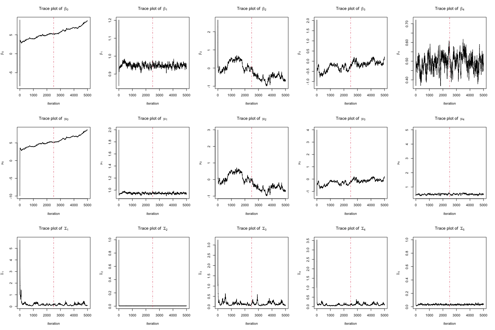
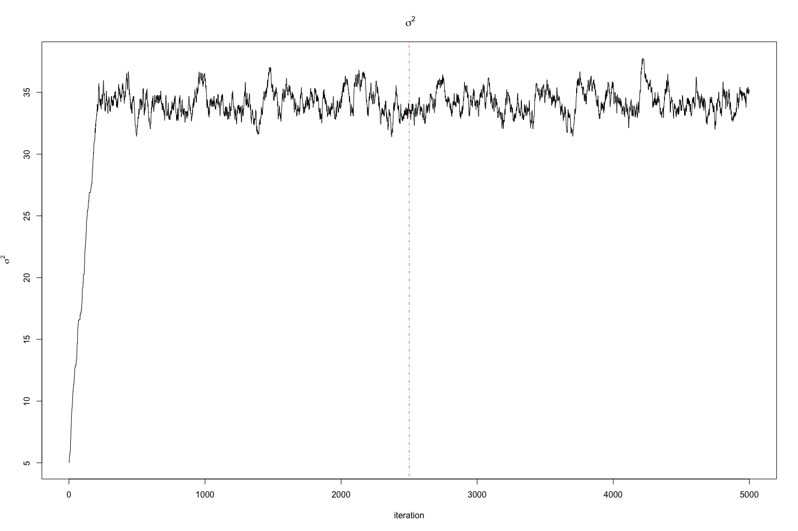
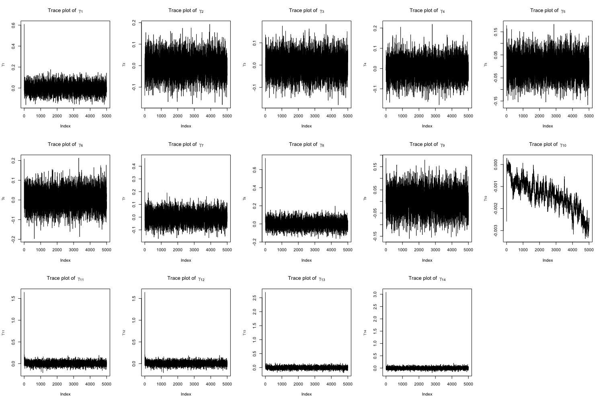
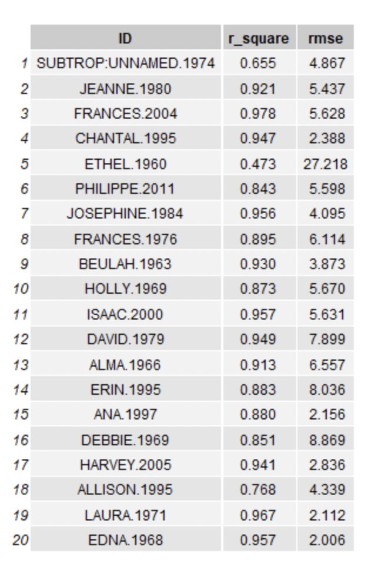
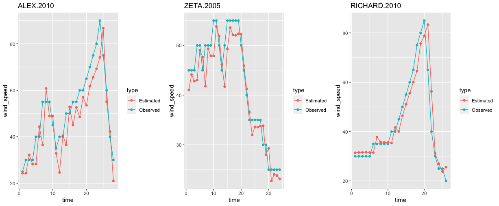
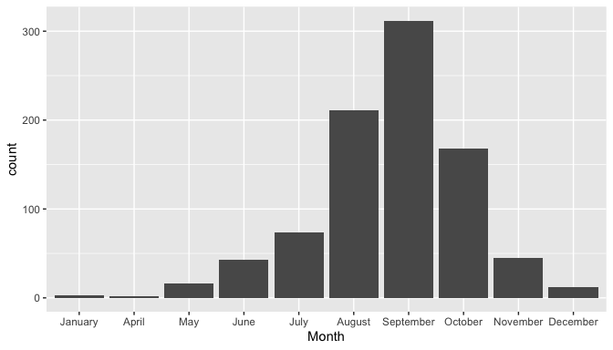
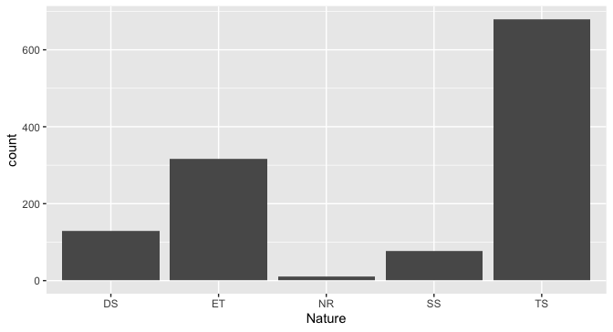
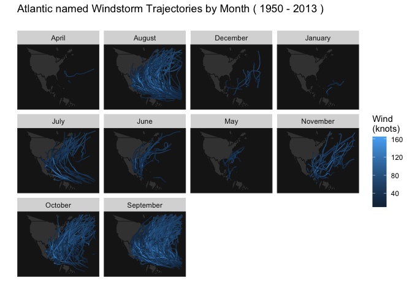

---
title: "Hierarchical Baysian Modeling of Hurricane Trajectories"
subtitle: "P8160 Group Project 3 - Markov chain Monte Carlo"
date: "May 2, 2023"
author: "Jingchen Chai, Yi Huang, Zining Qi, Ziyi Wang, Ruihan Zhang"
output:
  pdf_document:
    toc: yes
    toc_depth: 2
  keep_tex: true
  html_document:
    df_print: paged
    toc: yes
    toc_depth: '2'
header-includes:
- \usepackage{hyperref}
- \hypersetup{colorlinks=false, linktoc=all, linkcolor=red}
# - \AtBeginDocument{\addtocontents{toc}{\protect\hypertarget{mylink}{}\hspace{0.25in}\hspace{0.5in}\par}}
- \usepackage{placeins}
- \usepackage{caption}
- \usepackage{fancyhdr}
- \usepackage{lipsum}
- \pagestyle{fancy}
- \fancyhead[R]{\thepage}
- \usepackage{amsmath}
- \usepackage{algpseudocode}
- \usepackage{algorithm}

--- 

```{r setup, include=FALSE}
knitr::opts_chunk$set(echo = TRUE, 
                      message = FALSE, 
                      warning = FALSE, 
                      results = 'asis', 
                      fig.align = "center")
```

\newpage
```{r,include=FALSE}
library(ggplot2)
library(tidyverse)
library(data.table)
library(gtsummary)
```

# Abstract

A hurricane is a tropical storm with winds that have reached a constant speed of 74 miles per hour or more. Developing a model to predict the wind speed of the hurricane can provide early warning and help communities and individuals prepare for severe weather events. In this study we built a Bayesian model and implemented MCMC algorithm to to generate the distribution of corresponding parameters. Most parameters converged well, and the model performed good in predicting the wind speed. Our study also analyzed that there are no significant differences observed between wind speeds in different seasons.   


# Introduction

The United States faces significant social and economic risks from hurricanes, which cause fatalities and property damage through high winds, heavy rain, and storm surges(Blendon et al, 2007). To address this, there is a growing need to accurately predict hurricane behavior, including location and speed. This project aims to forecast wind speeds by modeling hurricane trajectories using a Hierarchical Bayesian Model. The hurricane data includes specific effects unique to each hurricane, and model integration is achieved through the use of a Markov Chain Monte Carlo algorithm.

Furthermore, we aim to explore seasonal variations in hurricane wind speeds using the Bayesian model previously estimated, and investigate whether there is evidence of increasing wind speeds over time. Additionally, we plan to utilize data on hurricane damages and fatalities in the United States to develop a prediction model. Through this model, we intend to identify the key factors that influence hurricanes and draw meaningful conclusions based on the results.

## Data

**ID**: ID of hurricanes

**Season**: In which year the hurricane occurred

**Month**: In which month the hurricane occurred

**Nature**: Nature of the hurricane

- ET: Extra Tropical
- DS: Disturbance
- NR: Not Rated
- SS: Sub Tropical
- TS: Tropical Storm

**Time**: dates and time of the record

**Latitude** and **Longitude**: The location of a hurricane check point

**Wind.kt**: Maximum wind speed (in Knot) at each check point

# Background


# Exploratory Data Analysis


## Data Pre-processing

- We have filtered observations that occurred on a 6-hour intervals. (e.g., hour 0, 6, 12, 18)

- Calculated the lag difference for latitude, longitude and wind speed. 

- After data cleaning, we obtained 20293 observations and with 699 different hurricanes.

# Methodology

## Markov chain Monte Carlo

In our project, we employed a Markov chain Monte Carlo (MCMC) simulation to estimate the parameters of a model that predicts wind speed based on velocity trajectory data. The MCMC algorithm generates samples from the Markov Chain in a way that leads us closer to the desired posterior. In our study, we used two MCMC techniques: the Metropolis-Hastings algorithm and Gibbs sampling. 

## Hierarchical Bayesian Model

Bayesian hierarchical modeling is a statistical approach that involves writing a model in multiple levels or a hierarchical form to estimate the parameters of the posterior distribution using Bayesian methodology. This technique assumes that the observed data are generated from a hierarchy of unknown parameters, and it estimates the posterior distribution of these parameters using a Bayesian approach. In other words, Bayesian hierarchical modeling is a way of modeling complex data structures by breaking them down into smaller, more manageable components and using Bayesian analysis to estimate the unknown parameters in each component.

From the Bayes' theorem: $$posterior\ distribution \propto likelihood \times prior\ distribution$$
$$ {\pi(\theta| X)} \propto {\pi(X|\theta)} \times {\pi(\theta)}$$

The Hierarchical Bayes
$$ {\pi(\theta, \alpha| X)} \propto {\pi(X|\theta)} \times {\pi(\theta|\alpha)} \times {\pi(\alpha)}$$

The suggested Bayesian model is 
$$Y_{i}(t+6) =\beta_{0,i}+\beta_{1,i}Y_{i}(t) + \beta_{2,i}\Delta_{i,1}(t)+ \beta_{3,i}\Delta_{i,2}(t) +\beta_{4,i}\Delta_{i,3}(t)  +\boldsymbol{X_i}\gamma+ \epsilon_{i}(t)$$

- where $Y_{i}(t)$ the wind speed at time $t$ (i.e. 6 hours earlier),  $\Delta_{i,1}(t)$, $\Delta_{i,2}(t)$ and $\Delta_{i,3}(t)$ are the changes of latitude, longitude and wind speed between $t$ and $t-6$, and $\epsilon_{i,t}$ follows a  normal distributions with mean zero and variance $\sigma^2$, independent across $t$. 

- ${X}_i = (x_{i,1},x_{i,2},x_{i,3})$ are covariates with fixed
effect $\gamma$, where $x_{i,1}$ be the month of year when the $i$-th
hurricane started, $x_{i,2}$ be the calendar year of the $i$ hurricane,
and $x_{i,3}$ be the type of the $i$-th hurricane.

- ${\beta}_{i} =  (\beta_{0,i},\beta_{1,i},...,\beta_{5,i})$, we assume that ${\beta}_{i} \sim N({\mu}, {\Sigma})$.

### Prior Distribution
$$
\begin{aligned}
\quad P({\mu}) = \frac{1}{\sqrt{2\pi}| V|^{\frac{1}{2}}}\exp\{-\frac{1}{2}\mu^{\top} V^{-1}\mu\}\propto | V|^{-\frac{1}{2}}\exp\{-\frac{1}{2}\mu^{\top} V^{-1}\mu\}
\end{aligned}
$$
\begin{center} 
where ${V}$ is a variance-covariance matrix
\end{center} 

$$
\begin{aligned}
\quad P( \Sigma) \propto 
|\Sigma|^{-\frac{(\nu+d+1)}{2}} \exp(-\frac{1}{2}tr( S\Sigma^{-1}))
\end{aligned}
$$

\begin{center} 
where $d$ is the dimension of $\boldsymbol{\beta}_{i}$, $\boldsymbol{S}$ is the scale matrix
\end{center} 

$$
\begin{aligned}
P(\gamma) \propto exp(-\frac{\gamma^2}{2\times(0.05)^2}) =e^{-200\gamma^2}
\end{aligned}
$$

$$
\begin{aligned}
P(\sigma) = \frac{2\alpha}{\sigma^2+\alpha^2} \propto \frac{1}{\sigma^2+\alpha^2} = \frac{1}{\sigma^2+100}
\end{aligned}
$$

### Joint Posterior Distribution

Let $B = ({\beta}_1^\top,..., {\beta}_n^\top)^\top$, derive the posterior distribution of the parameters $\Theta = (\textbf{B}^\top, {\mu}^\top, \sigma^2, \Sigma, \gamma)$.
\
\
Let${Z}_i(t){\beta}_i^\top = \beta_{0,i} + \beta_{1,i}Y_i(t) + \beta_{2,i}\Delta_{i,1}(t) + \beta_{3,i}\Delta_{i,2}(t) + \beta_{4,i}\Delta_{i,3}(t) + {X_i}\gamma+\epsilon_{i}(t)$

Where ${Z_i}$ is the $n_{i}$*d covariate matrix for hurricane i. 

We can find that
$$
\begin{aligned}
{Y_i} {\sim} MVN({Z}_i{\beta}_i^{T}, \sigma^2I)
\end{aligned}
$$
The likelihood for Y is:

$$
\scriptsize{
\begin{aligned}
&f( Y \mid  B,  \mu, \sigma,  \Sigma,\gamma) = \prod_{i = 1}^n f( Y_i | B, \mu, \Sigma, \sigma)=\\&\prod_{i=1}^n\frac{1}{\sqrt{2\pi}\sigma}\exp\{-\frac{1}{2}({Y}_i - {Z}_i{\beta}_i-{X_i}\gamma)^\top (\sigma^2 I)^{-1}({Y}_i - {Z}_i{\beta}_i-{X_i}\gamma)\}\\
&\propto  (\sigma^2)^{-\frac{N}{2}} \prod_{i=1}^n\exp\big\{-\frac{1}{2}({Y}_i - {Z}_i{\beta}_i-{X_i}\gamma)^\top (\sigma^2 I)^{-1}({Y}_i - {Z}_i{\beta}_i-{X_i}\gamma)\big\}
\end{aligned}
}
$$

For simple notation, let $N$=$(\sum_i^nn_i)$, representing the total number of unique hurricanes. 

The likelihood for $ B$  is:

$$
\scriptsize{
\begin{aligned}
&f( B \mid   \mu,  \Sigma) = \prod_{i = 1}^n f( B |\mu, \Sigma)=\\&\prod_{i=1}^n\frac{1}{\sqrt{2\pi|\Sigma|}}\exp\{-\frac{1}{2}({Y}_i - {Z}_i{\beta}_i-{X_i}\gamma)^\top (\sigma^2 I)^{-1}({Y}_i - {Z}_i{\beta}_i-{X_i}\gamma)\}\\
&\propto  (|\Sigma|)^{-\frac{N}{2}} \prod_{i=1}^n\exp\big\{-\frac{1}{2}((\beta_i-\mu)^\top \Sigma^{-1}(\beta_i-\mu))\big\}
\end{aligned}
}
$$


### Joint Posterior

By using the Bayesian rule, we can show the posterior distribution for $\boldsymbol{\Theta}$ is,
$$
\begin{aligned}
&\pi(\Theta| Y) =  P( B, \mu, \sigma, \Sigma, \gamma| Y)  
\propto \underbrace{L( Y| B, \sigma)}_{\text{likelihood of } {Y}}\underbrace{L( B|\mu,\Sigma)}_{\text{likelihood of }\textbf{B}}\underbrace{p(\mu)p(\sigma)p(\Sigma)p(\gamma)}_{\text{priors}}\\
&\propto \frac{1}{\sigma^{N}(\sigma^2+10^2)} \prod_{i=1}^n\exp\big\{-\frac{1}{2}({Y}_i - {Z}_i{\beta}_i-{X_i}\gamma)^\top (\sigma^2 I)^{-1}({Y}_i - {Z}_i{\beta}_i-{X_i}\gamma)\big\}\\
&\times \exp\{-\frac{1}{2}\sum_i^n(\beta_i-\mu)^\top \Sigma^{-1}(\beta_i-\mu)\} |\Sigma^{-1}|^{\frac{N+d+v+1}{2}} \exp\{-\frac{1}{2}tr( S\Sigma^{-1})\}| V|^{-\frac{1}{2}}\\
&\times \exp\{-\frac{1}{2}\mu^{\top} V^{-1}\mu\} \\
&\times\exp\{-200\gamma^2\}
\end{aligned}
$$

### Conditional Posterior Distribution

1. The posterior distribution of ${B}$
Let $A$= $\Sigma^{-1}$

$$
\begin{aligned}
\pi(\textbf{B} | {Y}, {\mu}^\top, \sigma, {\Sigma}) 
&\propto  \prod_{i=1}^n\exp\big\{-\frac{1}{2}({Y}_i - {Z}_i{\beta}_i-{X_i}\gamma)^\top (\sigma^2 I)^{-1}({Y}_i - {Z}_i{\beta}_i-{X_i}\gamma)\big\}\\
&\times \exp\{-\frac{1}{2}\sum_i^n(\beta_i-\mu)^\top \Sigma^{-1}(\beta_i-\mu)\}\\
&\propto \prod_{i=1}^n \exp\big\{-\frac{1}{2}({Y}_i - {Z}_i{\beta}_i-{X_i}\gamma_i)^\top (\sigma^2 I)^{-1}({Y}_i - {Z}_i{\beta}_i-{X_i}\gamma)\big\}+(\beta_i-\mu)^\top A(\beta_i-\mu)\}\\
&\propto \prod_{i=1}^n \exp\big\{-\frac{1}{2}({\beta}_i({Z}_i^\top(\sigma^2 I)^{-1}Z_i+{A}){\beta}_i^\top - 2({Z}_i^\top(\sigma^2 I)^{-1}{Y}_i- {Z}_i^\top\gamma {X}_i(\sigma^2 I)^{-1} +{\mu}{A}){\beta}_i \\
&\propto \prod_{i=1}^n \exp\big\{-\frac{1}{2}[{\beta}_i-({Z}_i^\top(\sigma^2 I)^{-1}{Z}_i+{A})^{-1}({Z}_i^\top(\sigma^2 I)^{-1}{Y}_i-{Z}_i^\top\gamma{X}_i(\sigma^2 I)^{-1} + {\mu}_i{A})^\top]^\top \\
&\times ({Z}_i^\top(\sigma^2 I)^{-1}{Z}_i+{A}) [{\beta}_i- ({Z}_i^\top(\sigma^2 I)^{-1}{Z}_i+{A})^{-1}({Z}_i^\top(\sigma^2 I)^{-1}{Y}_i-{Z}_i^\top\gamma{X}_i(\sigma^2 I)^{-1} + {\mu}_i{A})^\top]\big\}
\end{aligned}
$$

$\beta_i \sim MVN(N^{-1}M,N^{-1})$, where $N=\frac{Z_i^\top Z_i}{\sigma^2}+{A}$, $M=\frac{Z_i^\top Y_i-Z_i^\top X_i\gamma}{\sigma^2}+\mu {A}$


2. The posterior distribution of ${\mu}$

$$
\begin{aligned}
\pi(\mu|B, \sigma, A, \gamma) & \propto \exp \{-\frac{\mu^\top V^{-1}\mu}{2}\}\prod_{i=1}^N\exp\{-\frac{(\beta_i-\mu)^\top A(\beta_i-\mu)}{2}\}\\
&=\exp\{\sum_i^N-\frac{1}{2}(\mu^\top(A-\frac{1}{N} V^{-1})\mu-2\mu^\top A\beta_i+\beta_i^\top A\beta_i)\}\\
&=\exp\{-\frac{1}{2}(\mu^\top(NA- V^{-1})\mu-2\mu^\top \sum_i^N( A\beta_i)+\beta_i^\top  A\beta_i)\}
\end{aligned}
$$

$\mu \sim MVN(M^{-1}N,M^{-1})$, where $M=NA- V^{-1}$ and $N=\sum_i^N( A\beta_i)$

3. The posterior distribution of ${\Sigma}$

$$
\begin{aligned}
\pi({\Sigma}|{B} ,{\mu},{\gamma},\sigma,{Y}) \propto  {|\Sigma|}^{-\frac{(N+v+d+1)}{2}}\exp\{-\frac{1}{2}(\sum_i^N({\beta_i-\mu})^\top A ({\beta_i-\mu})+tr({ S A}))\}\\
\propto {|\Sigma|}^{-\frac{(N+v+d+1)}{2}} \exp\{-\frac{1}{2}tr { (S+\sum_i^N(\beta_i-\mu)(\beta_i-\mu)^\top}) A\}
\end{aligned}
$$


$${\Sigma} \sim w^{-1}({ S+\sum_i^N(\beta_i-\mu)(\beta_i-\mu)^\top,N+v})$$
4. The posterior distribution of $\gamma$ 

$$
\begin{aligned}
\pi(\gamma| B,\mu, \Sigma,\sigma,{Y})&\propto \prod_{i=1}^N\exp\{-\frac{1}{2}(Y_i-Z_i\beta_i-X_i\gamma)^\top(\sigma^2I)^{-1}(Y_i-Z_i\beta_i-X_i\gamma)\} \times \exp\{-\frac{400\gamma^\top\gamma}{2}\}\\
&\propto \exp\{-\frac{1}{2}\sum_i^N\gamma^\top(X_i^\top\sigma^{-2}IX_i+400N^{-1}I)\gamma-2\gamma^\top(X_i^\top\sigma^{-2}IY_i-X_i^\top\sigma^{-2}IZ_i\beta_i)\\&+
Y_i^\top\sigma^{-2}IY_i-2Y_i^\top\sigma^{-2}IZ_i\beta_i+\beta_i^\top Z_i^\top \sigma^{-2}IZ_i\beta_i\}
\end{aligned}
$$
$\gamma \sim MVN(M^{-1}N, M^{-1})$, where $M =\frac{\sum_i^NX_i^\top X_i}{\sigma^2}+400I$ and $N=\frac{\sum_i^N(X_i^\top Y_i-X_i^\top Z_i\beta_i)}{\sigma^2}$ 


5. The posterior distribution of $\sigma$ 

$$
\begin{aligned}
\pi(\sigma|{Y},B, {\mu},{\Sigma},{\gamma})
&\propto \frac{1}{\sigma^{N}(\sigma^2+10^2)} \\
&\times \prod_{i=1}^n\exp\big\{-\frac{1}{2(\sigma^2 I)}({Y}_i - {Z}_i{\beta}_i-{X_i}\gamma)^\top ({Y}_i - {Z}_i{\beta}_i-{X_i}\gamma)\big\}
\end{aligned}
$$
$\sigma$ does not have a close distribution.

## MCMC Algorithm
After deriving the conditional posterior of parameter that we want to estimate, the next step is to apply these conditional posterior to the MCMC Algorithm. Our MCMC algorithm is a hybrid of Metropolis-Hastings and Gibb Sampling. 

### Metropolis-Hastings
From the conditional posterior of $\sigma$, it is hard to find a closed form distribution for it, unlike other parameters. Here, we apply Metropolis-Hastings to generate new $\sigma$. The detailed steps of Metropolis-Hasting is shown below:

\begin{algorithm}
\caption{MCMC: Metropolis-Hastings}\label{alg:cap1}
\begin{algorithmic}
\Require Target distribution $\pi(\sigma)$
\For{$i$ = 1 to 1000}
\State 1. Proposed $\sigma_{proposed} = \sigma^{(i-1)} + (U - 0.5) *2*a$, where $U \sim$ Uniform(0,1), $a$ is step size
\State 2. Calculate acceptance rate$\alpha_{XY} = \min(0, \frac{\pi(\sigma_{proposed})}{\pi(\sigma^{(i-1)})}$
\State 3. If $U < \alpha_{XY}$: $\sigma^{(i)} = \sigma_{proposed}$, else $\sigma^{(i)} = \sigma^{(i-1)}$
\EndFor
\State $\sigma_{k} = \sum_{i=801}^{1000} \frac{\sigma^{(i)}}{200}$, where $k$ is the iteration of Gibb Sampling
\end{algorithmic}
\end{algorithm}

The target distribution is the conditional posterior of $\sigma$. By setting the step size to 0.5, the acceptance rate reaches 43.5%, which is acceptable. The new sigma generated for Gibb Sampling will be the mean of next 200 values in the chain. 

### Gibb Sampling
After defining the Metropolis-Hastings algorithm to generate $\sigma$, we combine the Metropolis-Hastings with Gibb Sampling. We first initialized the parameters to start the algorithm. The parameters in Gibb Sampling will be updated component-wise. For each parameter to be updated, it always conditioned on the most recent values of other parameters. More precisely, 

\begin{algorithm}
\caption{MCMC: Gibb Sampling}\label{alg:cap2}
\begin{algorithmic}
\Require Initialize $\boldsymbol B, \boldsymbol \mu, \sigma, \boldsymbol \Sigma, \boldsymbol \gamma$
\For{$k$ = 1 to 5000}
\State 1. Generate $\boldsymbol \beta_{i}^{k}$ for $i^{th}$ hurricane from $\pi(\textbf{B}|\boldsymbol{Y}, \boldsymbol{\mu}^{k-1},\sigma^{k-1}, \boldsymbol{\Sigma}^{k-1},\boldsymbol{\gamma}^{k-1})$
\State 2. Generate $\boldsymbol \mu^{k}$ from $\pi(\boldsymbol{\mu}|\boldsymbol{Y}, \textbf{B}^{k},\sigma^{k-1}, \boldsymbol{\Sigma}^{k-1},\boldsymbol{\gamma}^{k-1})$
\State 3. Generate $\sigma_{k}$ from the Metropolis-Hastings steps
\State 4. Generate $\boldsymbol \Sigma_{k}$ from $\pi(\boldsymbol{\Sigma}|\boldsymbol{Y}, \textbf{B}_{k},\boldsymbol{\mu}_{k}, \sigma_{k},\boldsymbol{\gamma}_{k-1})$
\State 5. Generate $\boldsymbol \gamma_{k}$ from $\pi(\boldsymbol{\gamma}|\boldsymbol{Y}, \textbf{B}_{k},\boldsymbol{\mu}_{k},\sigma_{k},\boldsymbol{\Sigma}_{k})$
\EndFor
\end{algorithmic}
\end{algorithm}

We have tested different start values for MCMC algorithm, the result chain behave similarly. We finally decide to initialize the parameters by using the results from fitting generalized linear mixed model in R. $\boldsymbol B$ is a 5 * 699 matrix, $\boldsymbol \mu$ is a 5 * 1 matrix, $\sigma$ is a number, $\boldsymbol \Sigma$ is a 5 * 5 matrix, and $\boldsymbol \gamma$ is a 14 * 1 matrix.


# Results

In Markov Chain Monte Carlo, determining the appropriate number of iterations can depend on many factors such as the complexity of the model, the size of the dataset, etc. Therefore, it is difficult to make a general statement about a specific number of iterations that will be sufficient for all MCMC simulations. In our algorithm, we believe for most of the parameters, 5000 iterations reached the stationary of their posterior distribution. For convergence diagnostics, we generate trace plots, autocorrelation plots, and histograms.

## Random effect parameter

Figure 1 shows convergence plots of $\boldsymbol{B}$. $\beta_1$ takes only a few steps to reach stationary. The trace plot shows the history of our parameter $\beta_1$ across iterations of the chain. This chain appears most likely to converge with an average value of about 0.95. Similarly for $\beta_4$, the chain appears most likely to converge with an average value of about 0.48. $\beta_2$ and $\beta_3$ need to take more iterations to achieve convergence. In Figure 2, we extract Hurricane George 1951 from the data to check its $\beta$ convergence plots and distribution. We can see on trace plot of 5000 iterations for the selected parameter, each of the distributions are relatively normal with some heavy tails in $\beta_0$.

The Convergence plot of $\sigma^2$ suggests that the chain is mixing well and that the algorithm is converging to its posterior distribution of sigma^2. After iteration 500, this chain appears to converge with an average value of 34.5 This also indicates that the estimated values of $\sigma^2$ are becoming more independent and less influenced by their past values as iterations increase.


```{r,echo=FALSE,out.width='100%',out.height='100%',fig.align='center'}

```
\begin{center}
Figure 1
\end{center}


```{r,echo=FALSE,out.width='100%',out.height='100%',fig.align='center'}

```
\begin{center}
Figure 2
\end{center}

```{r,echo=FALSE,out.width='90%',out.height='70%',fig.align='center'}

```
\begin{center}
Figure 3
\end{center}

## Fix effect parameter $\gamma$

```{r,echo=FALSE,out.width='100%',out.height='100%',fig.align='center'}

```
\begin{center}
Figure 4
\end{center}

## Model Performance

To assess how well the model predicts hurricane wind speeds, we calculate the RMSE and $R^2$ values for each hurricane, using the residuals of Bayesian estimates that have converged after iterations from MCMC to predict wind speeds for a test dataset. The overall RMSE is 6.647. We filtered the valid $R^2$ values between 0 and 1 and find that most of the hurricanes have positive $R^2$ values, indicating that the model performs well for most hurricanes. However, a few of the estimated Bayesian models have negative $R^2$ values, which may be due to the limited number of observations of hurricanes. Table 1 displays the 20 hurricanes chosen randomly. These hurricanes indicate that the estimated model accurately predicts wind speeds for most hurricanes. 
```{r,echo=FALSE,out.width='40%',out.height='40%',fig.align='center'}

```
\begin{center}
Table1. R-squared values and RMSE for prediction results on test data
\end{center}

Figure 3 displays the actual wind speed and the estimated wind speed for a random selection of three hurricanes. It seems that there is a relatively high degree of overlap between the two curves for most parts, indicating that most of the predicted wind speeds are in close agreement with the actual wind speeds. For the hurricane Alex.2010, the RMSE is 8.879. For the hurricane Zeta.2005, the RMSE is 3.46. For the hurricane Richard.2010, the RMSE is 6.085456.
```{r,echo=FALSE,out.width='100%',out.height='100%',fig.align='center'}

```

# Limitation and Discussion 

During model training and testing, we excluded hurricanes with limited observations. However, this exclusion could impact the results, as the lack of data may be associated with the nature of the hurricanes and affect the damage and financial loss they cause. We recommend further study of these short-term hurricanes.

Furthermore, our goal was to obtain similar results using both MCMC and ordinary linear regression methods. However, we faced some challenges with the limited amount of data for specific hurricanes and highly correlated predictor values within a limited time span. When two or more predictors for a particular hurricane were highly correlated, the determinant of the predictor matrix for that hurricane became zero, indicating that the coefficients were not unique. In such cases, the lm function in R returned NA for constant predictors, making it difficult to compare the results with the MCMC predictors.

Finally, we excluded some hurricanes from our model due to the limited number of observations, which may have introduced bias into the model. The systematic exclusion of hurricanes with limited observations could have resulted in a bias towards predicting larger and more destructive hurricanes that last for a longer duration. 

# Conclusion

Our Markov Chain Monte Carlo (MCMC) technique accurately calculates the parameters in high-dimensional settings. Most parameters converge when initialized with good values. Additionally, the model provides a good fit for the data as evidenced by a high overall $R^2$.

Using the posterior estimates of $\mu$, we observe that an increase in the current wind speed and changes in wind speed are linked to an increase in wind speed in the near future. Furthermore, the posterior estimate of $\boldsymbol{\Sigma}$ indicates that the correlations among the $\beta_i$ variables are relatively low.

During our investigation into how the year, month, and nature of hurricanes impact wind speed, we discovered that there are no significant differences observed between wind speeds in different months and years. Furthermore, we found that the nature of hurricanes does play an important role in wind speed.

# References

Blendon, R., Benson, J., DesRoches, C., Lyon-Daniel, K., Mitchell, E., Pollard, W.(2007). "The Public's Preparedness for Hurricanes in Four Affected Regions". National Library of Medicine, 122(2):167-176. https://www.ncbi.nlm.nih.gov/pmc/articles/PMC1820441/

Taboga, Marco (2021). "Markov Chain Monte Carlo (MCMC) diagnostics", Lectures on probability theory and mathematical statistics. Kindle Direct Publishing. Online appendix.

Polson, N. G., & Scott, J. G. (2012). On the half-Cauchy prior for a global scale parameter.

Zhang, Z. (2021). A Note on Wishart and Inverse Wishart Priors for Covariance Matrix. Journal of Behavioral Data Science, 1(2), 119–126.

# Contributions


# A First section of Appendix

```{r,echo=FALSE,out.width='90%',out.height='90%',fig.align='center'}

```
\begin{center}
Figure 10. Frequency of Hurricane by Month
\end{center}


```{r,echo=FALSE,out.width='90%',out.height='90%',fig.align='center'}
 
```
\begin{center}
Figure 11. The Average Speed of Hurricanes in Each Year
\end{center}


```{r,echo=FALSE,out.width='90%',out.height='90%',fig.align='center'}
 
```
\begin{center}
Figure 12. The Count of Hurricanes in Each Nature
\end{center}

```{r,echo=FALSE,out.width='90%',out.height='90%',fig.align='center'}
 
```
\begin{center}
Figure 13. Altantic Windstorm mean knot
\end{center}

```{r,echo=FALSE,out.width='90%',out.height='90%',fig.align='center'}
 
```
\begin{center}
Figure 14. Atlantic Windstorm Trajectories by Month
\end{center}

# B Section section of Appendix

```{r, eval = FALSE}

```