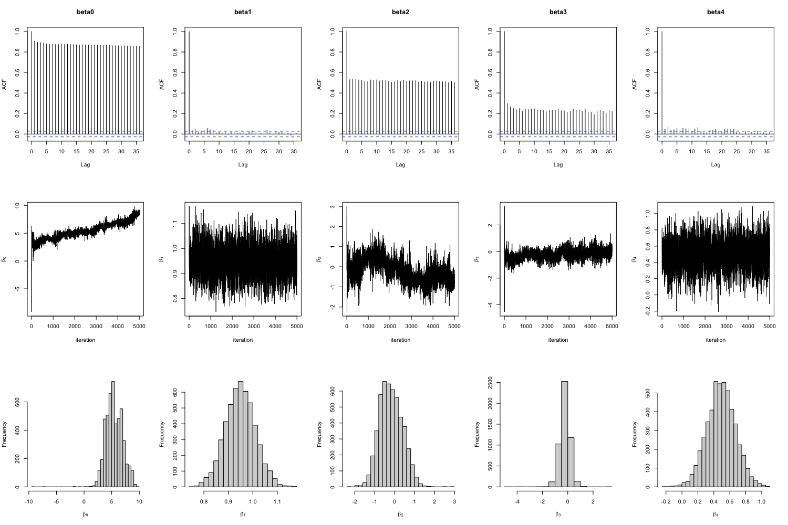

---
title: "Hierarchical Baysian Modeling of Hurricane Trajectories"
subtitle: "P8160 Group Project 3 - Markov chain Monte Carlo"
date: "May 2, 2023"
author: "Jingchen Chai, Yi Huang, Zining Qi, Ziyi Wang, Ruihan Zhang"
output:
  pdf_document:
    toc: yes
    toc_depth: 2
  keep_tex: true
  html_document:
    df_print: paged
    toc: yes
    toc_depth: '2'
header-includes:
- \usepackage{hyperref}
- \hypersetup{colorlinks=false, linktoc=all, linkcolor=red}
# - \AtBeginDocument{\addtocontents{toc}{\protect\hypertarget{mylink}{}\hspace{0.25in}\hspace{0.5in}\par}}
- \usepackage{placeins}
- \usepackage{caption}
- \usepackage{fancyhdr}
- \usepackage{lipsum}
- \pagestyle{fancy}
- \fancyhead[R]{\thepage}
- \usepackage{amsmath}
- \usepackage{algpseudocode}
- \usepackage{algorithm}

--- 

```{r setup, include=FALSE}
knitr::opts_chunk$set(echo = TRUE, message = FALSE, warning = FALSE, results = 'asis', fig.align = "center")
```

\newpage
```{r,include=FALSE}
library(ggplot2)
```

# Abstract


# Introduction


# Background


# Exploratory Data Analysis


# Methodology

## Hierarchical Bayesian Model

The suggested Bayesian model is 
$$Y_{i}(t+6) =\beta_{0,i}+\beta_{1,i}Y_{i}(t) + \beta_{2,i}\Delta_{i,1}(t)+ \beta_{3,i}\Delta_{i,2}(t) +\beta_{4,i}\Delta_{i,3}(t)  +\boldsymbol{X_i}\gamma+ \epsilon_{i}(t)$$

- where $Y_{i}(t)$ the wind speed at time $t$ (i.e. 6 hours earlier),  $\Delta_{i,1}(t)$, $\Delta_{i,2}(t)$ and $\Delta_{i,3}(t)$ are the changes of latitude, longitude and wind speed between $t$ and $t-6$, and $\epsilon_{i,t}$ follows a  normal distributions with mean zero and variance $\sigma^2$, independent across $t$. 

- $\boldsymbol{X}_i = (x_{i,1},x_{i,2},x_{i,3})$ are covariates with fixed
effect $\gamma$, where $x_{i,1}$ be the month of year when the $i$-th
hurricane started, $x_{i,2}$ be the calendar year of the $i$ hurricane,
and $x_{i,3}$ be the type of the $i$-th hurricane.

- $\boldsymbol{\beta}_{i} =  (\beta_{0,i},\beta_{1,i},...,\beta_{5,i})$, we assume that $\boldsymbol{\beta}_{i} \sim N(\boldsymbol{\mu}, \boldsymbol{\Sigma})$.

### Prior Distribution
$$
\begin{aligned}
\quad P(\boldsymbol{\mu}) = \frac{1}{\sqrt{2\pi}|\boldsymbol V|^{\frac{1}{2}}}\exp\{-\frac{1}{2}\boldsymbol\mu^{\top}\boldsymbol V^{-1}\boldsymbol\mu\}\propto |\boldsymbol V|^{-\frac{1}{2}}\exp\{-\frac{1}{2}\boldsymbol\mu^{\top}\boldsymbol V^{-1}\boldsymbol\mu\}
\end{aligned}
$$
\begin{center} 
where $\boldsymbol{V}$ is a variance-covariance matrix
\end{center} 

$$
\begin{aligned}
\quad P(\Sigma) \propto 
|\Sigma|^{-\frac{(\nu+d+1)}{2}} \exp(-\frac{1}{2}tr(S\Sigma^{-1}))
\end{aligned}
$$

\begin{center} 
where $d$ is the dimension of $\boldsymbol{\beta}_{i}$.
\end{center} 

$$
\begin{aligned}
P(\gamma) \propto exp(-\frac{\gamma^2}{2\times(0.05)^2}) =e^{-200\gamma^2}
\end{aligned}
$$

$$
\begin{aligned}
P(\sigma) = \frac{2\alpha}{\sigma^2+\alpha^2} \propto \frac{1}{\sigma^2+\alpha^2} = \frac{1}{\sigma^2+100}
\end{aligned}
$$

### Posterior

Let $\textbf{B} = (\boldsymbol{\beta}_1^\top,..., \boldsymbol{\beta}_n^\top)^\top$, derive the posterior distribution of the parameters $\Theta = (\textbf{B}^\top, \boldsymbol{\mu}^\top, \sigma^2, \Sigma, \gamma)$.
\
\
Let$\boldsymbol{Z}_i(t)\boldsymbol{\beta}_i^\top = \beta_{0,i} + \beta_{1,i}Y_i(t) + \beta_{2,i}\Delta_{i,1}(t) + \beta_{3,i}\Delta_{i,2}(t) + \beta_{4,i}\Delta_{i,3}(t) + \boldsymbol{X_i}\gamma+\epsilon_{i}(t)$
We can find that
$$
\scriptsize{
\begin{aligned}
\boldsymbol{Y_i} {\sim} MVN(\boldsymbol{Z}_i\boldsymbol{\beta}_i, \sigma^2I)
\end{aligned}
}
$$

The likelihood for Y is
$$
\scriptsize{
\begin{aligned}
&f(Y \mid \boldsymbol B, \boldsymbol \mu, \sigma^2, \boldsymbol \Sigma,\gamma) = \prod_{i = 1}^n f(Y_i | B, \mu, \Sigma, \sigma^2)=\\&\prod_{i=1}^n\frac{1}{\sqrt{2\pi}\sigma}\exp\{-\frac{1}{2}(\boldsymbol{y}_i - \boldsymbol{Z}_i\boldsymbol{\beta}_i-\boldsymbol{X_i}\boldsymbol\gamma_i)^\top (\sigma^2 I)^{-1}(\boldsymbol{y}_i - \boldsymbol{Z}_i\boldsymbol{\beta}_i-\boldsymbol{X_i}\boldsymbol\gamma_i)\}\\
&\propto  (2\pi\sigma^2)^{-\frac{n}{2}} \prod_{i=1}^n\exp\big\{-\frac{1}{2}(\boldsymbol{Y}_i - \boldsymbol{Z}_i\boldsymbol{\beta}_i-\boldsymbol{X_i}\boldsymbol\gamma_i)^\top (\sigma^2 I)^{-1}(\boldsymbol{Y}_i - \boldsymbol{Z}_i\boldsymbol{\beta}_i-\boldsymbol{X_i}\boldsymbol\gamma_i)\big\}
\end{aligned}
}
$$

### Joint Posterior

$$
\scriptsize{
\begin{aligned}
&\pi(\Theta|Y) =  P(B, \mu, \sigma^2, \Sigma, \gamma|Y)  
\propto \underbrace{L(Y| B, \sigma^2)}_{\text{likelihood of } \boldsymbol{Y}}\underbrace{L(B|\mu,\Sigma)}_{\text{distribution of }\textbf{B}}\underbrace{p(\mu)p(\sigma)p(\Sigma)p(\gamma)}_{\text{priors}}\\
&\propto \frac{1}{\sigma^{N}(\sigma^2+10^2)} \prod_{i=1}^n\exp\big\{-\frac{1}{2}(\boldsymbol{Y}_i - \boldsymbol{Z}_i\boldsymbol{\beta}_i-\boldsymbol{X_i}\boldsymbol\gamma_i)^\top (\sigma^2 I)^{-1}(\boldsymbol{Y}_i - \boldsymbol{Z}_i\boldsymbol{\beta}_i-\boldsymbol{X_i}\boldsymbol\gamma_i)\big\}\\
&\times \exp\{-\frac{1}{2}\sum_i^n(\beta_i-\mu)^\top \Sigma^{-1}(\beta_i-\mu)\} |\Sigma^{-1}|^{\frac{N+d+v+1}{2}} \exp\{-\frac{1}{2}tr(S\Sigma^{-1})\}|\boldsymbol V|^{-\frac{1}{2}}\\
&\times \exp\{-\frac{1}{2}\boldsymbol\mu^{\top}\boldsymbol V^{-1}\boldsymbol\mu\} \\
&\times\exp\{-200\gamma^2\}
\end{aligned}
}
$$
where $\boldsymbol{V}$ is a variance-covariance matrix, N is the total number of hurricanes and d is the dimension of $\beta$, and v is the degree of freedom.

### Conditional Posterior Distribution

## MCMC Algorithm
After deriving the conditional posterior of parameter that we want to estimate, the next step is to apply these conditional posterior to the MCMC Algorithm. Our MCMC algorithm is a hybrid of Metropolis-Hastings and Gibb Sampling. 

### Metropolis-Hastings
From the conditional posterior of $\sigma$, it is hard to find a closed form distribution for it, unlike other parameters. Here, we apply Metropolis-Hastings to generate new $\sigma$. The detailed steps of Metropolis-Hasting is shown below:

\begin{algorithm}
\caption{MCMC: Metropolis-Hastings}\label{alg:cap1}
\begin{algorithmic}
\Require Target distribution $\pi(\sigma)$
\For{$i$ = 1 to 1000}
\State 1. Proposed $\sigma_{proposed} = \sigma^{(i-1)} + (U - 0.5) *2*a$, where $U \sim$ Uniform(0,1), $a$ is step size
\State 2. Calculate acceptance rate$\alpha_{XY} = \min(0, \frac{\pi(\sigma_{proposed})}{\pi(\sigma^{(i-1)})}$
\State 3. If $U < \alpha_{XY}$: $\sigma^{(i)} = \sigma_{proposed}$, else $\sigma^{(i)} = \sigma^{(i-1)}$
\EndFor
\State $\sigma_{k} = \sum_{i=801}^{1000} \frac{\sigma^{(i)}}{200}$, where $k$ is the iteration of Gibb Sampling
\end{algorithmic}
\end{algorithm}

The target distribution is the conditional posterior of $\sigma$. By setting the step size to 0.5, the acceptance rate reaches 43.5%, which is acceptable. The new sigma generated for Gibb Sampling will be the mean of next 200 values in the chain. 

### Gibb Sampling
After defining the Metropolis-Hastings algorithm to generate $\sigma$, we combine the Metropolis-Hastings with Gibb Sampling. We first initialized the parameters to start the algorithm. The parameters in Gibb Sampling will be updated component-wise. For each parameter to be updated, it always conditioned on the most recent values of other parameters. More precisely, 

\begin{algorithm}
\caption{MCMC: Gibb Sampling}\label{alg:cap2}
\begin{algorithmic}
\Require Initialize $\boldsymbol B, \boldsymbol \mu, \sigma, \boldsymbol \Sigma, \boldsymbol \gamma$
\For{$k$ = 1 to 5000}
\State 1. Generate $\boldsymbol \beta_{i}^{k}$ for $i^{th}$ hurricane from $\pi(\textbf{B}|\boldsymbol{Y}, \boldsymbol{\mu}^{k-1},\sigma^{k-1}, \boldsymbol{\Sigma}^{k-1},\boldsymbol{\gamma}^{k-1})$
\State 2. Generate $\boldsymbol \mu^{k}$ from $\pi(\boldsymbol{\mu}|\boldsymbol{Y}, \textbf{B}^{k},\sigma^{k-1}, \boldsymbol{\Sigma}^{k-1},\boldsymbol{\gamma}^{k-1})$
\State 3. Generate $\sigma_{k}$ from the Metropolis-Hastings steps
\State 4. Generate $\boldsymbol \Sigma_{k}$ from $\pi(\boldsymbol{\Sigma}|\boldsymbol{Y}, \textbf{B}_{k},\boldsymbol{\mu}_{k}, \sigma_{k},\boldsymbol{\gamma}_{k-1})$
\State 5. Generate $\boldsymbol \gamma_{k}$ from $\pi(\boldsymbol{\gamma}|\boldsymbol{Y}, \textbf{B}_{k},\boldsymbol{\mu}_{k},\sigma_{k},\boldsymbol{\Sigma}_{k})$
\EndFor
\end{algorithmic}
\end{algorithm}

We have tested different start values for MCMC algorithm, the result chain behave similarly. We finally decide to initialize the parameters by using the results from fitting generalized linear mixed model in R. $\boldsymbol B$ is a 5 * 699 matrix, $\boldsymbol \mu$ is a 5 * 1 matrix, $\sigma$ is a number, $\boldsymbol \Sigma$ is a 5 * 5 matrix, and $\boldsymbol \gamma$ is a 14 * 1 matrix.


# Results

In Markov Chain Monte Carlo, determining the appropriate number of iterations can depend on many factors such as the complexity of the model, the size of the dataset, etc. Therefore, it is difficult to make a general statement about a specific number of iterations that will be sufficient for all MCMC simulations. In our algorithm, we believe for most of the parameters, 5000 iterations reached the stationary of their posterior distribution. For convergence diagnostics, we generate trace plots, autocorrelation plots, and histograms.

## Random effect parameter

Figure 1 shows convergence plots of $\boldsymbol{B}$. $\beta_1$ takes only a few steps to reach stationary. The trace plot shows the history of our parameter $\beta_1$ across iterations of the chain. This chain appears most likely to converge with an average value of about 0.95. Similarly for $\beta_4$, the chain appears most likely to converge with an average value of about 0.48. $\beta_2$ and $\beta_3$ need to take more iterations to achieve convergence. In Figure 2, we extract Hurricane George 1951 from the data to check its $\beta$ convergence plots and distribution. We can see on trace plot of 5000 iterations for the selected parameter, each of the distributions are relatively normal with some heavy tails in $\beta_0$.

The Convergence plot of $\sigma^2$ suggests that the chain is mixing well and that the algorithm is converging to its posterior distribution of sigma^2. After iteration 500, this chain appears to converge with an average value of 34.5 This also indicates that the estimated values of $\sigma^2$ are becoming more independent and less influenced by their past values as iterations increase.


```{r,echo=FALSE,out.width='100%',out.height='100%',fig.align='center'}

```
\begin{center}
Figure 1
\end{center}

Figure 2 shows the selected $\boldsymbol{B}$: Hurricane GEORGE.1951 

```{r,echo=FALSE,out.width='100%',out.height='100%',fig.align='center'}

```
\begin{center}
Figure 2
\end{center}

## Fix effect parameter $\gamma$


# Limitation and Discussion 

# Conclusion


# References

Taboga, Marco (2021). "Markov Chain Monte Carlo (MCMC) diagnostics", Lectures on probability theory and mathematical statistics. Kindle Direct Publishing. Online appendix.

Polson, N. G., & Scott, J. G. (2012). On the half-Cauchy prior for a global scale parameter.

Zhang, Z. (2021). A Note on Wishart and Inverse Wishart Priors for Covariance Matrix. Journal of Behavioral Data Science, 1(2), 119–126.

# Contributions


# A First section of Appendix

```{r, eval = FALSE}

```

# B Section section of Appendix
