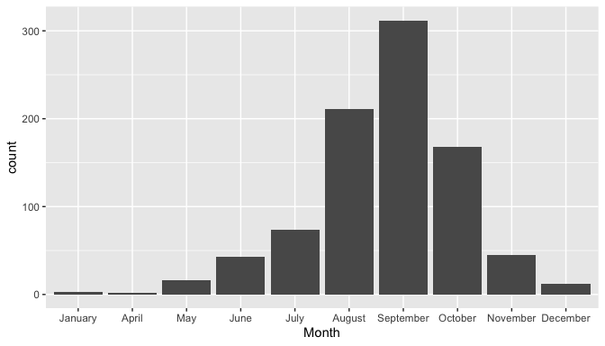
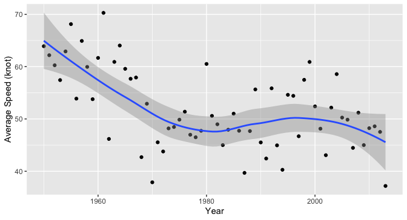
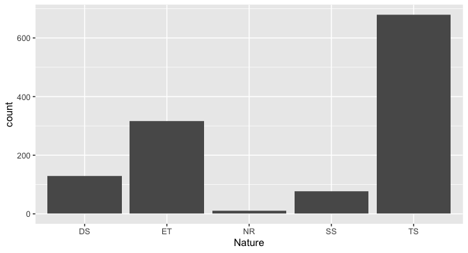
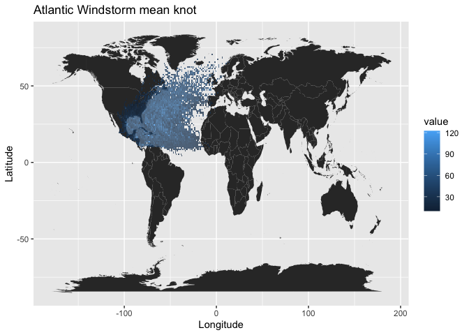
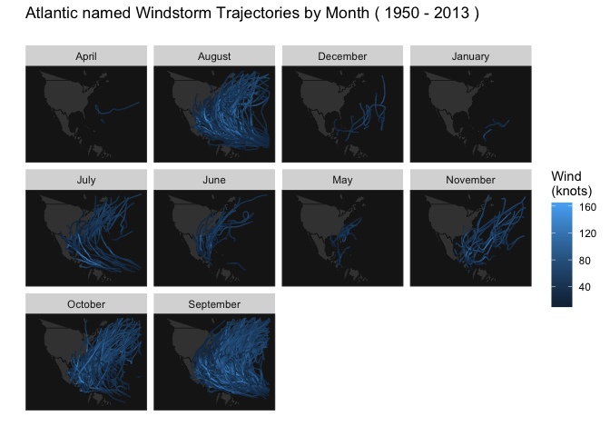

---
title: "Hierarchical Baysian Modeling of Hurricane Trajectories"
subtitle: "P8160 Group Project 3 - Markov chain Monte Carlo"
date: "May 4, 2023"
author: "Jingchen Chai, Yi Huang, Zining Qi, Ziyi Wang, Ruihan Zhang"
output:
  pdf_document:
    toc: yes
    toc_depth: 2
  keep_tex: true
  html_document:
    df_print: paged
    toc: yes
    toc_depth: '2'
header-includes:
- \usepackage{hyperref}
- \hypersetup{colorlinks=false, linktoc=all, linkcolor=red}
# - \AtBeginDocument{\addtocontents{toc}{\protect\hypertarget{mylink}{}\hspace{0.25in}\hspace{0.5in}\par}}
- \usepackage{placeins}
- \usepackage{caption}
- \usepackage{fancyhdr}
- \usepackage{lipsum}
- \pagestyle{fancy}
- \fancyhead[R]{\thepage}
- \usepackage{amsmath}
- \usepackage{algpseudocode}
- \usepackage{algorithm}

--- 

```{r setup, include=FALSE}
knitr::opts_chunk$set(echo = TRUE, 
                      message = FALSE, 
                      warning = FALSE, 
                      results = 'asis', 
                      fig.align = "center")
```

\newpage
```{r,include=FALSE}
library(ggplot2)
library(tidyverse)
library(data.table)
library(gtsummary)
```

# Abstract

A hurricane is a tropical storm with winds that have reached a constant speed of 74 miles per hour or more. Developing a model to predict the wind speed of the hurricane can provide early warning and help communities and individuals prepare for severe weather events. In this study we built a Bayesian model and implemented MCMC algorithm to to generate the distribution of corresponding parameters. Most parameters converged well, and the model performed good in predicting the wind speed. Our study also analyzed that there are no statistical significant differences in the seasonal difference in hurricane wind speeds, and there is no evidence to support the claim that hurricane wind speeds have been increasing over the years.


# Introduction

The United States faces significant social and economic risks from hurricanes, which cause fatalities and property damage through high winds, heavy rain, and storm surges (Blendon et al, 2007). To address this, there is a growing need to accurately predict hurricane behavior, including location and speed. This project aims to forecast wind speeds by modeling hurricane trajectories using a Hierarchical Bayesian Model. The hurricane data includes specific effects unique to each hurricane, and model integration is achieved through the use of a Markov Chain Monte Carlo algorithm. Through this model, we intend to identify the key factors that influence hurricanes and draw meaningful conclusions based on the results.

Additionally, we aim to explore seasonal variations in hurricane wind speeds and investigate whether there is evidence of increasing wind speeds over time. Furthermore, we utilized our estimated model parameters and covariate values to develop a prediction model for tracking each hurricane's wind speeds at each time point. Prediction performance is compared with the actual wind speeds recorded during the hurricane.


# Study Data

## Variable List

**ID**: ID of hurricanes

**Season**: In which year the hurricane occurred

**Month**: In which month the hurricane occurred

**Nature**: Nature of the hurricane

- ET: Extra Tropical
- DS: Disturbance
- NR: Not Rated
- SS: Sub Tropical
- TS: Tropical Storm

**Time**: dates and time of the record

**Latitude** and **Longitude**: The location of a hurricane check point

**Wind.kt**: Maximum wind speed (in Knot) at each check point

## Exploratory Data Analysis

```{r,echo=FALSE,out.width='90%',out.height='70%',fig.align='center'}

```
\begin{center}
Figure 1. Count of Hurricanes in each Month
\end{center}
Figure 1 shows September has the highest number of hurricanes, while there are none in February and March. 

```{r,echo=FALSE,out.width='90%',out.height='70%',fig.align='center'}

```
\begin{center}
Figure 2. Average Speed of Hurricanes
\end{center}
Figure 2 shows as the year increases, the average speed of hurricanes first decreases, then increases a little bit, and finally decreases.

```{r,echo=FALSE,out.width='90%',out.height='70%',fig.align='center'}

```
\begin{center}
Figure 3. Count of Hurricanes in each Nature
\end{center}
Figure 3 shows over 50% of the nature ratings are Tropical Storm, and TS has the highest average wind speed (approximately 60 knots). Note that some hurricanes have different nature ratings at different times.

```{r,echo=FALSE,out.width='90%',out.height='70%',fig.align='center'}

```
\begin{center}
Figure 4. Atlantic Windstorm Mean Knot
\end{center}
Figure 4 shows the Atlantic windstorm mean knot, and the windstorm mainly concentrates on the US. 

```{r,echo=FALSE,out.width='90%',out.height='70%',fig.align='center'}

```
\begin{center}
Figure 5. Atlantic Windstorm Trajectories by Months
\end{center}
Figure 5 shows the Atlantic windstorm trajectories, and the windstorm mainly occurs in August and September.


## Data Pre-processing

We selected observations that occurred on a $6$-hour intervals (e.g., hour $0, 6, 12, 18$). Three new variables including the changes of latitude, the changes of longitude, and the changes of wind speed between the time $t$ and $t-6$ is created for analysis purpose. After data cleaning, we obtained $20293$ observations and with $699$ different hurricanes.

# Methodology

## Markov chain Monte Carlo

In our project, we employed a Markov chain Monte Carlo (MCMC) simulation to estimate the parameters of a model that predicts wind speed based on velocity trajectory data. The MCMC algorithm generates samples from the Markov Chain in a way that leads us closer to the desired posterior. In our study, we used two MCMC techniques: the Metropolis-Hastings algorithm and Gibbs sampling. 

## Hierarchical Bayesian Model

Bayesian hierarchical modeling is a statistical approach that involves writing a model in multiple levels or a hierarchical form to estimate the parameters of the posterior distribution using Bayesian methodology. This technique assumes that the observed data are generated from a hierarchy of unknown parameters, and it estimates the posterior distribution of these parameters using a Bayesian approach. In other words, Bayesian hierarchical modeling is a way of modeling complex data structures by breaking them down into smaller, more manageable components and using Bayesian analysis to estimate the unknown parameters in each component.

From the Bayes' theorem: $$posterior\ distribution \propto likelihood \times prior\ distribution$$
$$ {\pi(\theta| X)} \propto {\pi(X|\theta)} \times {\pi(\theta)}$$

The Hierarchical Bayes
$$ {\pi(\theta, \alpha| X)} \propto {\pi(X|\theta)} \times {\pi(\theta|\alpha)} \times {\pi(\alpha)}$$

Our suggested Bayesian model is 
$$Y_{i}(t+6) =\beta_{0,i}+\beta_{1,i}Y_{i}(t) + \beta_{2,i}\Delta_{i,1}(t)+ \beta_{3,i}\Delta_{i,2}(t) +\beta_{4,i}\Delta_{i,3}(t)  +\boldsymbol{X_i}\gamma+ \epsilon_{i}(t)$$

- where $Y_{i}(t)$ the wind speed at time $t$ (i.e. 6 hours earlier),  $\Delta_{i,1}(t)$, $\Delta_{i,2}(t)$ and $\Delta_{i,3}(t)$ are the changes of latitude, longitude and wind speed between $t$ and $t-6$, and $\epsilon_{i,t}$ follows a  normal distributions with mean zero and variance $\sigma^2$, independent across $t$. 

- ${X}_i = (x_{i,1},x_{i,2},x_{i,3})$ are covariates with fixed
effect $\gamma$, where $x_{i,1}$ be the month of year when the $i$-th
hurricane started, $x_{i,2}$ be the calendar year of the $i$ hurricane,
and $x_{i,3}$ be the type of the $i$-th hurricane.

- ${\boldsymbol\beta}_{i} =  (\beta_{0,i},\beta_{1,i},...,\beta_{5,i})$, we assume that ${\boldsymbol\beta}_{i} \sim N({\boldsymbol\mu}, {\boldsymbol\Sigma})$.

### Prior Distribution
$$
\quad P({\boldsymbol\mu}) = \frac{1}{\sqrt{2\pi}|\boldsymbol V|^{\frac{1}{2}}}\exp\{-\frac{1}{2}\mu^{\top}\boldsymbol V^{-1}\mu\}\propto |\boldsymbol V|^{-\frac{1}{2}}\exp\{-\frac{1}{2}\mu^{\top}\boldsymbol V^{-1}\mu\}
$$
\begin{center} 
where ${V}$ is a variance-covariance matrix
\end{center} 

$$
\quad P( \boldsymbol\Sigma) \propto 
|\boldsymbol\Sigma|^{-\frac{(\nu+d+1)}{2}} \exp(-\frac{1}{2}tr(\boldsymbol S\boldsymbol\Sigma^{-1}))
$$

\begin{center} 
where $d$ is the dimension of $\boldsymbol{\beta}_{i}$, ${S}$ is the scale matrix
\end{center} 

$$
P(\gamma) \propto exp(-\frac{\gamma^2}{2\times(0.05)^2}) =e^{-200\gamma^2}
$$

$$
P(\sigma) = \frac{2\alpha}{\sigma^2+\alpha^2} \propto \frac{1}{\sigma^2+\alpha^2} = \frac{1}{\sigma^2+100}
$$


### Joint Posterior Distribution

Let $\boldsymbol B = ({\beta}_1^\top,..., {\beta}_n^\top)^\top$, derive the posterior distribution of the parameters $\Theta = (\boldsymbol{B}^\top, {\boldsymbol\mu}^\top, \sigma^2, \boldsymbol\Sigma, \gamma^\top)$.
\
\
Let ${Z}_i(t){\beta}_i^\top = \beta_{0,i} + \beta_{1,i}Y_i(t) + \beta_{2,i}\Delta_{i,1}(t) + \beta_{3,i}\Delta_{i,2}(t) + \beta_{4,i}\Delta_{i,3}(t)$

Where ${Z_i}$ is the $n_{i}$x$d$ covariate matrix for hurricane i. 

We can find that
$$
\begin{aligned}
{Y_i} {\sim} MVN({Z}_i{\beta}_i^{T}, \sigma^2I)
\end{aligned}
$$

The likelihood for Y is:

$$
\begin{aligned}
f( Y \mid \boldsymbol B,  \boldsymbol\mu, \sigma,  \boldsymbol\Sigma,\gamma) 
&= \prod_{i = 1}^n f( Y_i |\boldsymbol B, \boldsymbol\mu, \boldsymbol\Sigma, \sigma,\gamma)\\
&=\prod_{i=1}^n\frac{1}{\sqrt{2\pi}\sigma}\exp\{-\frac{1}{2}({Y}_i - {Z}_i{\beta}_i^{T}-{X_i}\gamma)^\top (\sigma^2 I)^{-1}({Y}_i - {Z}_i{\beta}_i^{T}-{X_i}\gamma)\}\\
&\propto  (\sigma^2)^{-\frac{N}{2}} \prod_{i=1}^n\exp\big\{-\frac{1}{2}({Y}_i - {Z}_i{\beta}_i^{T}-{X_i}\gamma)^\top (\sigma^2 I)^{-1}({Y}_i - {Z}_i{\beta}_i^{T}-{X_i}\gamma)\big\}
\end{aligned}
$$

For simple notation, let $N$=$(\sum_i^nn_i)$, representing the total number of unique hurricanes. 

The likelihood for $B$  is:

$$
\begin{aligned}
f( \boldsymbol B \mid   \boldsymbol\mu,  \boldsymbol\Sigma) &= \prod_{i = 1}^n f( \boldsymbol B |\boldsymbol\mu, \boldsymbol\Sigma)\\
&\propto(|\boldsymbol\Sigma|)^{-\frac{N}{2}} \prod_{i=1}^n\exp\big\{-\frac{1}{2}((\beta_i-\mu)^\top \boldsymbol\Sigma^{-1}(\beta_i-\mu))\big\}
\end{aligned}
$$


### Joint Posterior

By using the Bayesian rule, we can show the posterior distribution for $\boldsymbol{\Theta}$ is:
$$
\begin{aligned}
\pi(\boldsymbol\Theta| Y) &=  P(\boldsymbol B,\boldsymbol \mu, \sigma,\boldsymbol \Sigma, \gamma| Y)\\ 
&\propto \underbrace{L( Y|\boldsymbol B, \sigma)}_{\text{likelihood of } {Y}}\underbrace{L(\boldsymbol B|\boldsymbol\mu,\boldsymbol\Sigma)}_{\text{likelihood of }\textbf{B}}\underbrace{p(\boldsymbol\mu)p(\sigma)p(\boldsymbol\Sigma)p(\gamma)}_{\text{priors}}\\
&\propto \frac{1}{\sigma^{N}(\sigma^2+10^2)} \prod_{i=1}^n\exp\big\{-\frac{1}{2}({Y}_i - {Z}_i{\beta}_i^{T}-{X_i}\gamma)^\top (\sigma^2 I)^{-1}({Y}_i - {Z}_i{\beta}_i^{T}-{X_i}\gamma)\big\}\\
&\times \exp\{-\frac{1}{2}\sum_i^n(\beta_i-\mu)^\top \Sigma^{-1}(\beta_i-\mu)\} |\boldsymbol\Sigma^{-1}|^{\frac{N+d+v+1}{2}} \exp\{-\frac{1}{2}tr( \boldsymbol S\boldsymbol\Sigma^{-1})\}|\boldsymbol V|^{-\frac{1}{2}}\\
&\times \exp\{-\frac{1}{2}\mu^{\top}\boldsymbol V^{-1}\mu\} \\
&\times\exp\{-200\gamma^2\}
\end{aligned}
$$
\newpage

### Conditional Posterior Distribution

1. The posterior distribution of ${B}$
$$
\begin{aligned}
\pi(\boldsymbol B | {Y}, {\boldsymbol\mu}^\top, \sigma, {\boldsymbol\Sigma}) 
&\propto  \prod_{i=1}^n\exp\big\{-\frac{1}{2}({Y}_i - {Z}_i{\beta}_i^{T}-{X_i}\gamma)^\top (\sigma^2 I)^{-1}({Y}_i - {Z}_i{\beta}_i^{T}-{X_i}\gamma)\big\}\\
&\times \exp\{-\frac{1}{2}\sum_i^n(\beta_i-\mu)^\top \Sigma^{-1}(\beta_i-\mu)\}\\
&\propto \prod_{i=1}^n \exp\big\{-\frac{1}{2}({Y}_i - {Z}_i{\beta}_i^{T}-{X_i}\gamma_i)^\top (\sigma^2 I)^{-1}({Y}_i - {Z}_i{\beta}_i^{T}-{X_i}\gamma)\big\}+(\beta_i-\mu)^\top\boldsymbol A(\beta_i-\mu)\}\\
&\propto \prod_{i=1}^n \exp\big\{-\frac{1}{2}({\beta}_i({Z}_i^\top(\sigma^2 I)^{-1}Z_i+{\boldsymbol A}){\beta}_i^\top - 2({Z}_i^\top(\sigma^2 I)^{-1}{Y}_i- {Z}_i^\top\gamma {X}_i(\sigma^2 I)^{-1} +{\mu}{\boldsymbol A}){\beta}_i \\
&\propto \prod_{i=1}^n \exp\big\{-\frac{1}{2}[{\beta}_i-({Z}_i^\top(\sigma^2 I)^{-1}{Z}_i+{\boldsymbol A})^{-1}({Z}_i^\top(\sigma^2 I)^{-1}{Y}_i-{Z}_i^\top\gamma{X}_i(\sigma^2 I)^{-1} + {\mu}{\boldsymbol A})^\top]^\top \\
&\times ({Z}_i^\top(\sigma^2 I)^{-1}{Z}_i+{\boldsymbol A}) [{\beta}_i- ({Z}_i^\top(\sigma^2 I)^{-1}{Z}_i+{\boldsymbol A})^{-1}({Z}_i^\top(\sigma^2 I)^{-1}{Y}_i-{Z}_i^\top\gamma{X}_i(\sigma^2 I)^{-1} + {\mu}{\boldsymbol A})^\top]\big\} \\
&\propto MVN(N^{-1}M,N^{-1})
\end{aligned}
$$

where $\boldsymbol A$= $\boldsymbol \Sigma^{-1}$, $N=\frac{Z_i^\top Z_i}{\sigma^2}+{\boldsymbol A}$, $M=\frac{Z_i^\top Y_i-Z_i^\top X_i\gamma}{\sigma^2}+\mu {\boldsymbol A}$


2. The posterior distribution of ${\mu}$
$$
\begin{aligned}
\pi(\boldsymbol\mu|\boldsymbol B, \sigma,\boldsymbol A, \gamma) & \propto \exp \{-\frac{\mu^\top \boldsymbol V^{-1}\mu}{2}\}\prod_{i=1}^N\exp\{-\frac{(\beta_i-\mu)^\top\boldsymbol A(\beta_i-\mu)}{2}\}\\
&=\exp\{\sum_i^N-\frac{1}{2}(\mu^\top(\boldsymbol A-\frac{1}{N}\boldsymbol V^{-1})\mu-2\mu^\top\boldsymbol A\beta_i+\beta_i^\top\boldsymbol A\beta_i)\}\\
&=\exp\{-\frac{1}{2}(\mu^\top(N\boldsymbol A- \boldsymbol V^{-1})\mu-2\mu^\top \sum_i^N(\boldsymbol A\beta_i)+\beta_i^\top \boldsymbol A\beta_i)\}\\
&\propto MVN(M^{-1}N,M^{-1})
\end{aligned}
$$

where $M=NA- V^{-1}$ and $N=\sum_i^N(\boldsymbol A\beta_i)$

3. The posterior distribution of ${\Sigma}$
$$
\begin{aligned}
\pi({\boldsymbol\Sigma}|{\boldsymbol B} ,{\boldsymbol\mu},{\gamma},\sigma,{Y}) 
&\propto  {|\boldsymbol\Sigma|}^{-\frac{(N+v+d+1)}{2}}\exp\{-\frac{1}{2}(\sum_i^N({\beta_i-\mu})^\top\boldsymbol \Sigma^{-1} ({\beta_i-\mu})+tr({\boldsymbol S\boldsymbol \Sigma^{-1}}))\}\\
&\propto {|\boldsymbol\Sigma|}^{-\frac{(N+v+d+1)}{2}} \exp\{-\frac{1}{2}tr { (\boldsymbol S+\sum_i^N(\beta_i-\mu)(\beta_i-\mu)^\top})\boldsymbol \Sigma^{-1}\} \\
&\propto w^{-1}({\boldsymbol S+\sum_i^N(\beta_i-\mu)(\beta_i-\mu)^\top,N+v})
\end{aligned}
$$

where $w^{-1}({\boldsymbol S+\sum_i^N(\beta_i-\mu)(\beta_i-\mu)^\top,N+v})$ is the inverse-Wishart distribution with degrees of freedom $N+v$ and scale matrix $\boldsymbol S+\sum_i^N(\beta_i-\mu)(\beta_i-\mu)^\top$.


4. The posterior distribution of $\gamma$ 
$$
\begin{aligned}
\pi(\gamma|\boldsymbol B,\boldsymbol\mu,\boldsymbol \Sigma,\sigma,{Y})&\propto \prod_{i=1}^N\exp\{-\frac{1}{2}(Y_i-Z_i\beta_i^{T}-X_i\gamma)^\top(\sigma^2I)^{-1}(Y_i-Z_i\beta_i^{T}-X_i\gamma)\} \times \exp\{-\frac{400\gamma^\top\gamma}{2}\}\\
&\propto \exp\{-\frac{1}{2}\sum_i^N\gamma^\top(X_i^\top\sigma^{-2}IX_i+400N^{-1}I)\gamma-2\gamma^\top(X_i^\top\sigma^{-2}IY_i-X_i^\top\sigma^{-2}IZ_i\beta_i)\\&+
Y_i^\top\sigma^{-2}IY_i-2Y_i^\top\sigma^{-2}IZ_i\beta_i^{T}+\beta_i^\top Z_i^\top \sigma^{-2}IZ_i\beta_i^{T}\} \\
&\propto MVN(M^{-1}N, M^{-1})
\end{aligned}
$$
where $M =\frac{\sum_i^NX_i^\top X_i}{\sigma^2}+400I$ and $N=\frac{\sum_i^N(X_i^\top Y_i-X_i^\top Z_i\beta_i^{T})}{\sigma^2}$ 


5. The posterior distribution of $\sigma$ 
$$
\begin{aligned}
\pi(\sigma|{Y},\boldsymbol B, {\boldsymbol\mu},{\boldsymbol\Sigma},{\gamma})
&\propto \frac{1}{\sigma^{N}(\sigma^2+10^2)} \\
&\times \prod_{i=1}^n\exp\big\{-\frac{1}{2(\sigma^2 I)}({Y}_i - {Z}_i{\beta}_i^{T}-{X_i}\gamma)^\top ({Y}_i - {Z}_i{\beta}_i^{T}-{X_i}\gamma)\big\}
\end{aligned}
$$
$\sigma$ does not have a closed distribution.

## MCMC Algorithm
After deriving the conditional posterior of parameter that we want to estimate, the next step is to apply these conditional posterior to the MCMC Algorithm. Our MCMC algorithm is a hybrid of Metropolis-Hastings and Gibb Sampling. 

### Metropolis-Hastings
From the conditional posterior of $\sigma$, it is hard to find a closed form distribution for it, unlike other parameters. Here, we apply Metropolis-Hastings to generate new $\sigma$. The detailed steps of Metropolis-Hasting is shown below:

\begin{algorithm}
\caption{MCMC: Metropolis-Hastings}\label{alg:cap1}
\begin{algorithmic}
\Require Target distribution $\pi(\sigma)$
\For{$i$ = 1 to 1000}
\State 1. Proposed $\sigma_{proposed} = \sigma^{(i-1)} + (U - 0.5) *2*a$, where $U \sim$ Uniform(0,1), $a$ is step size
\State 2. Calculate acceptance rate$\alpha_{XY} = \min(0, \frac{\pi(\sigma_{proposed})}{\pi(\sigma^{(i-1)})})$
\State 3. If $U < \alpha_{XY}$: $\sigma^{(i)} = \sigma_{proposed}$, else $\sigma^{(i)} = \sigma^{(i-1)}$
\EndFor
\State $\sigma_{k} = \sum_{i=801}^{1000} \frac{\sigma^{(i)}}{200}$, where $k$ is the iteration of Gibb Sampling
\end{algorithmic}
\end{algorithm}

The target distribution is the conditional posterior of $\sigma$. By setting the step size to 0.5, the acceptance rate reaches 43.5%, which is acceptable. The new sigma generated for Gibb Sampling will be the mean of next 200 values in the chain. 

\newpage

### Gibb Sampling
After defining the Metropolis-Hastings algorithm to generate $\sigma$, we combine the Metropolis-Hastings with Gibb Sampling. We first initialized the parameters to start the algorithm. The parameters in Gibb Sampling will be updated component-wise. For each parameter to be updated, it always conditioned on the most recent values of other parameters. More precisely, 

\begin{algorithm}
\caption{MCMC: Gibb Sampling}\label{alg:cap2}
\begin{algorithmic}
\Require Initialize $\boldsymbol B, \boldsymbol \mu, \sigma, \boldsymbol \Sigma, \boldsymbol \gamma$
\For{$k$ = 1 to 5000}
\State 1. Generate $\boldsymbol \beta_{i}^{k}$ for $i^{th}$ hurricane from $\pi(\textbf{B}|\boldsymbol{Y}, \boldsymbol{\mu}^{k-1},\sigma^{k-1}, \boldsymbol{\Sigma}^{k-1},\boldsymbol{\gamma}^{k-1})$
\State 2. Generate $\boldsymbol \mu^{k}$ from $\pi(\boldsymbol{\mu}|\boldsymbol{Y}, \textbf{B}^{k},\sigma^{k-1}, \boldsymbol{\Sigma}^{k-1},\boldsymbol{\gamma}^{k-1})$
\State 3. Generate $\sigma^{k}$ from the Metropolis-Hastings steps
\State 4. Generate $\boldsymbol \Sigma^{k}$ from $\pi(\boldsymbol{\Sigma}|\boldsymbol{Y}, \textbf{B}^{k},\boldsymbol{\mu}^{k}, \sigma^{k},\boldsymbol{\gamma}^{k-1})$
\State 5. Generate $\boldsymbol \gamma^{k}$ from $\pi(\boldsymbol{\gamma}|\boldsymbol{Y}, \textbf{B}^{k},\boldsymbol{\mu}^{k},\sigma^{k},\boldsymbol{\Sigma}^{k})$
\EndFor
\end{algorithmic}
\end{algorithm}

We have tested different start values for MCMC algorithm, the result chain behave similarly. We finally decide to initialize the parameters by using the results from fitting generalized linear mixed model in R. $\boldsymbol B$ is a $5$ x $699$ matrix, $\boldsymbol \mu$ is a $5$ x $1$ matrix, $\sigma$ is a number, $\boldsymbol \Sigma$ is a $5$ x $5$ matrix, and $\boldsymbol \gamma$ is a $14$ x $1$ matrix.


# Results

## MCMC Convergence Diagnostics

In Markov Chain Monte Carlo, determining the appropriate number of iterations can depend on many factors such as the complexity of the model, the size of the dataset, the convergence rate, etc. Therefore, it is difficult to make a general statement about a specific number of iterations that will be sufficient for all MCMC simulations. In our algorithm, we believe for most of the parameters, $5000$ iterations reached the stationary of their posterior distribution. For convergence diagnostics, we generate trace plots. We also randomly choose a Hurricane George 1951 from the data to check its $\beta$ trace plot, autocorrelation, and distribution.

### Random Effect Parameter $\boldsymbol{B}$, $\boldsymbol\mu$, $\boldsymbol\sigma^2$, $\boldsymbol\Sigma$

In Figure 6, the first row is the trace plots of $\boldsymbol{B}$, it shows the history of our parameter $\beta_1$ across iterations of the chain. $\beta_1$ takes only a few steps to reach stationary. This chain appears most likely to converge with an average value of about $0.95$. Similarly for $\beta_4$, the chain appears most likely to converge with an average value of about $0.48$. $\beta_2$ and $\beta_3$ need to take more iterations to achieve convergence. In regression model, the intercept $\beta_0$ represents the expected value of the response variable when all predictor variables are equal to $0$. Its convergence is not as informative for diagnosing the convergence of the MCMC algorithm as the convergence of the other coefficients. Similarly, the second row is the trace plots of $\boldsymbol\mu$, all $\mu's$ converge very quickly. $\boldsymbol\Sigma$ is the variance-covariance matrix of $\boldsymbol{B}$, we plot the trace plot of its diagonal, which is the variance of $\boldsymbol{B}$. The result implies, all variance of $\boldsymbol{B}$ converge very quickly, the result suggests that our algorithm has produced reliable estimates of the posterior distribution of the beta coefficients. This is important for making inferences and predictions based on the model.

In Figure 7, we extract Hurricane George 1951 from the data to check its $\beta$ convergence plots and distribution. We can see on trace plot of $5000$ iterations for the selected parameter, each of the distributions are relatively normal with some heavy tails in $\beta_0$. In Figure 8, the convergence plot of $\boldsymbol\sigma^2$ suggests that the chain is mixing well and that the algorithm is converging to its posterior distribution. After iteration $500$, this chain appears to converge with an average value of $34.5$ This also indicates that the estimated values of $\boldsymbol\sigma^2$ are becoming more independent and less influenced by their past values as iterations increase.


```{r,echo=FALSE,out.width='80%',out.height='90%',fig.align='center'}
knitr::include_graphics("graph/9.convergence_beta_mu_Sigma.png")
```
\begin{center}
Figure 6 Convergence Plot
\end{center}


```{r,echo=FALSE,out.width='80%',out.height='80%',fig.align='center'}
knitr::include_graphics("graph/6.beta_hurricane GEORGE.1951.png")
```
\begin{center}
Figure 7 The ACF, Convergence, Histogram of $\beta_{HurricaneGeorge1951}$
\end{center}

```{r,echo=FALSE,out.width='80%',out.height='80%',fig.align='center'}
knitr::include_graphics("graph/10.convergence_sigma^2.png")
```
\begin{center}
Figure 8 Trace Plot of $\sigma^2$
\end{center}

## Analysis of the Fixed Effect $\boldsymbol\gamma$
### MCMC convergence

The trace plots of $\boldsymbol\gamma$ shows the majority of $\gamma's$ are stationary base on the trends, except $\gamma_{10}$. To solve this issue, one possible method is to increase the number of iterations or change the year variable to a smaller scale. However, if the year variable have a weak relationship with the response variable, it is difficult to estimate its coefficient accurately, then it is reasonable that $\gamma_{10}$ is not converge in our algorithm. 

```{r,echo=FALSE,out.width='80%',out.height='80%',fig.align='center'}
knitr::include_graphics("graph/5.gamma.png")
```
\begin{center}
Figure 9 Trace Plot of $\gamma$
\end{center}

### $95\%$ Credible Intervals of $\boldsymbol\gamma$
We computed the $95\%$ credible intervals ($95\% CI$) of $\boldsymbol\gamma$ in Table 1. Note that January is used as the reference group for all the $\gamma's$ of months, and Disturbance (DS) is used as the reference groups for all the $\gamma's$ of nature ratings (types).

|$95\% CI$ | $2.5\%$ | $97.5\%$ |
|:---:|:---:|:---:|
| April | $-0.09922543$ | $0.09022636$ |
| May | $-0.10038368$ | $0.09254019$ |
| June | $-0.09761796$ | $0.09437084$ |
| July | $-0.09928455$ | $0.10249011$ |
| August | $-0.1028288$ | $0.0916931$ |
| September | $-0.0931095$ | $0.1077383$ |
| October | $-0.09762039$ | $0.09269326$ |
| November | $-0.1097137$ | $0.1001810$ |
| December | $-0.09799494$ | $0.09315765$ |
| Year | $-0.003099822$ | $-0.001501638$ |
| TS | $-0.08982878$ | $0.10641711$ |
| ET | $-0.10332349$ | $0.09418438$ |
| SS | $-0.09844162$ | $0.09384343$ |
| NR | $-0.09398186$ | $0.09398186$ |
\begin{center}
Table 1. $95\%$ credible intervals of $\boldsymbol\gamma$
\end{center}

### Detecting Seasonal Differences in Hurricane Wind Speeds
To investigate whether there are seasonal differences in hurricane wind speeds, we first paired each month to its previous month, and computed the $95\%$ credible interval for the difference in the fixed effects of each pairs, such as July compared to June ($\gamma_4 - \gamma_3$), August compared to July ($\gamma_5 - \gamma_4$). All of the $95\% CI$ for the pairs contain $0$, so there is no evidence of monthly differences in hurricane wind speeds.

Next, we grouped July, August, September, October as the summer season, and the rest months, April, May, June, November, December, as non-summer season. Let $\gamma_s$ be the difference of the fixed effects in the two season group, and the $95\%$ credible interval for $\gamma_s$ also contains $0$ (Table 2), so we conclude there is no evidence to show there are seasonal differences in hurricane wind speeds.

|$95\% CI$ | $2.5\%$ | $97.5\%$ |
|:---:|:---:|:---:|
| | $-0.05845757$ | $0.06854177$ |
\begin{center}
Table 2. $95\%$ credible intervals of $\gamma_s$
\end{center}

### Detecting Increase in Hurricane Wind Speeds over the Years

To detect whether there is an increase in the hurricane wind speeds over the years, we checked whether the $95\% CI$ for the fixed effect of the year variable, $\gamma_10$, is greater than $0$. According to Table 1, it is less than $0$, and thus we conclude there is no evidence to support the claim that hurricane wind speeds have been increasing over the years. 

## Model Prediction Performance

To assess how well the model predicts hurricane wind speeds, we calculated the RMSE and $R^2$ values for each hurricane, using the residuals of Bayesian estimates that have converged after iterations from MCMC to predict wind speeds for a test dataset. The overall RMSE is $6.647$. We filtered the valid $R^2$ values between 0 and 1 and find that most of the hurricanes have positive $R^2$ values, indicating that the model performs well for most hurricanes. However, a few of the estimated Bayesian models have negative $R^2$ values, which may be due to the limited number of observations of hurricanes. Table 3 displays the 20 hurricanes chosen randomly. These hurricanes indicate that the estimated model accurately predicts wind speeds for most hurricanes. 

```{r,echo=FALSE,out.width='40%',out.height='40%',fig.align='center'}
knitr::include_graphics("q4/4.png")
```
\begin{center}
Table 3. R-squared values and RMSE for prediction results on test data
\end{center}

Figure 10 displays the actual wind speed and the estimated wind speed for a random selection of three hurricanes. It seems that there is a relatively high degree of overlap between the two curves for most parts, indicating that most of the predicted wind speeds are in close agreement with the actual wind speeds. For the hurricane Alex.2010, the RMSE is $8.879$. For the hurricane Zeta.2005, the RMSE is $3.46$. For the hurricane Richard.2010, the RMSE is $6.085456$.
```{r,echo=FALSE,out.width='90%',out.height='90%',fig.align='center'}
knitr::include_graphics("q4/combine.png")
```
\begin{center}
Figure 10
\end{center}

# Limitation and Discussion 

During model training and testing, although the overall $R^2$ and RMSE are good, but there are still a few negative $R^2$, and a few RMSE values are large, because of the lack of data. In the further study, it's better to use a dataset with the larger size.

Furthermore, our goal was to obtain similar results using both MCMC and ordinary linear regression methods. However, we faced some challenges with the limited amount of data for specific hurricanes and highly correlated predictor values within a limited time span. When two or more predictors for a particular hurricane were highly correlated, the determinant of the predictor matrix for that hurricane became zero, indicating that the coefficients were not unique. In such cases, NAs are returned so that it's more difficult to compare the results with the MCMC predictors. 

Finally, the prior assumption in Bayesian MCMC could have resulted in a bias towards predicting larger and more destructive hurricanes that last for a longer duration. 

# Conclusion

Our Markov Chain Monte Carlo (MCMC) technique accurately calculates the parameters in high-dimensional settings. Most parameters converge with 5000 iterations when initialized with good values. Additionally, the model provides a good fit for the data as evidenced by a relatively high overall $R^2$ and a relatively low overall RMSE. Also, the predicted wind speed is highly close to the actual wind speed. 

During our investigation into how the year and month of hurricanes impacted wind speed, we discovered that there are no significant differences observed between the wind speeds in different seasons and years. However, note that the fixed effect of the year variable did not converge in our algorithm, and further investigation of the year trend on hurricanes wind speed is needed.

# References

Blendon, R., Benson, J., DesRoches, C., Lyon-Daniel, K., Mitchell, E., Pollard, W.(2007). "The Public's Preparedness for Hurricanes in Four Affected Regions". National Library of Medicine, 122(2):167-176. https://www.ncbi.nlm.nih.gov/pmc/articles/PMC1820441/

Taboga, Marco (2021). "Markov Chain Monte Carlo (MCMC) diagnostics", Lectures on probability theory and mathematical statistics. Kindle Direct Publishing. Online appendix.

Polson, N. G., & Scott, J. G. (2012). On the half-Cauchy prior for a global scale parameter.

Zhang, Z. (2021). A Note on Wishart and Inverse Wishart Priors for Covariance Matrix. Journal of Behavioral Data Science, 1(2), 119–126.

# Contributions

Jingchen Chai, Yi Huang, and Zining Qi worked collectively on tasks 1-2, especially completing the posterior distribution derivation, the Gibbs sampler, and running the algorithm. Jingchen and Yi were responsible for Gibbs sampling and generating the LaTeX expressions of the likelihood and posterior distribution of the parameters, as well as creating convergence trace plots, histograms, and charts of the estimates. Zining designed the MCMC-Metropolis-Hastings algorithm to obtain the $\sigma^2$ parameter estimates and completed task 4. Ziyi Wang coordinated our meetings, completed task 3, checked and debugged the code, compiled references, and finalized the report. Ruihan Zhang was responsible for exploratory data analysis, help with LaTex expression, and creating the introduction for the presentation and report.

All team members worked on the presentation slides and report write-up.

# Appendix: R-Codes

### Data processing

```{r, eval = FALSE}
data=read_csv("data/hurrican703.csv")%>%
  janitor::clean_names() %>%
  # reformat the time 
  tidyr::separate(
    time, c('Date', 'Time'), 
    sep = ' ', extra = 'merge') %>% 
  tidyr::separate(
    Date, c('year_num', 'month_num', 'day'), 
    sep = '-', extra = 'merge') %>% 
  tidyr::separate(
    Time, c('hour', 'min', 'sec'), 
    sep =':', extra = 'merge')  %>%
  mutate(
    year_num=gsub('[^[:alnum:] ]',"",year_num),
    sec=gsub('[^[:alnum:] ]',"",sec)
  ) %>%
  dplyr::select(id, nature, latitude, longitude, wind_kt, 
         season, month, day, hour, min) %>%
  # filter the time with 6 hours change
  filter(
  hour %in% c("00", "06", "12", "18"),
         min == "00") %>%
  group_by(id) %>% 
  # changes 
  mutate(latitude_d = latitude - lag(latitude, 1),
         longitude_d = longitude - lag(longitude, 1),
         wind_kt_d = lag(wind_kt, 1) - lag(wind_kt, 2),
         wind_prev = lag(wind_kt, 1),
         month = factor(month,levels = month.name)) %>% 
  na.omit() %>% 
  mutate(intercept = 1) 

data_sort = data[order(data$id), ]
data_sort$index = 1:nrow(data_sort)

X_sort2 = data_sort %>% 
  group_by(index) %>% 
  dplyr::select(nature, season, month, id) %>% 
  mutate(n = 1) %>% 
  pivot_wider(names_from = month, values_from = n, values_fill = 0) %>% 
  mutate(n = 1) %>% 
  pivot_wider(names_from = nature, values_from = n, values_fill = 0) %>% 
  ungroup() %>% 
  dplyr::select(April, May, June, July, August, September, October, November, December, season, TS, ET, SS, NR) 
  # %>% nest(.by=id) %>% pull()

Xi_sort2 = data_sort %>% 
  group_by(index) %>% 
  dplyr::select(nature, season, month, id) %>% 
  mutate(n = 1) %>% 
  pivot_wider(names_from = month, values_from = n, values_fill = 0) %>% 
  mutate(n = 1) %>% 
  pivot_wider(names_from = nature, values_from = n, values_fill = 0) %>% 
  ungroup() %>% 
  dplyr::select(April, May, June, July, August, September, October, November, December, season, TS, ET, SS, NR, id) %>%
  nest(.by=id) %>% pull()

X_mtx = as.matrix(X_sort2)

Y_sort = data_sort%>%dplyr::select(wind_kt)  
  # %>% nest() %>% pull(data)

Yi_sort = data_sort%>%dplyr::select(wind_kt, id) %>% nest() %>% pull(data)

Y_mtx = matrix(data_sort$wind_kt, nrow = nrow(data_sort))

Zi_sort = data_sort %>% 
  dplyr::select(intercept, wind_prev, latitude_d, longitude_d, wind_kt_d,id) %>% nest() %>% pull(data)
```

### GLMM model

```{r, eval = FALSE}
glmm.hurricane.1 <- lme4::glmer(wind_kt ~ month+season+nature +
                                  (1+wind_prev+latitude_d+longitude_d+wind_kt_d|id),
                       family = 'gaussian', data = data)
# summary(glmm.hurricane.1)

beta_raw <- as.data.frame(ranef(glmm.hurricane.1)$id)

B_sort <- beta_raw %>% t()

gamma_start <- as.matrix(fixef(glmm.hurricane.1))
gamma_start2 <- as.matrix(gamma_start[2:15])
beta_raw2 = beta_raw
beta_raw2[, 1] = beta_raw2[, 1] + gamma_start[1]
B_start2 = beta_raw2 %>% t()
```

### Posterior

```{r, eval = FALSE}
# B.post
B = function(zdat,ydat,xdat,mu_est, sigma, sigma_inv,gamma){
  res = NULL
  n = length(zdat)
  # Beta_i function ~ N(,)
  for (i in 1:n){
    z = zdat[[i]]
    y = ydat[[i]]
    x=  xdat[[i]]
    k = sigma^(-2) * as.matrix(t(z)) %*% as.matrix(z) + solve(sigma_inv) 
    m = (sigma^(-2)*as.matrix(t(z))%*%as.matrix(y))-(sigma^(-2)*as.matrix(t(z))%*%as.matrix(x)%*%gamma)+solve(sigma_inv)%*%as.matrix(mu_est)
    varcov = solve(k)
    if (!is.positive.definite(varcov)){
      varcov = make.positive.definite(varcov)
      return(varcov)
    }
    mu = varcov%*%m
    bi = mvrnorm(1, mu = mu, Sigma = varcov)
    
    res = rbind(res, bi)
  }
  res=as.matrix(t(res))
  return(res)
}

testB <- B(Zi_sort,Yi_sort,Xi_sort2, as.matrix(c(-10,2,3,4,5)), 5, diag(c(1,1,1,1,1)), as.matrix(gamma_start2))

# r mu.post
mu_est = function(B, sigma_inv){
  res= matrix(0, nrow=5, ncol=1)
  N = ncol(B)
  v = diag(0.8, 5)
  v[lower.tri(v)] = 0.1
  v[upper.tri(v)] = 0.1
  v_inv=solve(v)
  me= solve(N*solve(sigma_inv)-v_inv)
  for (i in 1:N){
    beta_i = as.matrix(B[,i])
    M = solve(sigma_inv) %*% beta_i
    res=res+M
  } 
  mean_vec = me %*% res
  mu = mvrnorm(1, mu = mean_vec, Sigma = me)
  return(as.matrix(mu))
}
testmu=mu_est(as.matrix(testB),diag(2,5,5))

# Sigma.post
sigma_inv=function(B, mu_est) {
  res= matrix(0,nrow=5,ncol=5)
  N = ncol(B) # N is number of hurricane
  S.matrix = diag(0.7,5)
  S.matrix[lower.tri(S.matrix)] = 0.2
  S.matrix[upper.tri(S.matrix)] = 0.2
  v=N+5+1
  for (i in 1:N){
    beta_i = as.matrix(B[,i])
    ai=(beta_i-mu_est) %*% t(beta_i-mu_est)
    res= res + as.matrix(ai)
  }
  sigma= rinvwishart(1, nu = v, Omega = S.matrix+res, checkSymmetry = T)
  return(sigma[,,1])
}

testsigmainv=sigma_inv(as.matrix(testB),testmu)

#gamma.post

gamma = function(B,zdat, ydat,xdat, sigma) {

  n = length(zdat)
  a = diag(0, 14)
  N = matrix(0,nrow=14,ncol=1)
  for (i in 1:n){
    z = as.matrix(zdat[[i]])
    y = as.matrix(ydat[[i]])
    x=  as.matrix(xdat[[i]])
    ai = sigma^(-2)*as.matrix(t(x))%*% as.matrix(x) 
    a = a + ai
    # mi = solve(ai)
    ni = sigma^(-2)*(t(x)%*%y - t(x)%*%z%*%as.matrix(B[,i]))
    N = N + ni
  }
  M = a + 400*diag(14)
  gamma_est = mvrnorm(1, mu = solve(M)%*%N, Sigma = solve(M))
  return(gamma_est)
}

# r sigma.mh, include=FALSE
compute_res = function(zdat, xdat, ydat, beta, gamma) {
  res = NULL
  for (i in 1:length(zdat)){
    z = as.matrix(zdat[[i]])
      #y = as.matrix(yi[[i]])
      #x=  as.matrix(Xi[[i]])
    betai = beta[ ,i] %>% matrix(nrow = 5)
    Z_mu <- z %*% betai  
    res = rbind(res, Z_mu)
  }
  resid = ydat - res - xdat %*% gamma
  return(resid)
}

#Y_mtx = data_sort$wind_kt

# r, include = FALSE
compute_res(Zi_sort, X_mtx, Y_mtx, B_sort, gamma_start2)
compute_res(Zi_sort, as.matrix(X_sort2), Y_mtx, B_start2, as.matrix(gamma_start2))


log_posterior_sigma <- function(zdat, xdat, ydat, beta, gamma, sigma){
  resid = compute_res(zdat, xdat, ydat, beta, gamma)
  n = length(resid)
  return(-n*log(sigma) - 1/(2*sigma^2)*sum(resid^2) - log(1+(sigma/10)^2))
}

#log_posterior_sigma(Zi_sort, X_mtx, Y_mtx, B_sort, gamma_start, 5)

sigma_propose <- function(zdat, xdat, ydat, beta, gamma, sigma_current, a){
    sigma_next = sigma_current + (runif(1) - 0.5) * 2 * a
    alpha = log_posterior_sigma(zdat, xdat, ydat, beta, gamma, sigma_next) - log_posterior_sigma(zdat, xdat, ydat, beta, gamma, sigma_current)
    ifelse(a > log(runif(1)), return(sigma_next), return(sigma_current))
}
  
#sigma_propose(Zi_sort, X_mtx, Y_mtx, B_sort, gamma_start2, 5, 0.5)


sigma_sample <- function(sigma, B, gamma, a){
  next.sg = sigma + (runif(1) - 0.5) *2 *a
  n = length(Zi_sort)
  if (next.sg <= 0){
    return(sigma)
  }
  RSS = sum(compute_res(Zi_sort, as.matrix(X_sort2), Y_mtx, B, gamma)^2)
  ratio = -n * log(next.sg/sigma) +
    log(1 + (sigma/10)^2) - log(1 + (next.sg/10)^2) -
    0.5 *(1/next.sg^2 - 1/sigma^2) * RSS
  prob = min(0, ratio)
  sigma_propose = ifelse(prob > log(runif(1)), next.sg, sigma)
  return(sigma_propose)
}
                    

#sigma_sample(5, B_start2, as.matrix(gamma_start2), 0.5)


sigma_MH <- function(zdat, xdat, ydat, beta, gamma, sigma_start, a, niter) {
    sigmavec <- rep(NA, niter)
    sigmavec[1] <- sigma_start
    for(i in 2:niter)
      sigmavec[i] <- sigma_propose(zdat, xdat, ydat, beta, gamma, sigmavec[i-1], a)
    return(sigmavec)
}

#mh_sim = sigma_MH(Zi_sort, X_mtx, Y_mtx, B_sort, gamma_start2, 5, 0.5, 200)
#df.sigma = data_frame(mh_sim)
#write.csv(df.sigma, './sigma_md_df.csv')
#plot(mh_sim[1:300],type="l",ylab="index")

#mh_sim2 = sigma_MH(Z_sort, X_mtx, Y_mtx, B_sort, gamma_start, 5, 2, 1000)
#df.sigma2 = data_frame(mh_sim2)
#write.csv(df.sigma2, './sigma_md_df2.csv')
#plot(mh_sim2[1:1000],type="l",ylab="index")


sigma = function(zdat, xdat, ydat, beta, gamma, sigma_start, a, niter){
  mh_res = sigma_MH(zdat, xdat, ydat, beta, gamma, sigma_start, a, niter) 
  sigma_res = mean(mh_res[(niter-50):niter])
  return(sigma_res)
}

# sigmatest = sigma(Zi_sort, X_mtx, Y_mtx, B_sort, gamma_start2, 5, 0.5, 200)
```

### Gibb sampling

```{r, eval = FALSE}
gibb <- function(niter,zdat, ydat,xdat, B_start,mustart,sigma_start, sigmainv_start, gamma_start) {
  Bvec = list(B_start)
  muvec = list(mustart)
  sigmasqvec = rep(NA, niter)
  sigmasqvec[1] = sigma_start
  SIGMAvec = list(sigmainv_start)
  gammavec = list(gamma_start)
  
  for (k in 2:niter) {
    Bvec[[k]] = B(zdat=zdat,ydat=ydat,xdat=xdat, mu_est = muvec[[k-1]], sigma=sigmasqvec[k-1],sigma_inv=SIGMAvec[[k-1]] ,gamma = gammavec[[k-1]])
    muvec[[k]] = mu_est(Bvec[[k]], SIGMAvec[[k-1]])
    sigmasqvec[k] = sigma_sample(sigmasqvec[k-1], Bvec[[k]], gammavec[[k-1]], 0.5)
    SIGMAvec[[k]] = sigma_inv(Bvec[[k]], muvec[[k]])
    gammavec[[k]] = gamma(Bvec[[k]],zdat, ydat,xdat, sigmasqvec[[k]])
    print(k)
  }
  
  return(list(B = Bvec, mu = muvec, sigmasq = sigmasqvec, SIGMA = SIGMAvec, gamma = gammavec))
}

# mh_res_6000 = gibb(6000, Zi_sort,Yi_sort,Xi_sort2, B_start2, as.matrix(c(5,2,3,4,5)), 5, diag(c(1,1,1,1,1)), as.matrix(gamma_start2))

# # saveRDS(mh_res_5000, file = "data/new_gibb5000_4.49.rds")
# saveRDS(mh_res_6000, file = "data/new_gibb6000.rds")

```

### Plot
```{r, eval = FALSE}
##### Plot for 5000 iterations
plot_df=readRDS("data/new_gibb5000.rds")

testB = plot_df$B[[5000]]
testmu = plot_df$mu[[5000]]
testsigmasq = plot_df$sigmasq[[5000]]
testSIGMA = plot_df$SIGMA[[5000]]
testgamma=plot_df$gamma[[5000]]


## Beta plot

beta.res.plot <- NULL
for (i in 1:5000) {
  B.res = plot_df$B[[i]]
  B.res = as.data.frame(B.res)
  B.res = rowMeans(B.res, na.rm = T)
  beta.res.plot = rbind(beta.res.plot, B.res)
}

sigma.res.plot = NULL
for (i in 1:5000) {
  sigma.res = plot_df$SIGMA[[i]]
  sigma.res = as.data.frame(sigma.res)
  sigma.res.plot = rbind(sigma.res.plot, sigma.res)
}

mu.res.plot = NULL
for (i in 2:5000) {
  mu.res = plot_df$mu[[i]]
  mu.res = as.data.frame(t(mu.res))
  mu.res.plot = rbind(mu.res.plot, mu.res)
}


par(mfrow = c(2, 2))
plot(beta.res.plot[,1],type = "l", main = bquote("Trace plot of "~ beta[0]), ylab = bquote(beta[0]))
abline(v = 2500, col = 2, lty = 4)
plot(beta.res.plot[,2],type = "l", main = bquote("Trace plot of "~ beta[1]), ylab = bquote(beta[1]))
abline(v = 2500, col = 2, lty = 4)
plot(beta.res.plot[,3],type = "l", main = bquote("Trace plot of "~ beta[2]), ylab = bquote(beta[2]))
abline(v = 2500, col = 2, lty = 4)
plot(beta.res.plot[,4],type = "l", main = bquote("Trace plot of "~ beta[3]), ylab = bquote(beta[3]))
abline(v = 2500, col = 2, lty = 4)
plot(beta.res.plot[,5],type = "l", main = bquote("Trace plot of "~ beta[4]), ylab = bquote(beta[4]))
abline(v = 2500, col = 2, lty = 4)

## sigma^2 plot

burn=1
chain_length=5000
#sigmasq
cur_s <- NA
for (i in burn:chain_length) {
  cur_s[i-burn+1] <- plot_df$sigmasq[i]
}

cur_s %>% acf()
cur_s %>% ts.plot(gpars=list(ylab="sigma^2"))
data.frame(cur_s) %>% ggplot(aes(x = cur_s)) + geom_histogram(bins = 50)


## Gamma plot


gamma.res.plot <- data.frame(matrix(nrow = 14, ncol = 5000))

for (i in 1:5000) {
    gamma.res = plot_df$gamma[[i]]
    gamma.res = as.data.frame(gamma.res)
    gamma.res.plot[,i]=gamma.res
}

gamma.res.plot = t(gamma.res.plot)

par(mfrow=c(2,2))
plot(gamma.res.plot[,1],type = "l",main = bquote("Trace plot of "~ gamma[1]), ylab=bquote(gamma[1]))

plot(gamma.res.plot[,2],type = "l", main = bquote("Trace plot of "~ gamma[2]), ylab=bquote(gamma[2]))

plot(gamma.res.plot[,3],type = "l", main = bquote("Trace plot of "~ gamma[3]), ylab=bquote(gamma[3]))

plot(gamma.res.plot[,4],type = "l", main = bquote("Trace plot of "~ gamma[4]), ylab=bquote(gamma[4]))

par(mfrow=c(2,2))
plot(gamma.res.plot[,5],type = "l", main = bquote("Trace plot of "~ gamma[5]), ylab = bquote(gamma[5]))
plot(gamma.res.plot[,6],type = "l", main = bquote("Trace plot of "~ gamma[6]), ylab = bquote(gamma[6]))
plot(gamma.res.plot[,7],type = "l", main = bquote("Trace plot of "~ gamma[7]), ylab = bquote(gamma[7]))
plot(gamma.res.plot[,8],type = "l", main = bquote("Trace plot of "~ gamma[8]), ylab = bquote(gamma[8]))

par(mfrow=c(2,2))
plot(gamma.res.plot[,9],type = "l", main = bquote("Trace plot of "~ gamma[9]), ylab = bquote(gamma[9]))
plot(gamma.res.plot[,10],type = "l", main = bquote("Trace plot of "~ gamma[10]), ylab=bquote(gamma[10]))
plot(gamma.res.plot[,11],type = "l", main = bquote("Trace plot of "~ gamma[11]), ylab=bquote(gamma[10]))
plot(gamma.res.plot[,11],type = "l", main = bquote("Trace plot of "~ gamma[12]), ylab=bquote(gamma[12]))
plot(gamma.res.plot[,13],type = "l", main = bquote("Trace plot of "~ gamma[13]), ylab=bquote(gamma[13]))
plot(gamma.res.plot[,14],type = "l", main = bquote("Trace plot of "~ gamma[14]), ylab=bquote(gamma[14]))


## Sigma_inverse plot

Sigma_inv.res.plot = NULL
for (i in 1:5000) {
  Sigma_inv.res = diag(plot_df$SIGMA[[i]])
  Sigma_inv.res = as.data.frame(t(Sigma_inv.res))
  Sigma_inv.res.plot = rbind(Sigma_inv.res.plot, Sigma_inv.res)
}

par(mfrow = c(2, 2))
plot(Sigma_inv.res.plot[,1],type = "l", main = bquote("Trace plot of "~ Sigma[1]), ylab = bquote(Sigma[1]))
abline(v = 2500, col = 2, lty = 4)
plot(Sigma_inv.res.plot[,2],type = "l", main = bquote("Trace plot of "~ Sigma[2]), ylab = bquote(Sigma[2]))
abline(v = 2500, col = 2, lty = 4)
plot(Sigma_inv.res.plot[,3],type = "l", main = bquote("Trace plot of "~ Sigma[3]), ylab = bquote(Sigma[3]))
abline(v = 2500, col = 2, lty = 4)
plot(Sigma_inv.res.plot[,4],type = "l", main = bquote("Trace plot of "~ Sigma[4]), ylab = bquote(Sigma[4]))
abline(v = 2500, col = 2, lty = 4)
plot(Sigma_inv.res.plot[,5],type = "l", main = bquote("Trace plot of "~ Sigma[5]), ylab = bquote(Sigma[5]))
abline(v = 2500, col = 2, lty = 4)
```

### Q3

```{r, eval = FALSE}
# load data from Q2 gibbs
dataRDS = readRDS("./data/new_gibb5000.rds")

gamma = dataRDS$gamma

# every element in the gamma list i.e.[[i]] is the ith gibbs run
gamma[[1]] 
as.matrix(gamma[[2]])

L = length(gamma)

# get last n gamma
n = 1000
df_gama = NULL

for (i in 1:n) {
    new = gamma[[L + 1 - i]]
    df_gama <- rbind(df_gama, c(L + 1 - i, t(as.matrix(new))))
}
df_gama2 = as.data.frame(df_gama)
names(df_gama2) = c("id",names(gamma[[L]]))
head(df_gama2)

df_month <- df_gama2 %>%
  select(-season, -TS, -ET, -SS, -NR) %>%
  gather(key = "month", value = "value", -id)

df_year <- df_gama2 %>%
  select(id, season) %>%
  gather(key = "name", value = "year", -id)

cred_int <- apply(df_gama2, 2, quantile, probs = c(0.025, 0.975))
cred_int

# E.X. May - April
df_gama2$May_April <- (df_gama2$May - df_gama2$April)
quantile(df_gama2$May_April, probs = c(0.025, 0.975))

# E.X. June - May
df_gama2$J_M <- (df_gama2$June - df_gama2$May)
quantile(df_gama2$J_M, probs = c(0.025, 0.975))

## summer season: 7,8,9,10
df_summer =  df_gama2 %>% select(July, August, September, October)
df_nosummer =  df_gama2 %>% select(April, May, June, November, December)
     
summer_wd = rowSums(df_summer)/4
nosummer_wd = rowSums(df_nosummer)/5

quantile(summer_wd - nosummer_wd, probs = c(0.025, 0.975))

quantile(df_year$year, probs = c(0.025, 0.975))
```
