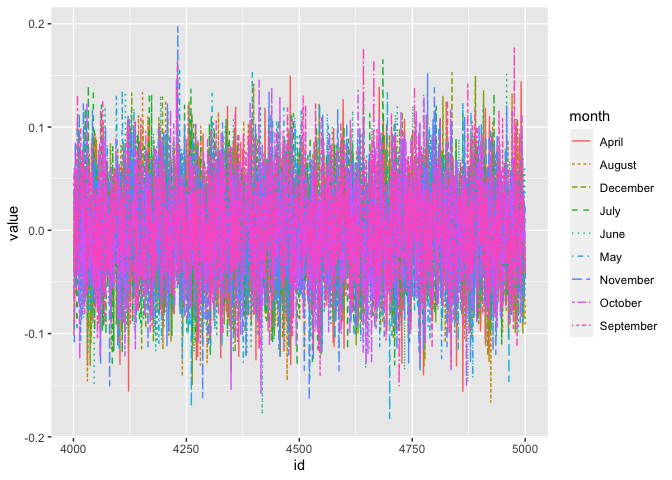
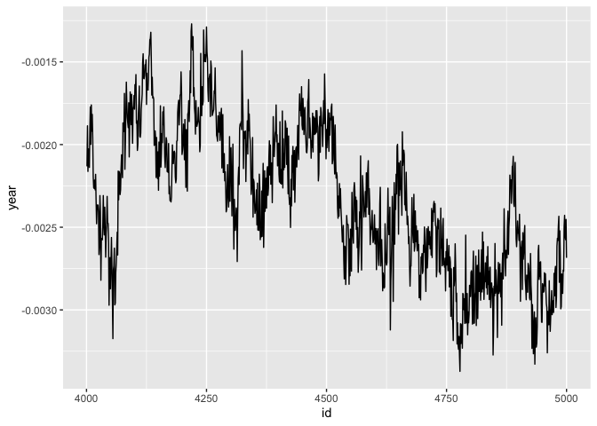
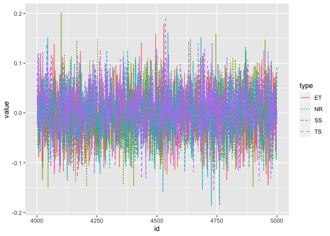

q3
================
Ziyi Wang
2023-04-30

#### 3. Compute posterior summaries and 95% credible intervals of $\gamma$, the fixed effects associated with the covariates in the model. Using the estimated Bayesian model, answer the following questions: (1) are there seasonal differences in hurricane wind speeds, and (2) is there evidence to support the claim that hurricane wind speeds have been increasing over the years?

# TASK

## Compute posterior summaries of $\gamma$

``` r
# load data from Q2 gibbs
dataRDS = readRDS("./data/new_gibb5000.rds")

#head(dataRDS) #dont do this, crazy

names(dataRDS)
```

    ## [1] "B"       "mu"      "sigmasq" "SIGMA"   "gamma"

``` r
# beta = dataRDS$B
# mu = dataRDS$mu
# sigmasq = dataRDS$sigmasq
# SIGMA = dataRDS$SIGMA
gamma = dataRDS$gamma

# every element in the gamma list i.e.[[i]] is the ith gibbs run
gamma[[1]] 
```

    ##            [,1]
    ##  [1,]  0.609573
    ##  [2,] -0.139560
    ##  [3,] -0.055835
    ##  [4,]  0.007938
    ##  [5,]  0.178128
    ##  [6,]  0.208701
    ##  [7,]  0.463327
    ##  [8,]  0.726293
    ##  [9,]  0.187005
    ## [10,] -0.002587
    ## [11,]  1.646888
    ## [12,]  0.536647
    ## [13,]  2.701619
    ## [14,]  3.086692

``` r
as.matrix(gamma[[2]])
```

    ##                    [,1]
    ## April     -0.0218672037
    ## May       -0.1330236577
    ## June      -0.0323676249
    ## July      -0.0082943192
    ## August     0.1145490660
    ## September -0.0404976719
    ## October    0.0267411551
    ## November   0.0154952409
    ## December  -0.0009932736
    ## season    -0.0010761266
    ## TS         0.0256320910
    ## ET        -0.2953530894
    ## SS         0.1161334158
    ## NR         0.0285937934

``` r
L = length(gamma)

# get last n gamma
n = 1000
df_gama = NULL

for (i in 1:n) {
    new = gamma[[L + 1 - i]]
    df_gama <- rbind(df_gama, c(L + 1 - i, t(as.matrix(new))))
}
df_gama2 = as.data.frame(df_gama)
names(df_gama2) = c("id",names(gamma[[L]]))
head(df_gama2)
```

    ##     id        April         May        June         July      August
    ## 1 5000 -0.042274189 -0.04216852  0.03285166 -0.050270631 -0.09173991
    ## 2 4999 -0.014208485 -0.04575054  0.06180438 -0.031912637 -0.01334415
    ## 3 4998  0.007959166  0.02964429  0.01242831 -0.058374411  0.02223794
    ## 4 4997 -0.032675907  0.03798924  0.05379611  0.029759787 -0.03524164
    ## 5 4996 -0.031818784 -0.03597159 -0.04306371 -0.046493279  0.03578697
    ## 6 4995  0.001245371 -0.08845939  0.06903063  0.002302252  0.02744473
    ##      September      October     November     December       season
    ## 1 -0.045438063 -0.034177505  0.023050408  0.007059219 -0.002685010
    ## 2 -0.041124233  0.001354346  0.008734701  0.010069476 -0.002452699
    ## 3 -0.010824903 -0.007137854 -0.066026008  0.022653704 -0.002575262
    ## 4 -0.041640956  0.016435146 -0.023287622 -0.084827980 -0.002554232
    ## 5  0.031989373  0.036037023  0.035706571  0.038715361 -0.002428093
    ## 6  0.003096131 -0.015452447  0.027040066 -0.101007975 -0.002495549
    ##              TS           ET            SS           NR
    ## 1  0.0002952156  0.007189893  0.0941567219 -0.021908380
    ## 2 -0.0218082754 -0.022972925  0.0002290247 -0.002976634
    ## 3  0.0302094217 -0.011308428 -0.0942826300  0.021317080
    ## 4 -0.0793150974  0.080233624 -0.0471967230  0.047927957
    ## 5 -0.0150773792  0.008257951  0.0646040694 -0.087970536
    ## 6  0.0001426201  0.020172023  0.0035869602  0.031669303

## plot month

``` r
df_month <- df_gama2 %>%
  select(-season, -TS, -ET, -SS, -NR) %>%
  gather(key = "month", value = "value", -id)
head(df_month)
```

    ##     id month        value
    ## 1 5000 April -0.042274189
    ## 2 4999 April -0.014208485
    ## 3 4998 April  0.007959166
    ## 4 4997 April -0.032675907
    ## 5 4996 April -0.031818784
    ## 6 4995 April  0.001245371

``` r
ggplot(df_month, aes(x = id, y = value)) + 
  geom_line(aes(color = month, linetype = month)) 
```

<!-- -->

``` r
#+ scale_color_manual(values = c("darkred", "steelblue", "red"))
```

## plot year

``` r
df_year <- df_gama2 %>%
  select(id, season) %>%
  gather(key = "name", value = "year", -id)
head(df_year)
```

    ##     id   name         year
    ## 1 5000 season -0.002685010
    ## 2 4999 season -0.002452699
    ## 3 4998 season -0.002575262
    ## 4 4997 season -0.002554232
    ## 5 4996 season -0.002428093
    ## 6 4995 season -0.002495549

``` r
ggplot(data = df_year, aes(x = id, y = year)) +
  geom_line()
```

<!-- -->

## plot type

``` r
#theme_set(theme_minimal())
df_type <- df_gama2 %>%
  select(id, TS, ET, SS, NR) %>%
  gather(key = "type", value = "value", -id)
head(df_type)
```

    ##     id type         value
    ## 1 5000   TS  0.0002952156
    ## 2 4999   TS -0.0218082754
    ## 3 4998   TS  0.0302094217
    ## 4 4997   TS -0.0793150974
    ## 5 4996   TS -0.0150773792
    ## 6 4995   TS  0.0001426201

``` r
ggplot(df_type, aes(x = id, y = value)) + 
  geom_line(aes(color = type, linetype = type)) 
```

<!-- -->

``` r
#+ scale_color_manual(values = c("darkred", "steelblue", "red"))
```

## Compute 95% credible intervals of $\gamma$, the fixed effects associated with the covariates in the model.

``` r
cred_int <- apply(df_gama2, 2, quantile, probs = c(0.025, 0.975))
cred_int
```

    ##             id       April         May        June        July     August
    ## 2.5%  4025.975 -0.09922543 -0.10038368 -0.09761796 -0.09928455 -0.1028288
    ## 97.5% 4975.025  0.09022636  0.09254019  0.09437084  0.10249011  0.0916931
    ##        September     October   November    December       season          TS
    ## 2.5%  -0.0931095 -0.09762039 -0.1097137 -0.09799494 -0.003099822 -0.08982878
    ## 97.5%  0.1077383  0.09269326  0.1001810  0.09315765 -0.001501638  0.10641711
    ##                ET          SS          NR
    ## 2.5%  -0.10332349 -0.09844162 -0.09398186
    ## 97.5%  0.09418438  0.09384343  0.09936401

## (1) are there seasonal differences in hurricane wind speeds

``` r
# E.X. May - April
df_gama2$May_April <- (df_gama2$May - df_gama2$April)
quantile(df_gama2$May_April, probs = c(0.025, 0.975))
```

    ##       2.5%      97.5% 
    ## -0.1456307  0.1489158

``` r
# include 0, meaning...no diff betw. May & April
```

``` r
# E.X. June - May
df_gama2$J_M <- (df_gama2$June - df_gama2$May)
quantile(df_gama2$J_M, probs = c(0.025, 0.975))
```

    ##       2.5%      97.5% 
    ## -0.1409543  0.1426547

``` r
# include 0, meaning...no diff betw. June & May
```

``` r
# E.X. Aug - July
df_gama2$A_J <- (df_gama2$August - df_gama2$July)
quantile(df_gama2$A_J, probs = c(0.025, 0.975))
```

    ##       2.5%      97.5% 
    ## -0.1382282  0.1369877

``` r
# include 0, meaning...no diff betw. Aug & July
```

``` r
df_summer =  df_gama2 %>% summarise(summer = sum(June, July, August))
head(df_summer)
```

    ##      summer
    ## 1 -1.759378

``` r
df_summer =  df_gama2 %>% select(June, July, August)
df_nosummer =  df_gama2 %>% select(April, May, September,
                                   October, November, December)
     
summer_wd = rowSums(df_summer)/3
nosummer_wd = rowSums(df_nosummer)/6

head(summer_wd - nosummer_wd)
```

    ## [1] -0.014061520  0.019003320 -0.003947452  0.037439432 -0.030366333
    ## [6]  0.061848912

``` r
quantile(summer_wd - nosummer_wd, probs = c(0.025, 0.975))
```

    ##        2.5%       97.5% 
    ## -0.06609543  0.06721837

## (2) is there evidence to support the claim that hurricane wind speeds have been increasing over the years

H0: gamma14 \<= 0; H1: gamma14 \> 0

``` r
quantile(df_year$year, probs = c(0.025, 0.975))
```

    ##         2.5%        97.5% 
    ## -0.003099822 -0.001501638

``` r
#         2.5%        97.5% 
# -0.003099822 -0.001501638
```

The gamma associated with type (Nature of the hurricane) is smaller than
0, fail to reject H1. No evidence to support the claim that hurricane
wind speeds have been increasing over the years.
